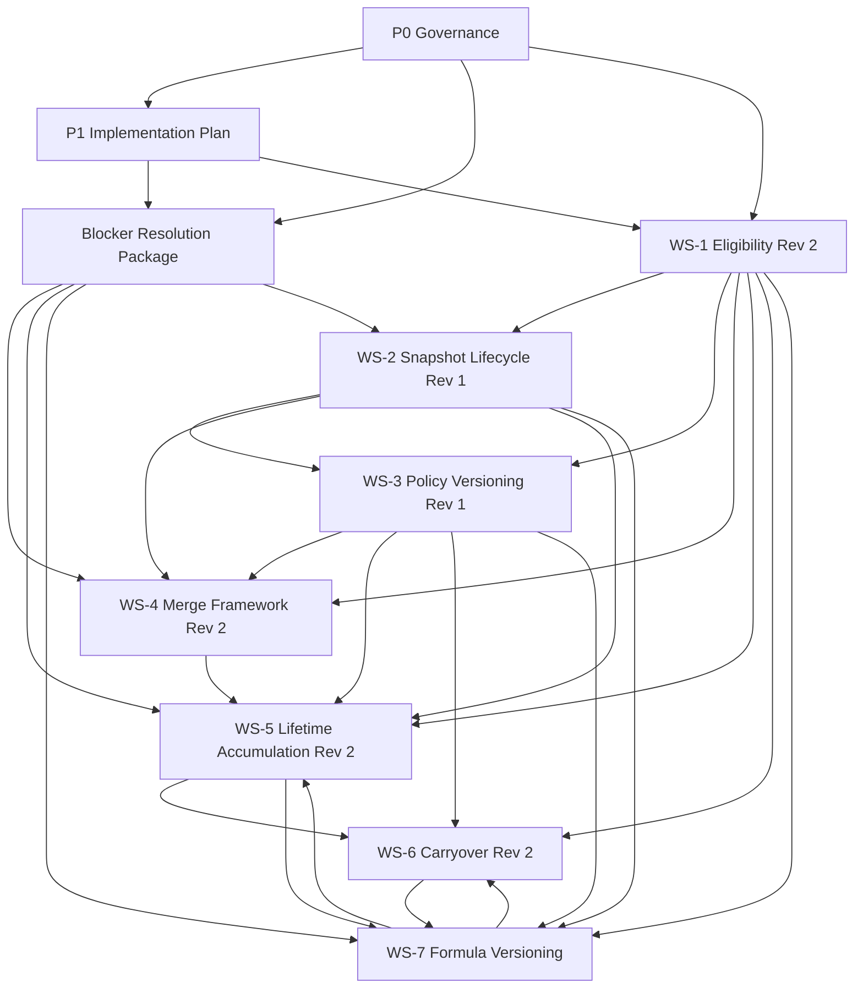
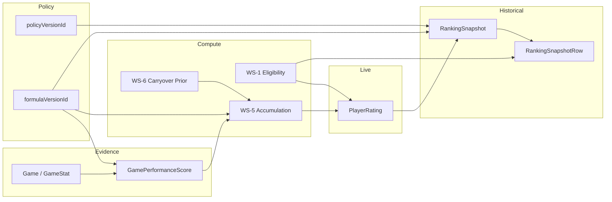
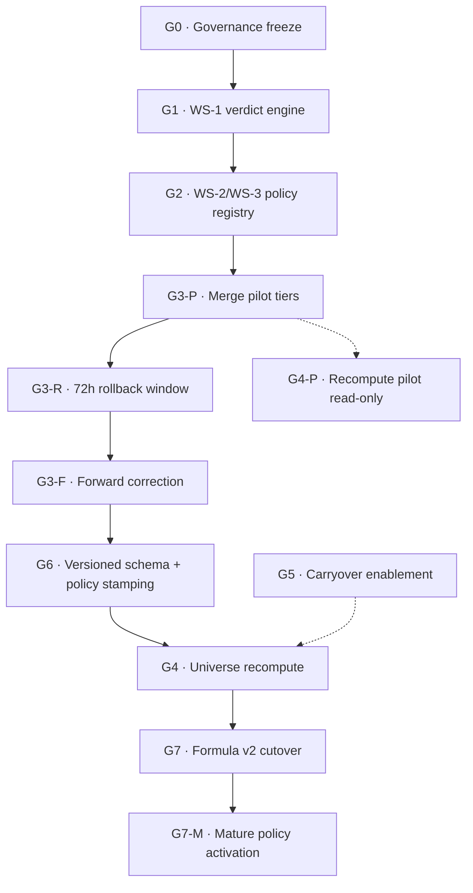

# Rankings Engine — Architecture Baseline Package

**Status:** Authoritative reference for Rankings Engine implementation planning  
**Version:** 1.0  
**Effective:** 2026-06-16  
**Scope:** Architecture documentation only — no code, migrations, schema changes, recomputes, merges, or cutovers

---

## Document Control

| Assumption | Status |
|---|---|
| P0 Ranking Governance Decision Memo | Approved |
| P1 Implementation Planning Specification | Approved |
| WS-1 through WS-7 specifications | Approved |
| Blocker Resolution Package (B1, B2, B3, H1) | Approved |

**Authority:** This package supersedes informal references in chat transcripts. When conflicts arise, this document and the indexed specifications govern. Operational counts and guardrails remain in `docs/PROJECT_STATUS.md`.

**Related documents:**
- `docs/PROJECT_STATUS.md` — stable counts, guardrails, Formula v2 preview checkpoints
- `docs/PHRANK_requirements.md` — methodology reference
- `docs/ranking-age-context.md` — age-group context
- `docs/adr/INDEX.md` — Architecture Decision Record index

---

## 1. Architecture Decision Record (ADR) Index

ADRs are immutable once accepted. A superseded ADR is marked `Superseded by ADR-NNN`; it is never deleted.

| ID | Title | Decision summary | Owning workstream | Status |
|---|---|---|---|---|
| [ADR-001](adr/ADR-001-source-of-truth.md) | Source of truth | Live public boards read **live `PlayerRating`**. Historical rankings and trends read **`RankingSnapshot` + `RankingSnapshotRow`**. Snapshots are immutable monthly freezes of the live board at publish time. | P0, WS-2 | Accepted |
| [ADR-002](adr/ADR-002-eligibility-thresholds.md) | Eligibility thresholds | Launch policy: Boys 10 / Girls 5 verified games. Mature target: 15 verified games. Threshold changes are policy-versioned and prospective-only. | P0, WS-1, WS-3 | Accepted |
| [ADR-003](adr/ADR-003-unknown-dob.md) | Unknown DOB policy | Unknown DOB is a verification gap. Players may be temporarily rank-eligible when competition trust is sufficient; long-term governance requires DOB escalation. | P0, WS-1 | Accepted |
| [ADR-004](adr/ADR-004-age-group-override.md) | `ageGroupOverride` semantics | Override is **eligibility-affecting**, not rating-affecting. Cross-bracket rating basis without carryover yields `PROVISIONAL`, not public rank. | P0, WS-1 | Accepted |
| [ADR-005](adr/ADR-005-duplicate-identity.md) | Duplicate identity / merge governance | One athlete = one canonical profile. Merges require explicit per-group approval. Evidence (`Game`/`GameStat`) is reassigned, never rewritten. | P0, WS-4 | Accepted |
| [ADR-006](adr/ADR-006-snapshot-lifecycle.md) | Snapshot lifecycle | Monthly cadence (`weekOf` = first day of month). States: `DRAFT` → `PUBLISHED` → `SUPERSEDED`. Published snapshots are immutable. | P0, WS-2 | Accepted |
| [ADR-007](adr/ADR-007-policy-versioning.md) | Policy versioning | Eligibility, threshold, and carryover parameters are versioned via WS-3 policy registry. Policy changes are **prospective-only**; historical snapshots are never retro-edited. | WS-3 | Accepted |
| [ADR-008](adr/ADR-008-lifetime-accumulation.md) | Lifetime accumulation | Ratings accumulate across leagues, seasons, and competitions **within an age group**. `verifiedGameCount` is career-scoped for the target bracket. | WS-5 | Accepted |
| [ADR-009](adr/ADR-009-carryover-discounted-prior.md) | Carryover as discounted prior | Carryover provides a **discounted prior** at age-group rollover. It is distinct from game-count Bayesian shrinkage. Carryover **never satisfies threshold alone**. | WS-6, B1 | Accepted |
| [ADR-010](adr/ADR-010-formula-versioning.md) | Formula versioning & coexistence | Formula versions coexist additively. v1 evidence is never overwritten. Uniqueness: `[gameStatId, formulaVersionId]` and `[playerId, ageGroup, formulaVersionId]`. | WS-7, B3 | Accepted |
| [ADR-011](adr/ADR-011-formula-v2-activation-profile.md) | Formula v2 activation profile | **G7** cutover uses approved "Claude No Shrinkage" profile: `shrinkageK=0`, all context factors `1.00`, tier multipliers inactive. **G7-M** activates tier multipliers / shrinkage via policy bump, not formula bump. | B1, WS-7 | Accepted |
| [ADR-012](adr/ADR-012-league-weight-once.md) | League weight applied once | League tier assignment is WS-3. Multiplier values are WS-7. Multiplier is applied **once at score compute**, never re-applied at accumulation. | WS-5, WS-7 | Accepted |
| [ADR-013](adr/ADR-013-snapshot-policy-provenance.md) | Snapshot policy provenance | Every snapshot freezes `formulaVersionId` **and** `policyVersionId`. Rows freeze minimum WS-1 verdict provenance for auditability. | H1, WS-2, WS-3 | Accepted |
| [ADR-014](adr/ADR-014-merge-slug-aliasing.md) | Merge slug aliasing | Soft-deleted source slugs redirect permanently to canonical `playerId`. Aliases are append-only. | B2, WS-4 | Accepted |
| [ADR-015](adr/ADR-015-g6-before-g4-universe.md) | G6 before G4 universe | Versioned schema (G6) must precede persisting universe recompute (G4). G4-P pilot is read-only / v1-only / non-persisting. | B3, P1 | Accepted |

---

## 2. Canonical Dependency Map

### 2.1 Workstream dependency graph

### 2.2 Runtime data-flow dependency

### 2.3 Gate dependency graph

### 2.4 Cross-workstream contracts

| From | To | Contract |
|---|---|---|
| WS-3 | WS-1 | Supplies `policyVersionId`; tier assignment for leagues |
| WS-3 | WS-6 | Owns carryover parameter policy |
| WS-7 | WS-5 | Owns `shrinkageK`, tier multiplier values, `formulaVersionId` on scores/ratings |
| WS-7 | WS-2 | Supplies `formulaVersionId` on snapshots |
| WS-6 | WS-5 | Supplies discounted carryover prior (never counts toward threshold) |
| WS-1 | WS-2 | Supplies verdict payload frozen on snapshot rows |
| WS-1 | WS-5 | `gamesQualified` = lifetime verified games in target bracket |
| WS-4 | WS-5 | Merges complete before accumulation; scores reassigned unchanged |
| WS-4 | WS-1 | Post-merge eligibility evaluated on canonical `playerId` only |
| WS-3 | WS-7 | G7-M tier/shrinkage activation is policy event, not formula bump |

---

## 3. Gate Registry (G0–G7-M)

All gates require **explicit human approval**. No gate self-promotes. No gate authorizes writes by itself.

| Gate | Name | Owner spec | Purpose | Entry precondition | Exit criterion |
|---|---|---|---|---|---|
| **G0** | Governance freeze | Baseline package | Ratify P0 A-1, WS-4 Rev 2, P1 A-2, H1; sign Invariant Ledger | All specs + blocker resolutions approved | Governance baseline locked in `docs/` |
| **G1** | Verdict engine | WS-1 Rev 2 | Finalize eligibility contract and verdict payload | G0 | Verdict hierarchy, precedence, and payload fields defined |
| **G2** | Policy registry | WS-2, WS-3 | Launch `policyVersionId` registry; threshold/eligibility policy defined | G1 | Active launch policy version resolvable |
| **G3-P** | Merge pilot | WS-4 Rev 2 | Execute risk-tiered merge pilot (Tier 1 → 2 → 3) | G2 | Pilot tier(s) complete per R2-d |
| **G3-R** | Merge rollback window | WS-4 Rev 2 | 72h rollback per merge group; **snapshot publish locked** | G3-P per group | All open rollback windows closed |
| **G3-F** | Forward correction | WS-4 Rev 2 | Split / re-canonicalize after rollback window (prospective only) | G3-R closed for affected group | Correction approved and audited |
| **G6** | Schema readiness | WS-7, H1 | Versioned score/rating keys; v1 backfill; `policyVersionId` + row provenance on snapshots | G3 complete | P-G6 satisfied; R-READ audit complete |
| **G4-P** | Recompute pilot | WS-5 Rev 2 | Validate accumulation math — **read-only, v1-only, non-persisting** | G3 (may parallel G6 prep) | Pilot validation report approved |
| **G5** | Carryover enablement | WS-6 Rev 2 | June rollover job; discounted prior; explicit carryover weight | G2 (policy) + feeds G4 | First rollover dry-run approved |
| **G4** | Universe recompute | WS-5 Rev 2 | Persist lifetime ratings for active formula version | **G6 (P-G6)** OR **P-W1 signed waiver** | v1 counts verified; lineage records complete |
| **G7** | Formula v2 cutover | P0 A-1, WS-7 | Public pointer → v2 with frozen neutral profile | G4 complete; v2 shadow validated | `isPublic=true` on v2; v1 → RETIRED |
| **G7-M** | Mature policy | WS-3, B1 | Tier multipliers and/or non-zero shrinkage via `policyVersionId` bump | **Separate approval** after G7 | New policy version active; snapshot lineage started |

### Gate preconditions (forks)

| Fork | Rule |
|---|---|
| **P-G6** | G6 schema landed: `@@unique([gameStatId, formulaVersionId])`, `@@unique([playerId, ageGroup, formulaVersionId])`, v1 backfill verified, R-READ hardened |
| **P-W1** | Alternative to P-G6 only with signed waiver: G4 scoped exclusively to `formulaVersionId = v1`; no v2 writes until G6 |
| **G7 profile** | At G7: `shrinkageK=0`, `leagueWeight=opponentFactor=teamFactor=1.00`, tier multipliers inactive |
| **G7-M profile** | Tier multipliers and/or `shrinkageK≠0` activate only via new `policyVersionId`, not new `FormulaVersion` |

### Operations blocked during active gates

| Active state | Blocked operations |
|---|---|
| Any G3-R window open | Monthly snapshot publish |
| G3 merge in flight | Snapshot publish for affected boards |
| Before G6 + R-READ | Any v2 `PlayerRating` write |
| Before G7 approval | Public formula pointer flip |
| G7 without G7-M approval | Tier multipliers, non-zero shrinkage |

---

## 4. Invariant Registry

Invariants are non-negotiable. Violation requires architecture review and explicit waiver.

| ID | Invariant | Protected by | Verification |
|---|---|---|---|
| **INV-01** | Live `PlayerRating` is the authoritative source for public live boards | ADR-001, G7 | Public `/rankings` reads live ratings filtered by active formula |
| **INV-02** | `RankingSnapshot` + `RankingSnapshotRow` are the authoritative historical record | ADR-001, ADR-006 | Trend/history reads snapshot rows only |
| **INV-03** | Published snapshots are immutable | ADR-006, WS-2 | No UPDATE/DELETE on PUBLISHED snapshot rows |
| **INV-04** | Eligibility module (WS-1) is the sole threshold authority | WS-1, G1 | No duplicate threshold logic in import or display paths |
| **INV-05** | Merges complete before lifetime accumulation (G3 before G4) | ADR-005, P1 | G4 blocked until G3 exit |
| **INV-06** | `Game` and `GameStat` are never rewritten by merges, transfers, or policy changes | ADR-005, WS-4 | Merge audit shows reassignment only |
| **INV-07** | Carryover never satisfies eligibility threshold alone | ADR-009, WS-1, WS-6 | `gamesQualified` excludes carryover-only basis |
| **INV-08** | League weight applied once at score compute, never at accumulation | ADR-012 | Accumulator consumes `finalPerformanceScore` only |
| **INV-09** | v1 formula evidence is never overwritten by v2 work | ADR-010, B3 | v1 score/rating counts unchanged after v2 shadow |
| **INV-10** | At most one `FormulaVersion` is public (`isPublic=true`) at a time | WS-7, G7 | Registry query returns single ACTIVE public formula |
| **INV-11** | Policy changes are prospective-only | ADR-007 | Historical snapshots retain frozen `policyVersionId` |
| **INV-12** | `FormulaVersion.weights` for ACTIVE/RETIRED versions are frozen; parameter change = new version | WS-7 | No in-place weight edits on ACTIVE/RETIRED |
| **INV-13** | G7 cutover uses frozen neutral profile until G7-M | ADR-011, B1 | G7 weights match approved profile before `isPublic=true` |
| **INV-14** | Every published snapshot carries `formulaVersionId` and `policyVersionId` | ADR-013, H1 | Snapshot header audit fields populated |
| **INV-15** | Snapshot rows freeze minimum WS-1 verdict provenance | ADR-013, H1 | Row fields populated at publish time |
| **INV-16** | Soft-deleted source slugs redirect to canonical player | ADR-014, WS-4 R2-a | Slug resolution consults alias map |
| **INV-17** | Age-group progression is controlled June rollover only | Domain rule, WS-6 | No ad-hoc bracket recalculation outside rollover job |

---

## 5. Specification Index

| Document | Version | Status | Scope | Gate alignment |
|---|---|---|---|---|
| **P0 Ranking Governance Decision Memo** | Approved + Amendment A-1 | Locked | Product decisions: source of truth, thresholds, DOB, override, merges | G0 |
| **P1 Implementation Planning Specification** | Approved + Amendment A-2 | Locked | Phased roadmap, workstreams, gate definitions | G0 |
| **WS-1 Eligibility Module** | Rev 2 | Locked | Unified eligibility contract; verdict hierarchy P1–P15; per-board evaluation | G1 |
| **WS-2 Snapshot Lifecycle** | Rev 1 | Locked | DRAFT→PUBLISHED→SUPERSEDED; monthly cadence; consumer behavior | G2, G6 |
| **WS-3 Policy Versioning** | Rev 1 | Locked | Policy registry; prospective-only; formula/policy separation | G2, G7-M |
| **WS-4 Duplicate Player Merge Framework** | Rev 2 | Locked | Detection, canonical selection, G3-R/G3-F, slug aliasing, pilot tiers | G3 |
| **WS-5 Lifetime Rating Accumulation** | Rev 2 | Locked | Career-scoped accumulation; lineage; G4-P/G4 gates | G4-P, G4 |
| **WS-6 Carryover Rating** | Rev 2 | Locked | June rollover; discounted prior; ACTIVE/DORMANT/EXPIRED/REVOKED | G5 |
| **WS-7 Formula Versioning & Formula v2** | Rev 1 | Locked | Coexistence model; G6/G6-B/G7; R-READ; replay/audit | G6, G7 |
| **Blocker Resolution Package** | 1.0 | Locked | B1, B2, B3, H1 resolutions | G0 |
| **Rankings Engine Baseline Package** | 1.0 | **This document** | Authoritative index and gate registry | G0 |

### WS-1 verdict payload (canonical fields)

Required on every eligibility evaluation; minimum subset frozen on snapshot rows (ADR-013):

- `verdict` — RANKED | PROVISIONAL | HIDDEN | FORMER
- `provisionalReason` / `exclusionReason` (separate fields)
- `ratingAgeGroup`, `evaluatedBoard`, `evaluationDate`
- `snapshotEligible`, `formulaVersionId`, `policyVersionId`
- `competitionAgeGroup`, `competitionTrustLevel`, `classYearStatus`
- `gamesQualified`, `verifiedGameCount`

### WS-4 Rev 2 amendments (reference)

| Amendment | Summary |
|---|---|
| R2-a | Mandatory slug-alias redirect for soft-deleted sources |
| R2-b | Forward-correction taxonomy: Split, Re-canonicalize via G3-F |
| R2-c | Snapshot publish locked during any open G3-R window |
| R2-d | Risk-tiered pilot: Tier 1 (no history) → Tier 2 → Tier 3 |
| R2-e | Canonical precedence: snapshot history → live rating → verified games → earliest `createdAt` |

---

## 6. Implementation Sequencing Guide

This section defines **what must happen in what order**. It does not define how to implement.

### Phase 0 — Governance lock (G0)

1. Ratify this baseline package and ADR index.
2. Confirm P0 Amendment A-1 (G7/G7-M split) and P1 Amendment A-2 (G6-before-G4) are recorded.
3. Confirm WS-4 Rev 2 and H1 requirements are incorporated into spec index.
4. Sign Invariant Registry (Section 4).

**Exit:** Implementation teams may begin planning against locked specs. No data writes.

---

### Phase A — Policy & eligibility foundation (G1–G2)

| Step | Gate | Deliverable |
|---|---|---|
| A.1 | G1 | WS-1 eligibility contract finalized; verdict payload schema agreed |
| A.2 | G2 | WS-3 policy registry design; launch `policyVersionId` defined |
| A.2 | G2 | WS-2 snapshot lifecycle states and publish workflow defined |

**Parallel constraint:** No rating math changes. No merges. No recomputes.

**Exit:** Eligibility and policy versions are resolvable by ID.

---

### Phase B — Identity cleanup (G3)

| Step | Gate | Deliverable |
|---|---|---|
| B.1 | G3-P | Tier 1 merge pilot (lowest risk group) |
| B.2 | G3-R | 72h rollback window per group; publish lock enforced |
| B.3 | G3-P | Tier 2, then Tier 3 merge groups |
| B.4 | G3-F | Forward-correction path documented for any post-window issues |

**Hard rule:** All 12 approved merge groups complete before G4 universe recompute.

**Exit:** Canonical identities established; slug aliases in place; no open G3-R windows.

---

### Phase C — Schema readiness (G6)

| Step | Gate | Deliverable |
|---|---|---|
| C.1 | G6 | Versioned uniqueness on `GamePerformanceScore` and `PlayerRating` |
| C.2 | G6 | v1 backfill on all existing rating/score rows |
| C.3 | G6 | `policyVersionId` on `RankingSnapshot`; row verdict provenance fields |
| C.4 | G6 | R-READ audit: all live read paths filter by active public `formulaVersionId` |
| C.5 | G6 | Optional: `LeagueSeasonAverage` versioning if v2 PPP averages are persisted |

**Parallel allowed:** G4-P read-only pilot (after G3, during G6 prep).

**Exit:** P-G6 satisfied. Public output identical to pre-G6 while serving v1.

---

### Phase D — Accumulation & carryover (G4-P, G5, G4)

| Step | Gate | Deliverable |
|---|---|---|
| D.1 | G4-P | Read-only recompute validation on bounded v1 universe |
| D.2 | G5 | Carryover policy active; June rollover evaluation order locked |
| D.3 | G4 | Universe lifetime recompute (v1 `formulaVersionId`, versioned storage) |

**Calendar rule:** First enabled June rollover occurs **after G5**, not between G4 and G5.

**Exit:** Live `PlayerRating` reflects lifetime accumulation within age groups.

---

### Phase E — Formula v2 shadow & cutover (G6-B, G7, G7-M)

| Step | Gate | Deliverable |
|---|---|---|
| E.1 | G6-B | v2 shadow scores and ratings (`isPublic=false`); v1 untouched |
| E.2 | G7 prep | v2 snapshot lineage generated (separate approval) |
| E.3 | G7 | Public pointer → v2; frozen profile: `shrinkageK=0`, factors `1.00` |
| E.4 | G7-M | Mature policy: tier multipliers / shrinkage via `policyVersionId` bump |

**Exit:** Public boards serve v2 under G7 profile. v1 lineage preserved permanently.

---

### Ongoing operations

- Monthly snapshot publish per WS-2 (after stable gate, no active G3-R window).
- New games trigger incremental recompute on active public formula version.
- June 1 rollover job per WS-6 (after G5 enabled).
- No G4/G5/G7 recomputes during active G3 merge windows.

---

## 7. Governance Ownership Matrix

| Domain | Primary owner | Artifact | Approver | Consumers |
|---|---|---|---|---|
| **Product governance** | Product / platform lead | P0, ADR index | Product owner | All teams |
| **Implementation sequencing** | Rankings architect | P1, this baseline | Engineering lead | Implementation teams |
| **Eligibility rules** | Rankings architect | WS-1, ADR-002–004 | Product + data integrity | Public UI, admin, snapshots, search |
| **Snapshot lifecycle** | Rankings architect | WS-2, ADR-006 | Engineering lead | Public trends, admin publish |
| **Policy versioning** | Rankings architect | WS-3, ADR-007 | Product owner | WS-1, WS-6, snapshots |
| **Duplicate identity / merges** | Data integrity lead | WS-4, ADR-005, ADR-014 | Data integrity + product | WS-5, profiles, search |
| **Rating accumulation** | Rankings architect | WS-5, ADR-008 | Engineering lead | Live boards, snapshots |
| **Carryover / rollover** | Rankings architect | WS-6, ADR-009 | Product owner | WS-5, June job |
| **Formula versioning** | Rankings architect | WS-7, ADR-010–011 | Product + engineering | WS-5, WS-6, snapshots |
| **Schema migrations** | Engineering lead | G6 scope doc | Engineering + data safety | All write paths |
| **Public cutover (G7)** | Product owner | G7 approval record | Product owner | Public UI, methodology page |
| **Mature policy (G7-M)** | Product owner | WS-3 policy bump | Product owner | Tier weights, shrinkage |
| **Audit / replay** | Data integrity lead | Lineage records, ADR-013 | Data integrity | Compliance, debugging |
| **Operational guardrails** | Project maintainer | `PROJECT_STATUS.md` | Project maintainer | All agents and developers |

### Approval authority by gate

| Gate | Approver(s) | Documentation required |
|---|---|---|
| G0 | Product owner + engineering lead | Signed baseline package |
| G1–G2 | Engineering lead | WS-1/WS-3 spec sign-off |
| G3-P/R/F | Data integrity lead | Per-group merge plan + audit |
| G6 | Engineering lead + data safety | Schema design + R-READ audit report |
| G4-P | Rankings architect | Pilot validation report |
| G4 | Product owner + data integrity | Recompute impact report |
| G5 | Product owner | Rollover dry-run report |
| G7 | Product owner | v2 preview comparison + rollback rehearsal |
| G7-M | Product owner | Policy change memo + rank movement analysis |

### Escalation paths

| Situation | Escalate to |
|---|---|
| Invariant violation detected | Rankings architect → product owner |
| Merge rollback after 72h window | Data integrity lead → G3-F approval |
| Formula cutover defect post-G7 | Product owner → G7 rollback (pointer flip) |
| Policy replay non-determinism | Data integrity lead → WS-3 review |
| Schema constraint blocks v1/v2 coexistence | Engineering lead → G6 scope review |

---

## Appendix A — Glossary

| Term | Definition |
|---|---|
| **Live board** | Current public ranking order from live `PlayerRating` |
| **Freeze** | Immutable capture of live board state into `RankingSnapshot` |
| **Discounted prior** | WS-6 carryover input to rating compute; not threshold-qualifying |
| **shrinkageK** | Bayesian game-count constant in `FormulaVersion.weights`; `0` at G7 |
| **R-READ** | Requirement that all live reads filter by active public `formulaVersionId` |
| **P-G6** | Precondition: versioned schema landed before persisting G4 |
| **P-W1** | Waiver: G4 v1-only with signed acknowledgment (fallback to P-G6) |
| **Prospective-only** | Policy changes affect future computes only; never rewrite history |

---

## Appendix B — Pre-implementation checklist

Before any code, migration, recompute, merge, or cutover:

- [ ] G0 governance freeze complete
- [ ] This baseline package version recorded in `docs/`
- [ ] Invariant Registry signed
- [ ] ADR index published
- [ ] WS-1 through WS-7 + Blocker Resolution referenced by version
- [ ] `PROJECT_STATUS.md` cross-linked (counts remain operational guardrails)
- [ ] Gate approvers identified per Section 7
- [ ] No gate skipped or combined without explicit waiver

---

*End of Rankings Engine Architecture Baseline Package v1.0*
