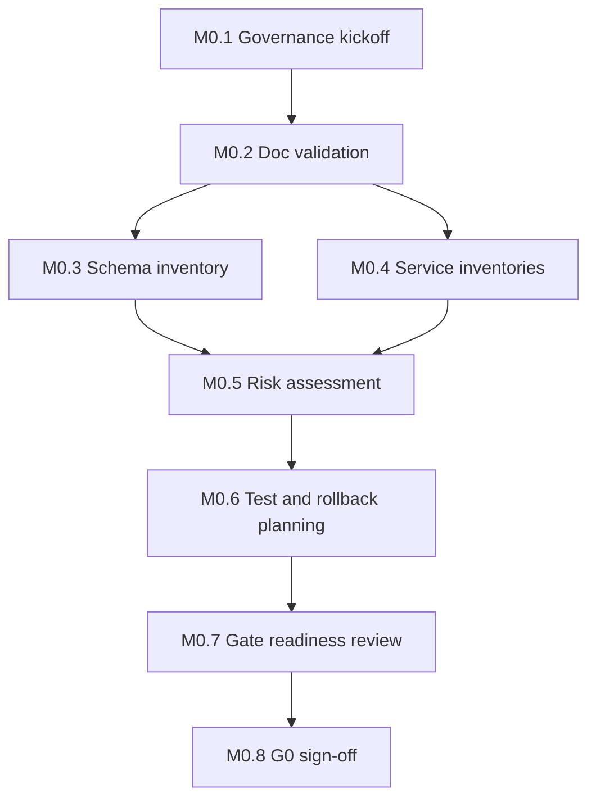
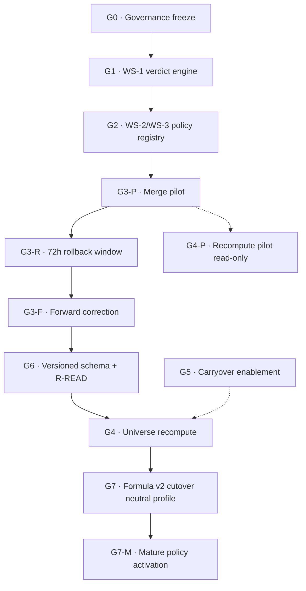

# Rankings Engine — Phase 0 Implementation Plan

**Status:** Planning artifact (G0 pre-implementation readiness)  
**Version:** 1.0  
**Effective:** 2026-06-16  
**Scope:** Governance lock, documentation validation, inventories, risk assessment, test/rollback planning, gate readiness — **not** Phase A (G1 eligibility) implementation

---

## Document Control

| Field | Value |
|---|---|
| **Authority** | Subordinate to `docs/RANKINGS_ENGINE_BASELINE.md` v1.0 |
| **Authoritative inputs** | P0 (+ A-1), P1 (+ A-2), WS-1 Rev 2 – WS-7, Blocker Resolution Package (B1, B2, B3, H1), ADR-001 – ADR-015 |
| **Operational guardrails** | `docs/PROJECT_STATUS.md` — stable counts and write prohibitions |
| **Gate target** | **G0 exit** → readiness for **G1** (WS-1 verdict engine) |
| **Explicitly out of scope** | Code, migrations, recomputes, merges, snapshot publish, Formula v2 writes |

### Assumptions

1. All baseline specifications listed in `RANKINGS_ENGINE_BASELINE.md` §5 are approved and locked.
2. Gate order is fixed: **G0 → G1 → G2 → G3 → G6 → G4 → G7 → G7-M** (ADR-015: G6 before G4 universe).
3. WS-4 Rev 2 merge governance completes (G3) before G4 universe recompute; Phase 0 inventories merge-touching paths but does not execute merges.
4. R-READ hardening is **G6 implementation scope**; Phase 0 inventories all read paths and documents the gap (Finding #1).
5. Stable operational counts use the **UAAP Season 88 validated dataset** unless a workstream explicitly references the broader historical dataset (Formula v2 write-plan context).
6. Phase 0 produces **planning artifacts only** — no production changes.
7. Approvers per baseline §7: Product owner + engineering lead sign G0; rankings architect owns eligibility/accumulation specs; data integrity lead owns merge domain.

### Stable Count Context (dual citation)

| Table | UAAP S88 stable (`PROJECT_STATUS`) | Broader dataset (Formula v2 write-plan) | Phase 0 use |
|---|---:|---:|---|
| GamePerformanceScore | 1,885 | 6,340 | Schema inventory sizing; v1 backfill scope estimate |
| PlayerRating | 181 | 611 | R-READ impact; uniqueness migration sizing |
| RankingSnapshot | 2 | 3 | Snapshot service inventory |
| RankingSnapshotRow | 138 | 511 | Row provenance gap (ADR-013) |

---

## 1. Executive Summary

Phase 0 establishes **pre-implementation readiness** for the Rankings Engine: ratify governance, validate documentation cross-references, produce exhaustive inventories of read/compute/snapshot/eligibility paths, assess migration and operational risks, and define test/rollback strategies before any G1+ work begins.

Phase 0 does **not** implement WS-1 verdict logic, policy registry, schema migrations, or rating recomputes.

---

## 2. Implementation Roadmap (Phase 0 Timeline)

| Milestone | Target | Owner | Exit deliverable |
|---|---|---|---|
| **M0.1 — Governance kickoff** | Week 1, Days 1–2 | Product owner + Engineering lead | G0 charter signed; approvers roster published |
| **M0.2 — Documentation validation** | Week 1, Days 3–5 | Rankings architect | Doc validation matrix (§3.1) complete; gaps logged |
| **M0.3 — Schema & blocker inventory** | Week 2, Days 1–3 | Engineering lead | G6 preparation inventory (§3.2); delta vs ADR-010/013/015 |
| **M0.4 — Service path inventories** | Week 2, Days 3–5 | Rankings architect + Engineering lead | Read / ranking / snapshot / eligibility inventories (§3.3–3.6) |
| **M0.5 — Risk & migration assessment** | Week 3, Days 1–3 | Rankings architect + Data integrity lead | Risk register (§6); migration risk doc (§3.7) |
| **M0.6 — Test & rollback planning** | Week 3, Days 3–5 | Engineering lead | Test strategy (§3.8); rollback playbooks (§3.9) |
| **M0.7 — Gate readiness review** | Week 4, Days 1–3 | Product owner + Engineering lead | G0 exit checklist (§7) reviewed |
| **M0.8 — G0 sign-off** | Week 4, Day 5 | Product owner + Engineering lead | G0 approved; Phase A (G1) authorized to plan |

**Total duration:** ~4 weeks (planning calendar; adjustable by approver availability).

---

## 3. Work Breakdown Structure (WBS)

### WP-0.1 — Documentation Validation

| ID | Task | Owner | Output |
|---|---|---|---|
| 0.1.1 | Cross-walk P0 A-1 (G7/G7-M split) against ADR-011, baseline §3 | Rankings architect | P0 ↔ ADR traceability row |
| 0.1.2 | Cross-walk P1 A-2 (G6-before-G4) against ADR-015, baseline gate registry | Rankings architect | P1 ↔ ADR traceability row |
| 0.1.3 | Validate WS-1 Rev 2 verdict payload vs ADR-002–004, ADR-013 row fields | Rankings architect | WS-1 field coverage matrix |
| 0.1.4 | Validate WS-4 Rev 2 (R2-a–R2-e) vs ADR-005, ADR-014, G3 gate ops | Data integrity lead | WS-4 compliance checklist |
| 0.1.5 | Validate blocker resolutions B1/B2/B3/H1 against ADR-009/010/013/014 | Rankings architect | Blocker resolution sign-off sheet |
| 0.1.6 | Confirm Invariant Registry (INV-01–INV-17) maps to verification owners | Engineering lead | Invariant ownership matrix |
| 0.1.7 | Reconcile `PROJECT_STATUS.md` counts with baseline appendix references | Project maintainer | Count context note (dual dataset) |

### WP-0.2 — Schema Preparation Inventory

| ID | Task | Owner | Output |
|---|---|---|---|
| 0.2.1 | Document current `GamePerformanceScore` constraints vs ADR-010 target | Engineering lead | Schema delta: `gameStatId @unique` → `[gameStatId, formulaVersionId]` |
| 0.2.2 | Document current `PlayerRating` constraints vs ADR-010 target | Engineering lead | Schema delta: add `formulaVersionId`; uniqueness change |
| 0.2.3 | Document `RankingSnapshot` gaps vs ADR-006/013 (policyVersionId, lifecycle state) | Engineering lead | Snapshot header delta spec (planning) |
| 0.2.4 | Document `RankingSnapshotRow` gaps vs WS-1/ADR-013 verdict provenance | Rankings architect | Row provenance field gap list |
| 0.2.5 | Document `LeagueSeasonAverage` vs ADR-010/WS-7 (seasonId-only unique) | Engineering lead | Optional G6 versioning decision memo (planning) |
| 0.2.6 | Document `FormulaVersion` registry state (`isPublic`, `weights` Json) | Engineering lead | Formula registry inventory |
| 0.2.7 | Document `PlayerAlias` readiness vs ADR-014 (slug redirect) | Data integrity lead | Merge alias inventory + slug resolution path audit |
| 0.2.8 | Estimate v1 backfill row counts (181 vs 611 PlayerRating; 1885 vs 6340 GPS) | Engineering lead | Backfill sizing table |

### WP-0.3 — Read-Path Inventory (R-READ prep)

| ID | Task | Owner | Output |
|---|---|---|---|
| 0.3.1 | Inventory all `PlayerRating` read sites | Engineering lead | Read-path register §4.1 |
| 0.3.2 | Flag Finding #1: live reads without `formulaVersionId` filter | Rankings architect | R-READ gap report (G6 scope) |
| 0.3.3 | Inventory `RankingSnapshot` / `RankingSnapshotRow` historical reads | Engineering lead | Snapshot read-path register §5.1 |
| 0.3.4 | Inventory public UI routes consuming rankings | Engineering lead | Route-to-service map |
| 0.3.5 | Inventory admin/audit reads touching ratings | Engineering lead | Admin read-path annex |
| 0.3.6 | Classify each path: live vs historical vs mixed | Rankings architect | Path classification matrix |

### WP-0.4 — Ranking Service Inventory (compute/write)

| ID | Task | Owner | Output |
|---|---|---|---|
| 0.4.1 | Inventory submission-scoped recompute pipeline | Engineering lead | Compute-path register §4.2 |
| 0.4.2 | Inventory batch scripts (`compute-player-ratings-v1*`, GPS scripts) | Engineering lead | Script inventory with write scope |
| 0.4.3 | Inventory Formula v2 preview/dry-run paths (read-only) | Rankings architect | v2 preview path register |
| 0.4.4 | Flag `weekly-ratings.ts` formulaVersion=2 discrepancy | Engineering lead | Legacy path risk note |
| 0.4.5 | Map compute paths to invariants INV-08, INV-09, INV-12 | Rankings architect | Compute ↔ invariant matrix |

### WP-0.5 — Snapshot Service Inventory

| ID | Task | Owner | Output |
|---|---|---|---|
| 0.5.1 | Inventory snapshot generation (`submission-post-import-processing`, `generate-ranking-snapshots-v1*`) | Engineering lead | Snapshot write-path register §5.2 |
| 0.5.2 | Document current publish model (no DRAFT/PUBLISHED/SUPERSEDED) vs WS-2 | Rankings architect | Lifecycle gap analysis |
| 0.5.3 | Document G3-R publish lock touchpoints (WS-4 R2-c) | Data integrity lead | Publish lock integration points |
| 0.5.4 | Inventory snapshot validation scripts | Engineering lead | Validation script register |
| 0.5.5 | Map snapshot rows to eligibility filter behavior (pre-WS-1) | Rankings architect | Eligibility-at-publish gap note |

### WP-0.6 — Eligibility Service Inventory

| ID | Task | Owner | Output |
|---|---|---|---|
| 0.6.1 | Inventory `ranking-eligibility.ts` (class year, age bracket) | Rankings architect | Eligibility function register §6.1 |
| 0.6.2 | Inventory `public-board-ranks.ts` threshold logic (Boys 10 / Girls 5) | Rankings architect | Threshold duplication map (INV-04 risk) |
| 0.6.3 | Inventory `players.ts` `leaderboardMinimumGamesForGender` | Rankings architect | Secondary threshold site |
| 0.6.4 | Inventory `ageGroupOverride` usage vs ADR-004 | Rankings architect | Override semantics audit |
| 0.6.5 | Inventory unknown DOB handling vs ADR-003 | Rankings architect | DOB gap assessment |
| 0.6.6 | Produce WS-1 Rev 2 replacement scope (planning): unified verdict engine | Rankings architect | G1 readiness brief |

### WP-0.7 — Migration Risk Assessment

| ID | Task | Owner | Output |
|---|---|---|---|
| 0.7.1 | Assess G6 uniqueness migration blast radius | Engineering lead | Migration risk doc §8 |
| 0.7.2 | Assess dual-dataset count divergence (181 vs 611) | Data integrity lead | Dataset scope decision input |
| 0.7.3 | Assess P-W1 waiver residual risk vs P-G6 | Rankings architect | P-G6 vs P-W1 decision brief |
| 0.7.4 | Assess merge-before-accumulation ordering (INV-05) | Data integrity lead | G3 → G6 → G4 dependency confirmation |
| 0.7.5 | Assess historical snapshot immutability (INV-03, ADR-007) | Rankings architect | Prospective-only migration constraints |

### WP-0.8 — Test Strategy (planning)

| ID | Task | Owner | Output |
|---|---|---|---|
| 0.8.1 | Define read-path regression suite scope (pre/post G6) | Engineering lead | R-READ test plan outline |
| 0.8.2 | Define G4-P pilot validation criteria (read-only, v1-only) | Rankings architect | G4-P acceptance criteria draft |
| 0.8.3 | Define snapshot lifecycle test scenarios (WS-2) | Rankings architect | Snapshot test scenario list |
| 0.8.4 | Define eligibility verdict test matrix (WS-1 P1–P15) | Rankings architect | G1 test matrix skeleton |
| 0.8.5 | Define formula coexistence test cases (ADR-010) | Rankings architect | v1/v2 coexistence test outline |
| 0.8.6 | Reference existing validation scripts as baseline harness | Engineering lead | Script ↔ test mapping |

### WP-0.9 — Rollback Preparation (planning)

| ID | Task | Owner | Output |
|---|---|---|---|
| 0.9.1 | Document G3-R 72h merge rollback playbook (WS-4) | Data integrity lead | Merge rollback runbook outline |
| 0.9.2 | Document G7 pointer-flip rollback (ADR-011) | Product owner | G7 rollback decision tree |
| 0.9.3 | Document G6 schema rollback constraints | Engineering lead | Schema rollback feasibility note |
| 0.9.4 | Document snapshot publish abort during G3-R | Rankings architect | Publish lock rollback procedure |
| 0.9.5 | Define count verification checkpoints post-rollback | Project maintainer | Stable count verification checklist |

### WP-0.10 — Gate Readiness Assessment

| ID | Task | Owner | Output |
|---|---|---|---|
| 0.10.1 | Complete G0 exit checklist (§7) | Product owner | Signed checklist |
| 0.10.2 | Confirm G1 entry preconditions documented | Rankings architect | G1 kickoff brief |
| 0.10.3 | Confirm no gate skipping without waiver | Engineering lead | Gate waiver process note |
| 0.10.4 | Publish Phase 0 artifact index | Project maintainer | Artifact registry |

---

## 4. Dependency Graph

### 4.1 Phase 0 internal dependencies

### 4.2 Rankings Engine gate sequence (post-G0)

### 4.3 Phase 0 artifact → gate linkage

| Phase 0 output | Enables |
|---|---|
| Doc validation matrix | G0 exit |
| Schema preparation inventory | G6 planning (not execution) |
| R-READ read-path register | G6 C.4 scope |
| Eligibility duplication map | G1 WS-1 consolidation scope |
| Merge path inventory | G3 planning |
| Migration risk doc | G6 / G4 gate approvals |
| Test strategy outline | G4-P, G6, G7 validation |
| Rollback playbooks | G3-R, G7 operational safety |

---

## 5. Detailed Inventories (verified / expand in Phase 0)

### 5.1 Read-path register (initial)

| Path | File / route | Data source | Formula filter? | Eligibility filter? | ADR / invariant | G6 R-READ |
|---|---|---|---|---|---|---|
| National boards | `src/lib/rankings.ts` → `getLatestNationalRankings`, `getLatestSnapshot` | Live `PlayerRating` + snapshot metadata | **No** — resolves v1 `formulaVersionId` for snapshot header only; `playerRating.findMany` unfiltered | Applied downstream via `getPublicBoardRows` | INV-01, Finding #1 | **Gap** |
| Board eligibility | `src/lib/public-board-ranks.ts` | In-memory rows | N/A | Boys ≥10, Girls ≥5; age bracket match | ADR-002, INV-04 risk | N/A |
| Rank display bands | `src/lib/public-rank-display.ts` | Rank number | N/A | N/A | — | N/A |
| Public search | `src/lib/public-search.ts` | `getLatestNationalRankings` + `currentRatings[0]` | **No** on `currentRatings` | Via board rank lookup | INV-01 | **Gap** |
| Homepage / site data | `src/lib/public-site-data.ts` | `getLatestNationalRankings`; direct `rankingSnapshot.findFirst` | Partial on snapshot query | Via board helpers | INV-01, INV-02 | **Gap** on live reads |
| Player profile | `src/lib/player-profile.ts` | `currentRatings`, GPS via `formulaVersionNumber=1`, `rankingRows` for trend | GPS filtered; **ratings unfiltered** | `getCurrentPublicBoardRankForPlayer` | INV-01, INV-02 | **Gap** |
| Players list / API | `src/lib/players.ts`, `src/app/api/rankings/route.ts` | `currentRatings[0]` | **No** | `leaderboardMinimumGamesForGender` in `getEligibleRankings` | INV-04 risk | **Gap** |
| Rankings pages | `src/app/rankings/page.tsx`, `[gender]/[age]/page.tsx` | `getLatestNationalRankings` | Inherited gap | Inherited | INV-01 | **Gap** |
| Team standings | `src/lib/team-rankings.ts` | Game results / `TeamRating` | N/A (not player formula) | N/A | — | Out of R-READ scope |
| Admin dashboards | `src/app/admin/page.tsx` | Count queries | N/A | N/A | — | Inventory only |
| Submission audit | `src/lib/submission-audit.ts` | GPS, PlayerRating, snapshots | v1 `formulaVersionId` on GPS/snapshot | N/A | — | Partial |

**Finding #1 (confirmed):** `src/lib/rankings.ts` hardcodes `formulaVersionNumber = 1`, loads live `playerRating` without `formulaVersionId` filter. Safe today (single formula rows) but **blocks ADR-010 coexistence** and violates R-READ intent.

### 5.2 Ranking compute / write-path register (initial)

| Path | File | Write scope | Formula version | Gate blocked until |
|---|---|---|---|---|
| Submission import pipeline | `src/lib/submission-post-import-processing.ts` | GPS upsert, `PlayerRating` upsert, snapshot rows | v1 (`formulaVersionNumber = 1`) | G6 for v2; G3-R for publish during rollback |
| Batch GPS compute | `scripts/compute-game-performance-scores-v1.ts`, `*-u16.ts` | GPS | v1 | Explicit approval |
| Batch rating compute | `scripts/compute-player-ratings-v1.ts`, `*-u16.ts` | `PlayerRating` | v1 | Explicit approval |
| Batch snapshot generate | `scripts/generate-ranking-snapshots-v1.ts`, `*-u16.ts` | `RankingSnapshot` + rows | v1 | G3-R publish lock |
| Formula v2 preview | `scripts/preview-formula-v2.ts` | **Read-only** | v2 shadow math | — |
| Formula v2 write plan | `scripts/plan-formula-v2-write.ts` | **Plan only** | v2 | G6 + G7 |
| Formula comparison | `scripts/compare-player-rating-formulas.ts` | **Read-only** | v1 vs v2 | — |
| Legacy weekly ratings | `src/lib/weekly-ratings.ts` | `FormulaVersion` upsert (`versionNumber = 2`) | **Anomaly — verify** | Phase 0 flag |
| Advanced metrics | `src/lib/advanced-metrics.ts` | Pure functions; v2 helpers | Both | — |
| Merge + rating repair scripts | `scripts/merge-approved-*`, `repair-*`, `create-*-merge-plan.ts` | Player identity, optional rating recompute | v1 | G3 approval |
| Snapshot regeneration post-merge | `scripts/regenerate-affected-ranking-snapshots-after-player-merge.ts` | Snapshots | v1 | G3 + approval |

### 5.3 Snapshot service register (initial)

| Concern | Current state | Target (WS-2 / ADR-006 / ADR-013) | Phase |
|---|---|---|---|
| Lifecycle states | No `status` field on `RankingSnapshot` | DRAFT → PUBLISHED → SUPERSEDED | G2/G6 planning |
| Monthly cadence | `weekOf` used; import pipeline generates monthly | WS-2 monthly publish workflow | G2 |
| Header provenance | `formulaVersionId` only | + `policyVersionId` (ADR-013) | G6 |
| Row provenance | `rating`, `starRating`, `verifiedGameCount`, `movement` | + WS-1 verdict subset (ADR-013) | G6 |
| Publish lock | Not enforced in code | Block publish during G3-R (WS-4 R2-c) | G3 |
| Immutability | No explicit enforcement | INV-03: no UPDATE on PUBLISHED | G2/G6 |
| Generation paths | `submission-post-import-processing.ts`; batch scripts | Unified publish service (future) | G2 planning |
| Validation | `validate-ranking-snapshots-v1*.ts`, `diagnose-ranking-snapshots-v1.ts` | Extend for lifecycle + provenance | G6 test planning |

### 5.4 Eligibility service register (initial)

| Function / module | Location | Behavior today | WS-1 Rev 2 gap |
|---|---|---|---|
| Class year derivation | `ranking-eligibility.ts` `getClassYear`, `getEffectiveClassYear` | March-birthday rule + override | Map to `classYearStatus` verdict input |
| Class year exclusion | `isRankingEligibleByClassYear` | June 1 exclusion | Map to FORMER / HIDDEN verdict |
| Age bracket (March 31) | `getAgeBracketAsOfMarch31`, `getCurrentRankingAgeBracket` | U13/U16/U19/OUT_OF_RANGE | Map to `competitionAgeGroup` / board evaluation |
| Game thresholds | `public-board-ranks.ts` `publicBoardMinimumGames` | Boys 10, Girls 5 | Must become policy-versioned (ADR-002, ADR-007) |
| Duplicate thresholds | `players.ts` `leaderboardMinimumGamesForGender` | Same values | **INV-04 violation risk** — consolidate at G1 |
| Age override | `Player.ageGroupOverride` on reads | Display + bracket filter | ADR-004: eligibility-affecting; PROVISIONAL path |
| Unknown DOB | Eligible when bracket null | Temporary rank-eligible | ADR-003: trust level + escalation |
| Verdict hierarchy P1–P15 | **Not implemented** | Ad hoc filters | **G1 deliverable** |

---

## 6. Risk Register

| ID | Risk | Severity | Likelihood | Mitigation | Gate linkage |
|---|---|---|---|---|---|
| R-01 | Live reads without formula filter cause duplicate-rating display after G6 | **High** | High (certain if unaddressed) | Inventory all paths (§5.1); R-READ audit as G6 exit criterion | G6 |
| R-02 | `GamePerformanceScore.gameStatId @unique` blocks v2 shadow | **High** | Certain | Schema prep inventory; defer v2 writes until G6 | G6, G7 |
| R-03 | `PlayerRating` lacks `formulaVersionId` — v2 overwrites v1 | **Critical** | Certain on v2 write | P-G6 before G4; no v2 writes pre-G6 | G6, G4 |
| R-04 | Eligibility threshold logic duplicated (INV-04) | **Medium** | High | Eligibility inventory; G1 unified verdict engine | G1 |
| R-05 | G4 executed before G6 (non-replayable universe) | **Critical** | Medium | ADR-015 locked in baseline; P-W1 only with signed waiver | G4, G6 |
| R-06 | Merge during accumulation corrupts lineage | **High** | Medium | WS-4 before WS-5; G3 complete before G4 | G3, G4 |
| R-07 | Snapshot publish during G3-R window | **High** | Medium | Publish lock inventory; WS-4 R2-c enforcement plan | G3-R |
| R-08 | Historical snapshots retro-edited on policy change | **High** | Low | ADR-007 prospective-only; immutability tests | G2, G6 |
| R-09 | Dual dataset counts (181 vs 611) cause wrong backfill scope | **Medium** | Medium | Document both contexts; explicit dataset scope decision before G6 | G6 |
| R-10 | `weekly-ratings.ts` v2 upsert conflicts with registry | **Medium** | Low | Phase 0 flag; deprecate or align in G6 planning | G6 |
| R-11 | G7 tier multipliers activated prematurely | **High** | Medium | ADR-011: neutral profile at G7; G7-M separate approval | G7, G7-M |
| R-12 | Carryover satisfies threshold (INV-07) | **Medium** | Low | WS-6/G5 test matrix; `gamesQualified` excludes carryover | G5 |
| R-13 | League weight double-applied (INV-08) | **Medium** | Medium | Compute path audit; accumulator consumes `finalPerformanceScore` only | G4, G7 |
| R-14 | Slug redirect missing post-merge (INV-16) | **Medium** | Medium | `PlayerAlias` inventory; slug resolution audit | G3 |
| R-15 | Missing `policyVersionId` on snapshots breaks audit replay | **High** | Certain until G6 | ADR-013 schema planning | G6 |
| R-16 | Formula v2 preview mistaken for production-ready | **Medium** | Medium | PROJECT_STATUS guardrails; admin UI block | G7 |
| R-17 | June rollover run before G5 | **Medium** | Low | Calendar rule in baseline §6; G5 gate | G5 |
| R-18 | Invariant registry unsigned — drift from chat | **Low** | Medium | G0 doc validation + sign-off | G0 |

---

## 7. Gate Readiness Checklist (G0 Exit → G1 Entry)

### 7.1 G0 exit criteria (from baseline)

- [ ] **G0-01** — `docs/RANKINGS_ENGINE_BASELINE.md` v1.0 ratified and version recorded
- [ ] **G0-02** — ADR index (ADR-001 – ADR-015) published and cross-linked
- [ ] **G0-03** — P0 Amendment A-1 (G7/G7-M split) recorded and traced to ADR-011
- [ ] **G0-04** — P1 Amendment A-2 (G6-before-G4) recorded and traced to ADR-015
- [ ] **G0-05** — WS-1 Rev 2 through WS-7 + Blocker Resolution Package referenced by version in spec index
- [ ] **G0-06** — Invariant Registry (INV-01 – INV-17) signed with verification owners
- [ ] **G0-07** — Gate approvers identified per baseline §7
- [ ] **G0-08** — `PROJECT_STATUS.md` cross-linked; dual count context documented
- [ ] **G0-09** — Phase 0 inventories complete (§5.1 – §5.4 expanded to final registers)
- [ ] **G0-10** — Risk register reviewed (§6) with owners assigned
- [ ] **G0-11** — Test strategy outline approved (§3.8)
- [ ] **G0-12** — Rollback playbooks outlined (§3.9)
- [ ] **G0-13** — No gate skipped or combined without explicit waiver record
- [ ] **G0-14** — Product owner + engineering lead G0 sign-off obtained

### 7.2 G1 entry readiness (prepared by Phase 0, implemented in Phase A)

- [ ] **G1-R01** — Eligibility duplication map complete; consolidation scope agreed
- [ ] **G1-R02** — WS-1 verdict payload schema draft aligned with ADR-002–004, ADR-013
- [ ] **G1-R03** — Verdict hierarchy P1–P15 test matrix skeleton ready
- [ ] **G1-R04** — No compute/write path changes scheduled during G1
- [ ] **G1-R05** — Public display paths documented for verdict rollout impact analysis

### 7.3 Explicit Phase 0 prohibitions (remain in force until respective gates)

| Action | Blocked until |
|---|---|
| Schema migrations | G6 approval |
| `PlayerRating` / GPS v2 writes | G6 + G7 |
| Universe recompute (G4) | G6 (P-G6) or P-W1 waiver + G4 approval |
| Player merges | G3 approval |
| Rating recomputes | Explicit approval per operation |
| Snapshot publish during G3-R | G3-R window closed |
| Formula v2 public cutover | G7 approval |
| Tier multipliers / shrinkage activation | G7-M approval |

---

## 8. Migration Risk Assessment Summary (planning)

### 8.1 G6 schema changes (inventory only)

| Model | Current constraint | Target (ADR-010) | Risk | Mitigation plan |
|---|---|---|---|---|
| `GamePerformanceScore` | `gameStatId @unique` | `@@unique([gameStatId, formulaVersionId])` | Migration must not drop v1 scores | Add column/index; backfill v1; drop old unique in controlled migration |
| `PlayerRating` | `@@unique([playerId, ageGroup])` | Add `formulaVersionId`; `@@unique([playerId, ageGroup, formulaVersionId])` | All read paths must filter before v2 insert | R-READ audit (G6 C.4); Phase 0 read register |
| `RankingSnapshot` | No `policyVersionId`, no status | Add per ADR-013, WS-2 | Existing 2 (or 3) snapshots lack new fields | Prospective-only; nullable → required on new publishes |
| `RankingSnapshotRow` | 5 fields | Add verdict provenance subset | Row width increase | Publish-time population only |
| `LeagueSeasonAverage` | `seasonId @unique` | Optional formula versioning | v2 PPP averages collision | Defer decision to G6 optional C.5 |

### 8.2 v1 backfill verification plan (G6 scope — defined in Phase 0)

1. Count GPS rows without `formulaVersionId = v1` → expect 0 post-backfill.
2. Count `PlayerRating` rows → map to 181 (S88) or agreed broader scope.
3. Verify public board output **byte-identical** pre/post G6 while serving v1 only (G6 exit criterion).
4. Verify v1 GPS count unchanged after v2 shadow begins (INV-09).

### 8.3 P-G6 vs P-W1

| Path | When to use | Residual risk |
|---|---|---|
| **P-G6** (default) | Versioned schema landed before G4 | Lowest; enables v2 shadow and replay |
| **P-W1** (waiver) | Emergency G4 v1-only with signed acknowledgment | v2 blocked longer; replay risk documented |

**Phase 0 recommendation:** Plan for P-G6; document P-W1 only as contingency.

---

## 9. Test Strategy Outline (planning)

### 9.1 Test layers by gate

| Gate | Test focus | Harness |
|---|---|---|
| G1 | WS-1 verdict determinism; P1–P15 precedence | Unit matrix (skeleton); fixture players |
| G2 | Policy version resolution; prospective-only | Registry resolution tests |
| G3 | Merge reassignment; slug alias; rollback | Merge pilot scripts + audit JSON |
| G6 | R-READ; backfill counts; public output parity | `validate-ratings-v1*.ts`, `validate-ranking-snapshots-v1*.ts`, browser QA |
| G4-P | Accumulation math read-only | Bounded universe pilot report |
| G4 | Lifetime accumulation; lineage records | Count verification vs PROJECT_STATUS |
| G5 | Carryover prior; threshold exclusion (INV-07) | June rollover dry-run |
| G7 | Neutral profile weights; v1 preservation | `compare-player-rating-formulas.ts`, `preview-formula-v2.ts` |
| G7-M | Policy bump rank movement | Policy version A/B comparison |

### 9.2 Regression anchors (stable S88 dataset)

- 76 active games, 1,885 GPS, 181 PlayerRating, 138 U19 snapshot rows
- Public `/rankings` renders without console errors
- Player profile trend reads snapshot rows only (INV-02)
- Boys ≥10 / Girls ≥5 board filtering unchanged until policy version bump

### 9.3 Non-goals in Phase 0

- No automated test implementation
- No CI pipeline changes
- No test database mutations

---

## 10. Rollback Preparation Outline (planning)

| Scenario | Trigger | Rollback action | Verification |
|---|---|---|---|
| **G3-R merge rollback** | Within 72h of merge group | Reverse reassignment per WS-4 audit | Player count, GPS ownership, slug resolution |
| **G3-F forward correction** | Post-window canonical error | Split / re-canonicalize (prospective) | Audit trail + approval record |
| **G6 migration defect** | Public output drift | Migration down / hotfix per engineering lead | R-READ parity suite |
| **G4 recompute defect** | Lineage mismatch | Restore pre-G4 rating backup (**requires approval + backup plan**) | PlayerRating counts |
| **G7 cutover defect** | Rank order anomaly | Flip `isPublic` pointer back to v1 (ADR-011) | Public board spot check |
| **G7-M policy defect** | Unintended shrinkage/tiers | Revert `policyVersionId` active pointer | Policy registry query |
| **Snapshot publish abort** | G3-R window open | Do not publish; retain DRAFT | WS-4 R2-c compliance |

---

## 11. Manual QA Checklist — Phase 0 Completion

Use this checklist to verify Phase 0 planning artifacts (not production behavior).

### Documentation

- [ ] Open `docs/RANKINGS_ENGINE_BASELINE.md` — confirm v1.0, effective 2026-06-16
- [ ] Open `docs/adr/INDEX.md` — confirm ADR-001 through ADR-015 listed as Accepted
- [ ] Confirm P0 A-1 and P1 A-2 amendments referenced in baseline §3 and §5
- [ ] Confirm WS-4 Rev 2 amendments R2-a through R2-e indexed in baseline §5
- [ ] Confirm Blocker Package (B1, B2, B3, H1) mapped in baseline §1 and §5

### Inventories

- [ ] Read-path register includes all files in §5.1 plus any newly discovered routes
- [ ] Finding #1 documented: `rankings.ts` loads `playerRating` without formula filter
- [ ] Compute-path register includes submission pipeline and batch scripts (§5.2)
- [ ] `weekly-ratings.ts` anomaly flagged for engineering review
- [ ] Snapshot register documents lifecycle and provenance gaps (§5.3)
- [ ] Eligibility register documents threshold duplication in `public-board-ranks.ts` and `players.ts` (§5.4)

### Schema preparation

- [ ] Schema delta table (§8.1) reviewed by engineering lead
- [ ] Dual count context (181 vs 611) understood and dataset scope decision scheduled

### Risk and gates

- [ ] Risk register (§6) reviewed; owners assigned for High/Critical items
- [ ] G0 exit checklist (§7.1) all items checked or explicitly waived with record
- [ ] G1 entry readiness items (§7.2) prepared
- [ ] Confirm no Phase 0 task authorized database writes

### Sign-off

- [ ] Product owner sign-off on G0 checklist
- [ ] Engineering lead sign-off on inventories and migration risk summary
- [ ] Rankings architect sign-off on eligibility/snapshot/formula planning scope
- [ ] Data integrity lead sign-off on merge path inventory and G3 sequencing

---

## 12. Phase 0 Artifact Registry (deliverables)

| Artifact | Location / format | Owner |
|---|---|---|
| This plan | `docs/RANKINGS_ENGINE_PHASE0_PLAN.md` | Rankings architect |
| Baseline package | `docs/RANKINGS_ENGINE_BASELINE.md` | Rankings architect |
| ADR index | `docs/adr/INDEX.md` | Rankings architect |
| Doc validation matrix | `docs/planning/` (to create in M0.2) | Rankings architect |
| Read-path register (final) | `docs/planning/r-read-inventory.md` (to create in M0.4) | Engineering lead |
| Schema delta spec | `docs/planning/g6-schema-delta.md` (to create in M0.3) | Engineering lead |
| Risk register (living) | §6 of this doc + `docs/planning/risk-register.md` | Rankings architect |
| G0 sign-off record | `docs/planning/g0-signoff.md` (to create at M0.8) | Product owner |

---

## 13. What Phase 0 Does Not Include

- Phase A (G1) WS-1 verdict engine implementation
- Policy registry implementation (G2)
- Merge execution (G3)
- Schema migrations or v1 backfill (G6)
- G4-P pilot execution or G4 universe recompute
- Formula v2 shadow writes or G7 cutover
- Any modification to `PlayerRating`, `RankingSnapshot`, `Game`, or `GameStat` rows

---

*End of Rankings Engine Phase 0 Implementation Plan v1.0*
