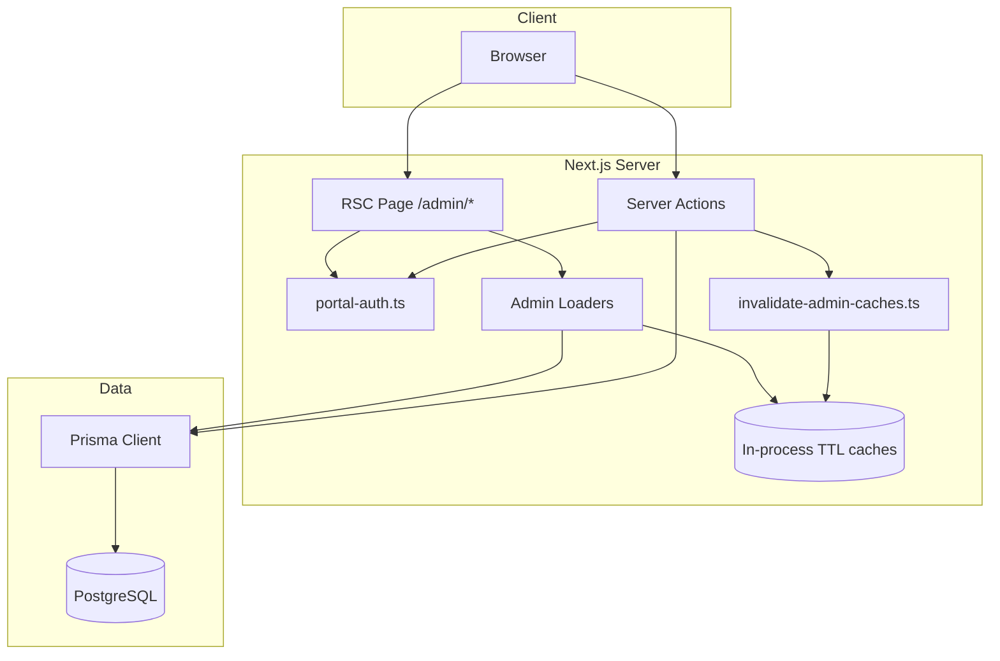
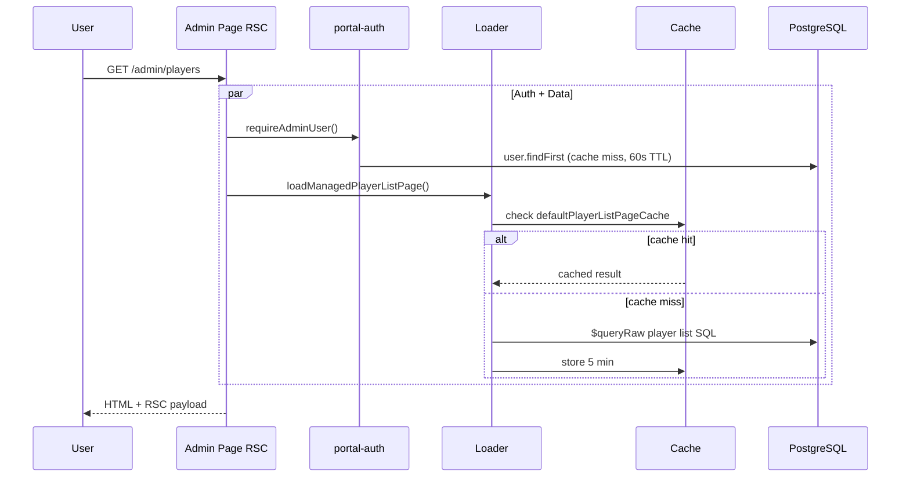
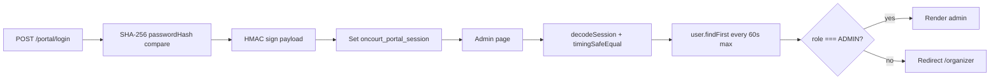
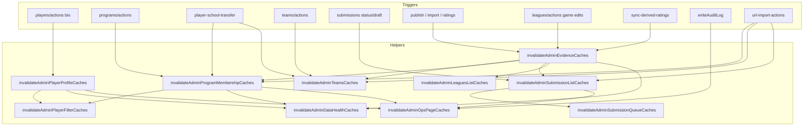
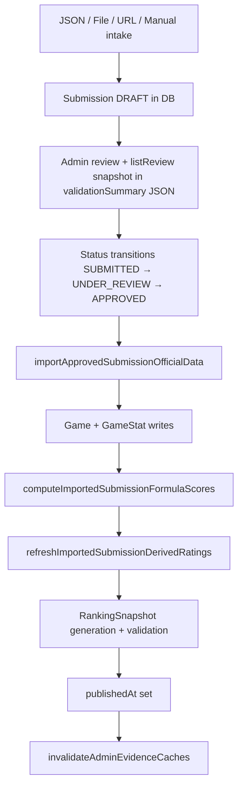
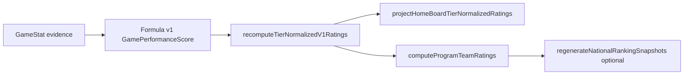

# Peach Basket Admin Platform — Technical Architecture

Last updated: 2026-06-28

This document describes how the `/admin/*` portal is structured: request flow, authentication, caching, data loaders, Server Actions, Prisma usage, and the submission/rating pipelines.

---

## Overview

| Layer | Technology |
|-------|------------|
| Framework | Next.js 14 App Router (`src/app/admin/`) |
| Auth | Signed HTTP-only cookie + per-request DB role check |
| Data | Prisma ORM + targeted `$queryRaw` for list performance |
| Mutations | Server Actions (`"use server"`) |
| Caching | In-process TTL caches (single Node instance) |



---

## Request flow

1. User navigates to `/admin/*`.
2. **No middleware** guards admin routes; each page calls `requireAdminUser()` (or auth-only for intake tabs).
3. Page runs `Promise.all([requireAdminUser(), loader...])` where optimized.
4. RSC serializes props to client components (`*Client.tsx`).
5. Mutations invoke Server Actions → Prisma writes → `invalidateAdmin*()` → `revalidatePath()`.



---

## Authentication flow

**Cookie:** `oncourt_portal_session` (HMAC-SHA256 signed payload, 12 h max-age).

| Step | Behavior |
|------|----------|
| Login | `src/app/(site)/portal/login/page.tsx` — inline Server Action |
| Session create | `createPortalSession()` sets httpOnly, `sameSite: lax`, `secure` in production |
| Session read | `getPortalUser()` — React `cache()` per request + 60 s in-process Map |
| Admin gate | `requireAdminUser()` → redirect `/portal/login` or `/organizer` |
| Logout | `clearPortalSession()` deletes cookie + cache entry |



**Production note:** Password storage uses unsalted SHA-256 (see Security audit). `PORTAL_SESSION_SECRET` is required in production.

---

## Authorization model

| Role | Access |
|------|--------|
| `ADMIN` | Full `/admin/*` |
| `ORGANIZER` | `/organizer/*` only; redirected from admin |
| Other | Cannot log into portal |

Authorization is **defense in depth**:

- Every admin **page** calls `requireAdminUser()`.
- Every admin **Server Action** calls `requireAdminUser()` at entry.
- No route-level middleware; a missed guard on a new page would be a vulnerability.

Organizer actions that affect admin data (submission create) invalidate admin caches but do not grant admin UI access.

---

## Cache architecture

All admin list caches are **in-process**, **read-only**, **5-minute TTL** (portal auth cache: **60 s**).

| Cache | Module | Key / scope | TTL |
|-------|--------|-------------|-----|
| Portal user | `portal-auth.ts` | Session cookie string | 60 s |
| Default player list | `load-managed-player-list.ts` | Page 1, unfiltered, size 50 | 5 min |
| Total players count | `load-managed-player-list.ts` | Global count | 5 min |
| Player filter context | `load-admin-player-filter-context.ts` | Programs + school options | 5 min |
| Teams activity + full | `load-managed-teams.ts` | Two slots, cleared together | 5 min |
| Programs list | `load-program-list.ts` | All `ProgramListRow[]` | 5 min |
| Submission queue | `load-admin-submission-queue.ts` | Limit 100 default | 5 min |
| Leagues list | `load-admin-leagues-list.ts` | All leagues + season counts | 5 min |
| Ops page data | `load-admin-ops-page-data.ts` | Counts + 50 audit logs | 5 min |
| Data health signals | `load-admin-data-health-signals.ts` | Five COUNT aggregates | 5 min |
| Bracket birth range | `managed-player-list-query.ts` | Map by bracket key | None (tiny, static) |
| UAAP alias rules | `uaap-school-display.ts` | Static Map | Process lifetime |

**Not cached:** Detail pages (`/admin/programs/[id]`, submission review), filtered player pages (non-default), client-side submission preset filters.

**Multi-instance:** Caches are per Node process. Horizontal scaling requires Redis or accepting stale reads up to TTL.

---

## Invalidation graph

Central module: `src/lib/admin/invalidate-admin-caches.ts`.



| Helper | Clears |
|--------|--------|
| `invalidateAdminPlayerFilterCaches` | Filter dropdown |
| `invalidateAdminTeamsCaches` | Teams M1 + M2 + assembled list |
| `invalidateAdminSubmissionListCaches` | Queue + ops submission count |
| `invalidateAdminEvidenceCaches` | All evidence-related admin caches |
| `invalidateAdminProgramMembershipCaches` | Programs list, player list, filter, ops, data-health |
| `invalidateAdminPlayerProfileCaches` | Player list, filter, ops, data-health |

---

## Page loaders

| Route | Loader(s) | Cached? |
|-------|-----------|---------|
| `/admin/players` | `loadManagedPlayerListPage`, `loadAdminPlayerFilterContext` | Default page + filters |
| `/admin/teams` | `loadManagedTeams` | Yes |
| `/admin/programs` | `loadProgramListRows` | Yes |
| `/admin/submissions` (queue) | `loadAdminSubmissionQueue` | Yes |
| `/admin/leagues` | `loadAdminLeaguesList` | Yes |
| `/admin/ops` | `loadAdminOpsPageData` | Yes |
| `/admin/data-health` | `loadAdminDataHealthSignals` | Yes |
| `/admin/programs/[id]` | Inline Prisma in page | No |
| `/admin/submissions/[id]` | Inline Prisma + review builders | No |
| `/admin/leagues/[id]` | Inline Prisma | No |

### Raw SQL loaders (parameterized via Prisma.sql)

- **Players list** — `load-managed-player-list.ts` — JOIN programs, ratings JSON agg, `COUNT(*) OVER()`
- **Player filters** — `load-admin-player-filter-context.ts` — scalar subqueries
- **Teams** — `load-managed-teams.ts` — M1 base aggregates + M2 activity JSON CTE
- **Programs** — `load-program-list.ts` — `findMany` + 2 UNION raw queries (parallel)
- **Submissions queue** — `load-admin-submission-queue.ts` — JOIN users, `COUNT(*) OVER()`

Filter SQL uses `Prisma.sql` tagged templates — user search strings are bound parameters, not concatenated.

---

## Server Actions

| Module | Actions |
|--------|---------|
| `admin/players/actions.ts` | `updatePlayerBio`, `updatePlayerSchool`, `updatePlayerRecruitment`, `loadAdminPlayerDetail` |
| `admin/programs/actions.ts` | `updateProgram`, `updateProgramTeam`, `updatePlayerCurrentProgram` |
| `admin/teams/actions.ts` | `updateTeamBio` |
| `admin/leagues/actions.ts` | `updateLeagueMetadata`, `updateOfficialGame`, `updateOfficialGameStat` |
| `admin/submissions/actions.ts` | Draft edit, create, publish, import, rating steps, delete |
| `admin/tools/submissions/url-import-actions.ts` | URL discovery, org creation, import submission |
| `admin/claims/actions.ts` | `reviewProfileClaim` |
| `admin/ops/actions.ts` | `recomputeAllTeamRatings` |
| `lib/admin/player-school-transfer.ts` | `updatePlayerSchoolAssignment` (shared) |
| `lib/ratings/sync-derived-ratings.ts` | `syncDerivedRatingsAfterEvidenceChange` |

**Pattern:** `requireAdminUser()` → validate FormData → Prisma transaction → `invalidateAdmin*()` → `revalidatePath()` → return state or `redirect()`.

---

## Prisma layer

- **Client:** `src/lib/prisma.ts` — singleton PrismaClient
- **Soft deletes:** Most queries filter `deletedAt: null`
- **Heavy lists:** Raw SQL for players, teams, programs aggregates, submission queue
- **Counts:** Parallel `prisma.*.count()` batched in ops/data-health loaders

Indexes on `deletedAt`, foreign keys, and list `ORDER BY` columns support admin queries; wall-clock is dominated by DB network RTT in remote deployments.

---

## Submission pipeline



**List review snapshot:** Precomputed `listReview` stored in `validationSummary` JSON (`submission-list-review-snapshot.ts`) — not an in-process cache.

**Lifecycle guards:** `submission-lifecycle.ts` — draft delete rules, status transitions, active submission filters.

---

## Rating pipeline

Triggered after game evidence changes (import, league game edit, manual recompute).



Entry point: `syncDerivedRatingsAfterEvidenceChange()` in `src/lib/ratings/sync-derived-ratings.ts`.

- **Production formula:** Tier-normalized v1 (`tier-normalized-v1.ts`)
- **Formula v2:** Experimental / scripts only — not approved for production writes
- **Carryover:** Planned, not implemented in v1

Admin ops panel exposes manual team rating recompute (`admin/ops/actions.ts`).

---

## Audit logging

`writeAuditLog()` in `src/lib/admin/log-admin-action.ts` persists to `audit_log` table and clears ops page cache.

Game edits also write `game_edit_audit` rows (`leagues/actions.ts`).

---

## File organization

```
src/app/admin/           # Routes + colocated actions
src/lib/admin/           # Loaders, caches, invalidation, transfer helpers
src/lib/portal-auth.ts   # Session + role gates
src/lib/submission-*.ts  # Submission parse, review, import, lifecycle
src/lib/ratings/         # Rating computation
src/components/admin/    # Shared admin UI
```

---

## Performance characteristics

- **Warm cache hit:** ~0 ms in-process for cached list pages
- **Cold load:** ~250–600 ms with remote PostgreSQL (network RTT bound)
- **Parallel auth:** `Promise.all([requireAdminUser(), loader])` hides auth latency when data is slower

Maintenance benchmark: `npx tsx .cursor/audit-admin-steady.ts`

---

## Related docs

- `docs/ADMIN_RUNBOOK.md` — operational procedures
- `docs/ADMIN_IA_MAP.md` — information architecture
- `docs/PROJECT_STATUS.md` — data guardrails and stable counts
- `.cursor/rules/data-safety.mdc` — mutation approval policy for agents
