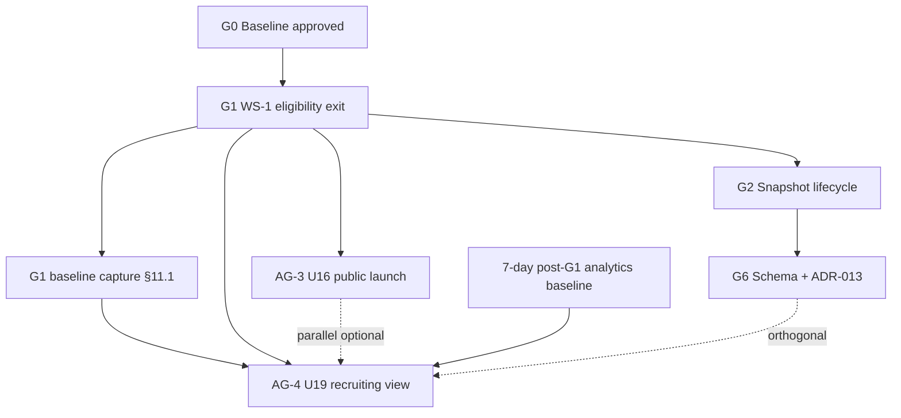

# AG-4 Recruiting View Implementation Plan

**Status:** Implementation-ready planning specification  
**Version:** 2.0 (Rev 2)  
**Effective:** 2026-06-16  
**Gate:** AG-4 — U19 class-year recruiting view  
**Authority:** Supersedes AG-4 v1.0; incorporates AG-4 Readiness Audit findings (RC-1, RC-2, RC-4, RC-5, RC-7); aligns with `G1_ELIGIBILITY_IMPLEMENTATION_PLAN.md` (G1 exit = RANKED-only `getPublicBoardRows`) and `AGE_GROUP_BOARD_EXPANSION_PLAN.md` (drift resolved per Expansion Plan Amendments appendix)  
**Scope:** Planning only — no code, migrations, recomputes, merges, snapshot publishes, or public launches without explicit approval

---

## Document Control

### Version history

| Version | Date | Author | Summary |
|---|---|---|---|
| 1.0 | 2026-06-16 | Rankings architect | Initial AG-4 recruiting view specification |
| **2.0 (Rev 2)** | **2026-06-16** | **Rankings architect** | **Readiness audit incorporations; RANKED-only public board contract (RC-1); post-G1 QA baselines (RC-2); U19 National Rank labeling (RC-4); alternate-sort behavior (RC-5); analytics hard gate (RC-7); expansion-plan drift resolution; validation framework §11; launch criteria L1–L12** |

### Rev 2 changelog (audit-driven)

| Audit ID | Decision | Rev 2 action |
|---|---|---|
| **RC-1** | Option A — RANKED-only public board contract | **LOCKED.** `getPublicBoardRows` returns `verdict === RANKED && publicRankAllowed` only (post-G1). PROVISIONAL / HIDDEN / FORMER never enter AG-4 filter input. §1, §4 rewritten. |
| **RC-2** | Rebase QA baselines to post-G1 | **LOCKED.** All regression anchors, Q1–Q10, rollback verification reference **post-G1 board state**, never pre-G1. Baseline capture procedure at G1 exit documented in §11. |
| **RC-4** | U19 National Rank labeling | **LOCKED.** When `class ≠ all`, rank column header reads "U19 National Rank" (gender-specific variant). Helper text clarifies full-board rank semantics. §7.4. |
| **RC-5** | Alternate sorts with class filter active | **LOCKED.** Default sort = national rank (subset monotonic). Non-rank sorts allowed with persistent banner. Rank column numbers remain national. §7.5. |
| **RC-7** | Analytics baseline → hard launch gate | **LOCKED.** Minimum 7-day post-G1, pre-AG-4 analytics baseline required. All AG-4 events include `boardSize`, `filterClassYear`, `g1PolicyVersion`. S4 promoted to hard gate L11. §8. |
| **Drift-1** | Search class-year facet | MVP = meta display only; facet/filter **deferred to AG-4.1**. §5. |
| **Drift-2** | Chip default | Default = `All` on first visit; smart default deferred to AG-4.1. §7.2. |
| **Drift-3** | Graduated player toggle | **Post-MVP (AG-4.1).** MVP excludes FORMER via G1 only. §7.4. |
| **Drift-4** | Expansion plan relationship | Expansion Plan Amendments appendix documents what Rev 2 supersedes in expansion plan §5.1–5.2. |

### Assumptions (updated)

| Assumption | Value |
|---|---|
| G1 eligibility | **Approved** — WS-1 verdict engine (INV-04) is sole public eligibility authority |
| **Public board contract (post-G1)** | **`getPublicBoardRows` → `verdict === RANKED && publicRankAllowed` only** (RC-1 Option A) |
| Authoritative ranking structure | Age groups U13 / U16 / U19 only |
| Class year | **Derived filter** on U19 board — not a separate ranking computation |
| AG-4 definition | U19 class-year recruiting view after U16 launch (AG-3) **or parallel** |
| Current public board | U19 Boys and U19 Girls (`PUBLIC_LAUNCH_AGE_GROUP` in `public-rankings-coverage.ts`) |
| Class-year rule | Jan–Mar birth → `birthYear + 19`; Apr–Dec → `birthYear + 20` (`ranking-eligibility.ts`) |
| Graduation exclusion | Eligible through May 31 of class year; excluded from June 1 (`isRankingEligibleByClassYear`; U19 path in `getCurrentRankingAgeBracket`) → `FORMER` verdict post-G1 |
| WS-1 verdicts | `RANKED` \| `PROVISIONAL` \| `HIDDEN` \| `FORMER`; only **RANKED** with `publicRankAllowed` on public board |
| DOB coverage | 85 / 216 players (~39%) with `birthDate` |
| Snapshots | Keyed by `ageGroup`; ADR-013 row provenance at G6 — **class year NOT stored as a snapshot dimension** |
| **QA regression anchor** | **Post-G1 board state** captured at G1 exit (RC-2) |

### Related artifacts

| Artifact | Role |
|---|---|
| `docs/planning/AGE_GROUP_BOARD_EXPANSION_PLAN.md` | AG-4 gate definition, class-year architecture (§3), recruiting UX (§5) — **amended for AG-4 scope per appendix** |
| `docs/planning/G1_ELIGIBILITY_IMPLEMENTATION_PLAN.md` | Verdict engine, `classYearStatus`, graduation → `FORMER`; G1 exit = RANKED-only `getPublicBoardRows` |
| `docs/ranking-age-context.md` | Locked class-year and progression policy |
| `docs/planning/g6-schema-delta.md` | Snapshot row `classYearStatus` (audit only; not filter storage) |
| `src/lib/ranking-eligibility.ts` | Pure class-year and bracket helpers |
| `src/lib/public-board-ranks.ts` | `getPublicBoardRows` — **post-G1: RANKED + `publicRankAllowed` only** |
| `src/lib/rankings-url-state.ts` | Rankings URL state parser/builder |
| `src/lib/public-search.ts` | Public search rank lookup |
| `src/app/rankings/RankingsClient.tsx` | Rankings UI and client-side filters |

### AG-4 scope boundary

| In scope | Out of scope |
|---|---|
| U19 class-year filter UX and URL state | U16/U13 class-year chips at launch |
| Read-time filter on live U19 **RANKED** board rows | New `PlayerRating` or `RankingSnapshot` types per class year |
| `effectiveClassYear` on board row assembly (display/filter) | Schema migrations (unless G6 already adds unrelated fields) |
| Search subtitle/meta class-year context (display only) | Class-year search facet/filter (AG-4.1) |
| Copy, analytics, validation, rollback | College commitment indicators, premium-gated columns |
| Subset-monotonic rank display (rank sort) | Re-ranking within class-year subset |
| U19 National Rank labeling when class filter active | "Show graduated" toggle (AG-4.1) |
| Alternate-sort banner when class filter active | Smart chip default / A/B test (AG-4.1) |

---

## Executive Summary

AG-4 delivers a **recruiting lens** on the existing U19 national board: coaches and recruiters filter by graduation class (`Class of 2027`, etc.) while **preserving national rank order** (under default rank sort) and **national rank numbers** from the full U19 RANKED board. Class year is computed from `Player.birthDate` and `Player.classYearOverride` via existing helpers in `ranking-eligibility.ts`; it does not create new rating rows or snapshot lineages.

**Rev 2 contract (RC-1):** After G1 exit, `getPublicBoardRows` returns **only** players with `verdict === RANKED && publicRankAllowed`. PROVISIONAL, HIDDEN, and FORMER players **never** reach the AG-4 filter pipeline. Unknown-class players without DOB are **not on the public board** unless they have `classYearOverride` (RANKED with known `effectiveClassYear`). The `includeUnknownClass` toggle applies only to rare RANKED rows where `effectiveClassYear === null`.

The filter is a **presentation layer** applied after WS-1 eligibility. Graduated players are excluded by eligibility (`FORMER`) before the class filter runs. All QA regression anchors, rollback verification, and launch gates reference **post-G1 board state** (RC-2).

**Recommended sequence:** G1 exit + baseline capture → AG-4 data/filter module → URL state + RankingsClient chips → search/copy/analytics → validation → 7-day analytics baseline → product sign-off → feature-flag launch. AG-3 (U16 public launch) may proceed in parallel; AG-4 does not depend on U16 being live.

---

## 1. Filter Architecture

### 1.1 Layering model (post-G1 / RC-1)

```
┌──────────────────────────────────────────────────────────────────┐
│  Authoritative layer (unchanged)                                 │
│  PlayerRating(ageGroup=U19) + formula v1 GPS                     │
│  Rank order: adjustedRating DESC, verifiedGameCount DESC, name   │
└────────────────────────────┬─────────────────────────────────────┘
                             │
┌────────────────────────────▼─────────────────────────────────────┐
│  Eligibility layer (G1 / WS-1) — RC-1 Option A LOCKED            │
│  getPublicBoardRows(snapshot)                                    │
│    → verdict === RANKED && publicRankAllowed === true ONLY       │
│  PROVISIONAL / HIDDEN / FORMER: EXCLUDED — never downstream      │
│  Graduation → FORMER (excluded before any AG-4 logic)            │
└────────────────────────────┬─────────────────────────────────────┘
                             │
┌────────────────────────────▼─────────────────────────────────────┐
│  Existing client filters (unchanged semantics)                     │
│  region, position, minGames slider, local search query           │
└────────────────────────────┬─────────────────────────────────────┘
                             │
┌────────────────────────────▼─────────────────────────────────────┐
│  AG-4 class-year filter (new)                                    │
│  Input: RANKED rows only from getPublicBoardRows                 │
│  Match: row.effectiveClassYear === classYear                     │
│  Unknown: effectiveClassYear === null → excluded unless toggle   │
│  Output: subset; rank # from full-board boardRank map            │
└──────────────────────────────────────────────────────────────────┘
```

**Critical invariant:** AG-4 filter input is always a subset of the post-G1 RANKED public board. No PROVISIONAL badge paths, no below-threshold players, no unknown-DOB PROVISIONAL rows on the full board.

### 1.2 Design principles (locked)

| ID | Principle |
|---|---|
| **P-AG4-1** | Filter **narrows** U19 RANKED board rows; never recomputes rating or re-orders by a class-local score |
| **P-AG4-2** | **Subset monotonic (rank sort):** if player A ranks above B on the full U19 public board and both pass the class filter, A displays above B with `boardRank(A) < boardRank(B)` when `sortKey === "rank"` |
| **P-AG4-3** | Display rank uses `boardRankByPlayerId` from the **full** `getPublicBoardRows` output (computed **before** class filter), not a re-numbered class-local rank |
| **P-AG4-4** | Class-year filter applies **only** when `ageGroup === "U19"`; ignored (stripped from URL) for U13/U16 |
| **P-AG4-5** | No new `PlayerRating` or `RankingSnapshot` keyed by class year |
| **P-AG4-6** | Eligibility rules (threshold, graduation, DOB) are **not** relaxed by class filter |
| **P-AG4-7 (RC-1)** | `getPublicBoardRows` contract: **RANKED + `publicRankAllowed` only**; AG-4 never branches on PROVISIONAL/HIDDEN/FORMER |
| **P-AG4-8 (RC-4)** | When `class ≠ all`, rank column labeled **U19 National Rank**; numbers reflect full national board |
| **P-AG4-9 (RC-5)** | Non-rank sorts may reorder display but rank column values remain national; banner required when class filter active |

### 1.3 Target module layout

| Module | Responsibility |
|---|---|
| `src/lib/ranking-eligibility.ts` | **Retain** — `getClassYear`, `getEffectiveClassYear`, `isRankingEligibleByClassYear`, `formatClassYear` (pure helpers) |
| `src/lib/recruiting-class-filter.ts` *(new)* | `applyClassYearFilter(rows, options)`, `getRecruitingClassYearOptions(rows)`, validation helpers |
| `src/lib/rankings.ts` | Attach `effectiveClassYear` (and `classYearLabel`) on `NationalRankingRow` at assembly |
| `src/lib/public-board-ranks.ts` | **RANKED-only filter** — `verdict === RANKED && publicRankAllowed`; **no class filter** |
| `src/lib/rankings-url-state.ts` | Parse/serialize `class` query param |
| `src/app/rankings/RankingsClient.tsx` | Chips UI, filter wiring, sort banner, national-rank labeling |

### 1.4 Filter function contract (planning)

```typescript
// Planning contract — not implementation
type ClassYearFilterOptions = {
  classYear: number | "all";
  includeUnknownClass: boolean; // default false
};

function applyClassYearFilter(
  rows: NationalRankingRow[], // precondition: all rows are RANKED + publicRankAllowed
  options: ClassYearFilterOptions
): NationalRankingRow[];
```

**Rules:**

1. If `classYear === "all"` → return `rows` unchanged (eligibility already applied).
2. If `classYear` is a number → keep rows where `row.effectiveClassYear === classYear`.
3. If `includeUnknownClass === true` → also keep RANKED rows where `effectiveClassYear === null`.
4. Never sort inside `applyClassYearFilter`; caller preserves sort order.
5. **Precondition:** Input rows are exclusively from `getPublicBoardRows` post-G1 (RANKED only).

### 1.5 WS-1 verdict interaction (post-G1 / RC-1 LOCKED)

| Verdict | In `getPublicBoardRows`? | Reaches AG-4 filter? | Notes |
|---|---|---|---|
| `RANKED` + `publicRankAllowed` | **Yes** | **Yes** | Sole AG-4 input population |
| `RANKED` + `publicRankAllowed` + `effectiveClassYear === null` | Yes | Yes; excluded from specific class chips unless `includeUnknownClass` | Rare: override cleared + no DOB should not be RANKED — see §4.3 |
| `RANKED` + `classYearOverride` without DOB | Yes | Yes; `effectiveClassYear` from override | Appears in matching class chip |
| `PROVISIONAL` | **No** | **Never** | Below threshold, unknown DOB, override cross-bracket — not on public board |
| `HIDDEN` | **No** | **Never** | Out of bracket, untrusted unknown DOB, zero games |
| `FORMER` | **No** | **Never** | Graduated; no "Show graduated" toggle at MVP |

**Removed from v1:** Any language implying PROVISIONAL players appear on the full U19 board or in class-year filter paths.

### 1.6 URL / state model

| State | Example URL | Behavior |
|---|---|---|
| Default U19 board | `/rankings?gender=Boys` or `/rankings?age=U19&gender=Boys` | All RANKED U19 rows; no class filter; chip `All` selected |
| Recruiting view | `/rankings?age=U19&gender=Boys&class=2027` | U19 Boys subset, class of 2027 |
| Invalid class on U16 | `/rankings?age=U16&class=2027` | Strip `class` on navigation; U16 standard board |
| Unknown-class toggle | `&includeUnknownClass=1` | Optional; off by default; only affects RANKED rows with `effectiveClassYear === null` |

Extend `RankingsUrlState`:

```typescript
type RankingsUrlState = {
  // existing fields…
  classYear: number | "all";
  includeUnknownClass: boolean;
};
```

**Defaults (Drift-2 LOCKED):** `classYear: "all"`, `includeUnknownClass: false`. Omit `class` from `buildRankingsSearchParams` when `"all"`. First visit always shows full U19 board — no smart default to current recruiting class at MVP.

---

## 2. Data Requirements

### 2.1 Source fields (existing schema)

| Field | Model | Role in AG-4 |
|---|---|---|
| `birthDate` | `Player` | Primary input to `getClassYear` |
| `classYearOverride` | `Player` | Overrides calculated class year; already loaded in `getLatestSnapshot` |
| `ageGroupOverride` | `Player` | Eligibility input to WS-1; does not change class-year math |
| `gender` | `Player` | Board gender scope |
| `verifiedGameCount`, `adjustedRating` | `PlayerRating` | Unchanged; filter does not alter |
| `eligibilityVerdict` | Attached at assembly (G1) | `getPublicBoardRows` filter source |

**No schema migration required for AG-4 MVP.**

### 2.2 Row assembly extension

`NationalRankingRow` today includes `birthYear`, `age`, `computedAgeBracket` but **not** `effectiveClassYear`. AG-4 adds at assembly time in `rankings.ts` → `getLatestNationalRankings`:

| New field | Type | Source |
|---|---|---|
| `effectiveClassYear` | `number \| null` | `getEffectiveClassYear(birthDate, classYearOverride)` |
| `classYearLabel` | `string \| null` | `effectiveClassYear ? \`Class of ${effectiveClassYear}\` : null` |

Already-selected player fields in `getLatestSnapshot` include `classYearOverride` — no extra DB round-trip.

### 2.3 Coverage expectations

| Metric | Current | AG-4 launch target | Post-launch target |
|---|---|---:|---:|
| `birthDate` among U19-rated players | ~39% overall pool | ≥ 40% U19 pool | ≥ 55% (12 months) |
| U19 **RANKED** rows with computable class year | TBD (dry-run audit) | ≥ 35% of **public** U19 board rows | ≥ 50% |
| `classYearOverride` rate | Small; admin-set | 100% with audit reason in admin | Maintain < 5% of U19 pool |
| RANKED rows with `effectiveClassYear === null` | TBD at G1 exit | Document in baseline; expect low post-G1 | Trend down via DOB entry |

**Pre-launch dry-run (requires approval for DB read script only):** Count U19 `getPublicBoardRows` RANKED rows by `effectiveClassYear` bucket; identify top chips and empty buckets. **Baseline captured at G1 exit, not pre-G1.**

### 2.4 Data quality gates

| Check | Method | Gate |
|---|---|---|
| Override audit | Admin export: all `classYearOverride` with reason | Before launch |
| Class vs DOB consistency | Sample 20 overrides vs `getClassYear(birthDate)` | Before launch |
| Graduation parity | `FORMER` verdict players absent from public board | G1 regression + AG-4 QA |
| RANKED-only board | No PROVISIONAL/HIDDEN/FORMER in `getPublicBoardRows` output | G1 exit + AG-4 W8 |
| No duplicate rank rows | Existing PYBC/UAAP identity QA | Unchanged |

### 2.5 Admin data entry (supporting)

No new admin fields. Reinforce existing `PlayerManagementClient` / program roster flows:

- DOB entry increases class-year chip utility and reduces null-class RANKED edge cases.
- `classYearOverride` only when calculated class year is wrong; cleared when matches calculated (existing `actions.ts` behavior).

---

## 3. Graduation-Year Derivation

### 3.1 Locked calculation (production)

From `ranking-eligibility.ts` and `docs/ranking-age-context.md`:

| Birth month | Formula | Example (born 2008) |
|---|---|---|
| January–March | `classYear = birthYear + 19` | Mar 2008 → Class of 2027 |
| April–December | `classYear = birthYear + 20` | Apr 2008 → Class of 2028 |

**Effective class year:** `classYearOverride ?? getClassYear(birthDate)`.

### 3.2 Graduation eligibility (U19 path only)

`isRankingEligibleByClassYear(birthDate, asOfDate, classYearOverride)`:

- `classYear === null` → **eligible** for class-year graduation rule (unknown class does not auto-graduate via P2).
- Exclusion starts `Date.UTC(classYear, 5, 1)` (June 1 of class year).
- Player eligible through **May 31** of class year.

Integrated in `getCurrentRankingAgeBracket` when `appliesToU19` → returns `OUT_OF_RANGE` when class-year ineligible → WS-1 maps to `FORMER` (P2).

### 3.3 WS-1 mapping (post-G1)

| Condition | Verdict | AG-4 effect |
|---|---|---|
| Class year past June 1 exclusion (U19) | `FORMER` (P2) | Excluded before class filter; **no graduated toggle at MVP** |
| `computedAgeBracket === OUT_OF_RANGE` with verified DOB | `HIDDEN` (P3) | Excluded |
| Unknown class year, past conservative graduation window | `FORMER` (P4) | Excluded |
| Below launch threshold | `PROVISIONAL` (P7) | **Not on public board** — excluded at `getPublicBoardRows` |
| Unknown DOB, below trust | `HIDDEN` (P11) | Not on public board |
| Unknown DOB, sufficient trust, qualified | `PROVISIONAL` (P12) | **Not on public board** post-G1 |
| Active U19, qualified, known class | `RANKED` | Eligible for class filter match |
| Override-only class year, qualified | `RANKED` | `effectiveClassYear` from override |

### 3.4 Recruiting chip year list (dynamic)

Derive chip options from **RANKED row distribution + season anchor**:

1. Compute `effectiveClassYear` for all U19 `getPublicBoardRows` rows (both genders).
2. Collect years with count ≥ configurable minimum (e.g. ≥ 3 players per gender combined, or ≥ 5 total).
3. Highlight years in current recruiting window (current class year through current + 2) when they have ≥ 1 RANKED player — informational styling only; **default chip remains `All`**.
4. Render chips: `All` + `Class of YYYY` for each year in sorted set.
5. Cap at 6 chips + overflow "More…" if needed (product decision).

**June rollover:** After June 1, graduating class drops from eligibility (`FORMER`), not merely from chips — chip list regenerates from remaining RANKED pool.

**AG-4.1 deferred:** Smart default pre-selecting current + next 2 recruiting classes with A/B test per analytics §8.1.

### 3.5 Display vs filter

| Context | Show class year |
|---|---|
| Full U19 board (`class=all`) | Athlete subline: `classYearLabel` when known; omit or "Class pending" only if RANKED with null effective year |
| Class-filtered view | Prominent — chip selected + subline or badge |
| Player profile | Already via `player-profile.ts` (`formatClassYear` / override) |
| Team roster | Existing `TeamRosterTable` class column |

---

## 4. Unknown-Class Handling (rewritten per RC-1)

### 4.1 Definition

**Unknown class** = `getEffectiveClassYear(birthDate, classYearOverride) === null` (no DOB and no override).

Post-G1, unknown-class players are **generally not on the public U19 board** because unknown DOB without sufficient trust yields `HIDDEN` or `PROVISIONAL`, both excluded by RANKED-only `getPublicBoardRows`.

### 4.2 Who can be RANKED with unknown class year?

| Scenario | Verdict | On public board? | In class chip `2027`? |
|---|---|---|---|
| No DOB, no override, below trust | `HIDDEN` or `PROVISIONAL` | **No** | N/A |
| No DOB, no override, qualified + trusted | `PROVISIONAL` (P12) | **No** post-G1 | N/A |
| No DOB, `classYearOverride` set, qualified | `RANKED` (if P15/other rules pass) | **Yes** | **Yes** if override matches |
| DOB present, class computable | `RANKED` (if qualified) | Yes | Yes if year matches |
| RANKED, override cleared, DOB still null | `RANKED` with `effectiveClassYear === null` | Yes (edge case) | Excluded unless `includeUnknownClass=1` |

**Edge case (document):** A player could theoretically remain RANKED with `effectiveClassYear === null` if they have verified DOB missing but `ageGroupOverride` and rating basis align such that WS-1 returns RANKED without class-year derivation — or if override was cleared mid-session. This population should be **near zero**; measure at G1 exit baseline.

### 4.3 Behavior matrix (post-G1)

| Surface | RANKED + known `effectiveClassYear` | RANKED + `effectiveClassYear === null` | PROVISIONAL / HIDDEN / FORMER |
|---|---|---|---|
| Full U19 board (`class=all`) | Visible with national rank | Visible if on board; subline "Class pending" | **Not on board** |
| Class chip `2027` | Included if year matches | **Excluded** (default) | Not on board |
| `includeUnknownClass=1` + `class=2027` | Included if year matches | **Included** (toggle adds null-class RANKED rows to filtered view) | Not on board |
| Search | In results if RANKED on board; meta shows class or "Class pending" | Meta: "Class pending" | Not in public search rank lookup |
| Profile | Class year from player record | Prompt DOB completion | No public rank (below board) |

### 4.4 `includeUnknownClass` toggle scope (RC-1)

- Applies **only** when a specific class year is selected (`class ≠ all`).
- Adds RANKED rows where `effectiveClassYear === null` to the filtered set **in addition to** class-year matches when enabled.
- Does **not** surface PROVISIONAL, HIDDEN, or FORMER players.
- Default: **off**.

**Product copy:** "Include players without class year on file" — not "include provisional players."

### 4.5 Copy requirements

| Message | Placement |
|---|---|
| "Class year is estimated from date of birth when available." | Recruiting helper text |
| "Players without a class year on file are excluded from class filters unless you include them." | Filter tooltip / empty state |
| "Rank numbers reflect the full U19 national board, not rank within graduation class." | Footer / How We Rank; **required when `class ≠ all`** (RC-4) |
| "Sorted by [field]. National rank order shown in rank column." | Banner when non-rank sort + class filter active (RC-5) |

### 4.6 Empty-state rules

When `class=2027` yields zero rows:

1. Distinguish **no RANKED players in class** vs **filter too narrow** (min games slider).
2. Suggest: clear class filter, lower min games, enable `includeUnknownClass`, or view full U19 board.
3. Do not imply rating or eligibility failure.
4. Do not suggest graduated players are hidden by toggle — they are excluded by eligibility.

---

## 5. Search / Index Impacts

### 5.1 Current state

`public-search.ts`:

- Loads `getLatestNationalRankings` + `getPublicBoardRows` for rank lookup.
- Player query: name, city, region, position, program — **no class-year facet**.
- Does not select `birthDate` or `classYearOverride` in player search query.

### 5.2 Planned changes (read-path only — MVP)

| Change | Detail |
|---|---|
| Select `birthDate`, `classYearOverride` | In `searchPlayers` prisma select |
| Compute `effectiveClassYear` | Use `getEffectiveClassYear` server-side |
| Meta line | Append `Class of YYYY` when known; **"Class pending"** when null |
| Rank label (RC-4) | When linking from class-filtered context or showing U19 rank: **"U19 National Rank #N"** (gender-specific) |
| Deep link from search | Rankings link may include `?class=YYYY` when class known |

### 5.3 Search facet deferral (Drift-1 LOCKED)

| Capability | MVP (AG-4) | AG-4.1 |
|---|---|---|
| Class year in result meta | **Yes** | Yes |
| `class:2027` query facet / filter | **No — deferred** | Evaluate after DOB coverage ≥ 50% RANKED |
| Site-wide class search | **No** | Product backlog |

**Rationale:** Facet without RANKED-only clarity and low DOB coverage risks confusing results (players not on board appearing in facet). Meta display is sufficient for MVP recruiting context.

### 5.4 Rank lookup consistency (INV-01)

Search rank label must reflect **full U19 RANKED public board rank**, not class-filtered rank:

- `getPublicRankLookup` unchanged in rank semantics.
- Display: **"#12 U19 Boys National Rank"** when product shows rank in recruiting context (RC-4).

### 5.5 Index / performance

| Concern | Mitigation |
|---|---|
| Extra fields in search select | Negligible — 6 results cap |
| No new DB indexes required | Class year derived in application layer |
| CDN / ISR | Class param increases cache cardinality — use `searchParams` cache policy consistent with existing rankings routes |

---

## 6. Snapshot Impacts

### 6.1 Principle

**No class-year dimension on `RankingSnapshot` or `RankingSnapshotRow`.** Snapshots remain keyed by `ageGroup` (U13/U16/U19) per ADR-001 / WS-2.

Class-year filter is applied at **read time** on live board assembly (same as region/position filters today).

### 6.2 Live board vs historical snapshot

| Data source | Class-year filter | Rank numbers |
|---|---|---|
| Live `PlayerRating` via `getLatestNationalRankings` | **Yes** — AG-4 scope | Full U19 RANKED board ranks |
| Published `RankingSnapshotRow` (profile trend) | **No** at AG-4 MVP | Historical snapshot rank frozen |
| Homepage leaders (`public-site-data.ts`) | **No** — remain full U19 | Unchanged |

### 6.3 G6 / ADR-013 interaction

G6 adds to snapshot rows (audit provenance, not filter storage):

- `classYearStatus` — eligibility enum at freeze time
- `verdict`, `gamesQualified`, etc.

AG-4 **does not** require G6 for launch on live board. When G6 lands:

- Live filter still uses `getEffectiveClassYear` from current `Player` fields.
- Snapshot replay for audits uses frozen `classYearStatus` + `verdict`; class-year **display** on historical months may use player `birthDate` at read time (immutable) for consistency.

### 6.4 Snapshot publish scripts

`generate-ranking-snapshots-v1.ts` / U16 variant:

- **No change required** for AG-4.
- Continue excluding graduated players via WS-1 at publish (G2 unifies).
- Class-year filter does not affect row counts at publish.

### 6.5 Trend charts (player profile)

`player-profile.ts` reads snapshot history by `ageGroup`. AG-4 does not add class-year trend lines. Profile may show text class year from live player record alongside U19 national rank.

---

## 7. UX Behavior

### 7.1 Entry points

| Entry | Behavior |
|---|---|
| Rankings page, U19 selected | Show class-year chip row below age-group pills |
| Direct URL `?class=2027` | Open U19 with chip pre-selected |
| U13/U16 selected | Hide chips; strip `class` from URL on age change |
| Homepage / nav | No change at MVP |

### 7.2 Class-year chips (U19 only)

| Chip | Action |
|---|---|
| `All` | `classYear: "all"` — full U19 RANKED board |
| `Class of 2026` … | Filter to matching `effectiveClassYear` |
| Active chip | Distinct visual state (match `AgeGroupPill` / gender toggle patterns) |

**Default (Drift-2 LOCKED):** `All` on first visit. No smart default to current recruiting class at MVP. Smart default (current + next 2 classes) deferred to **AG-4.1** with A/B test per §8.1.

### 7.3 RankingsClient filter pipeline (target order)

1. `publicBoardRows` = `getPublicBoardRows(selectedSnapshot)` — **RANKED only**
2. `boardRankByPlayerId` from full `publicBoardRows` (**before** class filter)
3. `applyClassYearFilter(publicBoardRows, classOptions)`
4. Existing: region, position, query, minGames
5. Sort: see §7.5

### 7.4 Table / row presentation

| Element | MVP | Deferred (AG-4.1) |
|---|---|---|
| National rank # | Always **full-board** rank from `boardRankByPlayerId` | — |
| Rank column header | **"Rank"** when `class=all`; **"U19 National Rank"** (or "U19 Boys National Rank") when `class ≠ all` (RC-4) | — |
| Athlete subline | `classYearLabel` when U19; "Class pending" if RANKED + null effective year | Dedicated Class column |
| Graduated players | **Not on board** (`FORMER` via G1) | "Show graduated" toggle |
| PROVISIONAL badge on board | **N/A post-G1** — not on RANKED board | — |

### 7.5 Sort behavior with class filter (RC-5 LOCKED)

**Chosen approach:** Banner + keep alternate sorts (do **not** disable sorts when class filter active).

| `sortKey` | `class=all` | `class ≠ all` |
|---|---|---|
| `rank` (default) | Full-board order; subset monotonic if other filters applied | **Subset monotonic** — filtered rows preserve national rank order |
| `rating`, `height`, `position`, `athlete` | Reorders display; rank column still national numbers | Reorders display; **display order may break subset monotonicity**; rank column numbers **remain national** |

**Banner (required when `class ≠ all` AND `sortKey !== "rank"`):**

> Sorted by [Rating | Height | Position | Name]. National rank order shown in rank column.

- Persistent (visible above table until sort returns to rank or class cleared).
- `aria-live="polite"` announcement on sort change.
- Helper text under banner reiterates RC-4 national-rank semantics.

**Tie-break:** All non-rank sorts use `boardRank` as secondary key (existing `RankingsClient` pattern) so equal primary values remain deterministic.

### 7.6 Mobile

- Chips horizontally scrollable (`flex overflow-x-auto`).
- Filter bar collapse: class chips remain visible when U19 selected.
- Sort banner stacks above table; does not obscure chip row.
- Touch targets ≥ 44px.

### 7.7 Accessibility

- Chips as `role="tablist"` / `aria-selected` or toggle buttons with `aria-pressed`.
- Announce filter result count: "Showing 24 players, Class of 2027".
- Unknown-class toggle: explicit label, not icon-only.
- Rank column header change announced when class filter applied.

### 7.8 Copy and trust (`public-rankings-coverage.ts`)

Extend coverage copy:

- "Recruiting view filters the U19 national board by graduation class. Rank order and rank numbers reflect the **full U19 national board**, not rank within class."
- When class filter active: "U19 National Rank shows where each player ranks on the complete U19 board."
- Link to How We Rank / `ranking-age-context.md` summary.

### 7.9 Non-goals (MVP)

- Class-year chips on U16/U13
- Separate `/recruiting` route (use query param on `/rankings`)
- Re-ranked "#1 in Class of 2027" local ranks
- Premium columns
- "Show graduated" toggle (AG-4.1)
- Class-year search facet (AG-4.1)
- Smart chip default (AG-4.1)

---

## 8. Analytics (RC-7 hard gates)

### 8.1 Event taxonomy (planning)

**Required payload fields on all AG-4 events (RC-7):**

| Field | Type | Description |
|---|---|---|
| `boardSize` | number | Count of RANKED rows on full U19 board for gender |
| `filterClassYear` | number \| `"all"` | Active class filter |
| `g1PolicyVersion` | string | Launch-policy stub id (e.g. `launch-v1`) |

| Event | Additional payload | Purpose |
|---|---|---|
| `rankings_class_filter_select` | `{ resultCount, gender, ageGroup }` + required | Adoption |
| `rankings_class_filter_clear` | `{ priorClassYear }` + required | Drop-off |
| `rankings_include_unknown_class_toggle` | `{ enabled, classYear }` + required | Unknown-class policy |
| `rankings_recruiting_empty_state` | `{ classYear, minGames }` + required | Data gaps |
| `rankings_profile_click_from_class_view` | `{ rank, playerId }` + required | Funnel |
| `rankings_class_view_sort_change` | `{ sortKey, classYear }` + required | RC-5 monitoring |
| `rankings_class_view_sort_banner_impression` | `{ sortKey, classYear }` + required | RC-5 comprehension |

### 8.2 Pre-launch analytics baseline (RC-7 HARD GATE)

Before production flag enable:

1. **G1 must be live** in production ≥ 7 days.
2. Capture **7-day rolling baseline** of U19 sessions, bounce rate, profile CTR — **without** AG-4 class filter (post-G1 board only).
3. Store baseline metrics in launch runbook (values + date range).
4. AG-4 staging events verified 100% taxonomy with required fields — promotes **S4 → L11**.

### 8.3 Success metrics (90 days post-launch)

| Metric | Target |
|---|---|
| Recruiting filter adoption | ≥ 15% of U19 sessions use `class≠all` |
| Top 3 class chips | ≥ 80% of filter sessions |
| Bounce rate on class-filtered views | ≤ post-G1 U19 baseline + 10% |
| Support tickets: "wrong class" / "missing player" | < 5 unique |
| Sort-banner comprehension (optional survey) | ≥ 70% understand national rank column |

### 8.4 Integrity monitoring

| Metric | Alert |
|---|---|
| RANKED rows with `effectiveClassYear === null` | Week-over-week spike > 10% |
| Class bucket count = 0 for a visible chip year | Pre-launch blocker |
| `classYearOverride` without DOB | Admin audit weekly |
| `boardSize` in events diverges from `getPublicBoardRows` count | Engineering alert |

### 8.5 Implementation note

Use existing analytics patterns. **No PII** in event payloads beyond `playerId` on click events (hash if required by policy).

---

## 9. Rollback Strategy

### 9.1 Feature flag

| Flag | Location (planned) | Default |
|---|---|---|
| `RECRUITING_CLASS_FILTER_ENABLED` | Env or `public-rankings-coverage.ts` constant | `false` until launch |

When `false`:

- Hide class-year chips and sort banner.
- Ignore `class` and `includeUnknownClass` URL params (strip on parse).
- `applyClassYearFilter` not called.
- Rank column header reverts to generic "Rank".

### 9.2 Rollback triggers

| Trigger | Action |
|---|---|
| Subset monotonic violation (rank sort + class filter) | Disable flag; hotfix filter module |
| Rank display regression (profile ≠ board) | Disable flag; G1 path audit |
| Mass incorrect class buckets (override incident) | Disable flag; admin override review |
| Critical accessibility blocker | Hide chips; retain URL ignore |
| Analytics `boardSize` systematic mismatch | Disable flag; investigate assembly |

### 9.3 Rollback steps

1. Set `RECRUITING_CLASS_FILTER_ENABLED=false`.
2. Deploy (no DB rollback — no schema change).
3. Verify `/rankings` U19 identical to **post-G1, pre-AG-4** behavior (RC-2).
4. Verify search meta reverts if class appended.
5. Post-mortem; fix forward.

### 9.4 Partial rollback

- **UI-only rollback:** flag off, keep `effectiveClassYear` on rows (harmless).
- **URL compatibility:** Old shared links with `?class=2027` safely ignored when flag off.

### 9.5 G1 coordination appendix

| Scenario | AG-4 action |
|---|---|
| G1 rollback (`WS1_VERDICT_ENGINE=false`) | **Disable AG-4 flag** — recruiting view depends on RANKED-only contract |
| G1 forward fix (verdict tweak) | Re-capture post-G1 baseline; re-run V-AG4-1 subset monotonic |
| G1 + AG-4 joint display spec (L12) | Single signed doc: rank column semantics, PROVISIONAL off-board, national rank labeling |

Align with `docs/planning/rollback-playbooks-outline.md` display-path rollback pattern.

---

## 10. Launch Criteria

### 10.1 Hard gates (all required — L1–L12)

| # | Criterion | Evidence |
|---|---|---|
| **L1** | **G1 exit complete** — `getPublicBoardRows` uses `verdict === RANKED && publicRankAllowed` | G1 exit audit signed |
| **L2** | Subset monotonic validation passes (V-AG4-1) under **rank sort** + class filter | Automated test + manual sample |
| **L3** | `class=2027` manual count matches admin export of RANKED rows | Dry-run script output |
| **L4** | Graduated / `FORMER` players absent from full U19 board | G1 + AG-4 QA; **no graduated toggle at MVP** |
| **L5** | URL deep links restore filter state | Manual QA matrix Q9 |
| **L6** | U16/U13: class param stripped; chips hidden | Manual QA Q5 |
| **L7** | Typecheck clean (`npx.cmd tsc --noEmit`) | CI |
| **L8** | Copy approved — U19 National Rank labeling, national-board authority | Product sign-off |
| **L9** | Rollback flag tested in staging; verifies **post-G1** baseline | Engineering sign-off |
| **L10** | No new `PlayerRating` / snapshot types | Architecture review |
| **L11 (RC-7)** | **7-day post-G1 analytics baseline captured**; all AG-4 events fire in staging with `boardSize`, `filterClassYear`, `g1PolicyVersion` | Analytics report |
| **L12 (RC-1)** | **RC-1 contract signed** in G1+AG-4 joint display spec (RANKED-only board, national rank semantics, PROVISIONAL off-board) | Rankings architect + product sign-off |

### 10.2 Soft gates (recommended)

| # | Criterion | Target | Notes |
|---|---|---|---|
| S1 | U19 RANKED rows with known class year | ≥ 35% | |
| S2 | Largest class bucket (e.g. 2027) | ≥ 10 players per gender combined | |
| S3 | Mobile chip scroll QA | No layout break 375px–1440px | |
| **W0** | AG-4-W0 distribution report complete | Signed or **waiver documented** | Promoted from implicit pre-work |

### 10.3 AG-3 relationship

AG-4 may launch **without** AG-3 (U16 public). If AG-3 launches first:

- Update `publicRankingsCoverageCopy` independently.
- Ensure age-group pill change clears class filter (existing reset pattern in `RankingsClient`).

### 10.4 Approval

| Role | Required |
|---|---|
| Product owner | Yes |
| Rankings architect | Yes |
| Engineering lead | Yes |
| Data integrity lead | Consulted |

**Explicit approval required** before enabling `RECRUITING_CLASS_FILTER_ENABLED` in production.

---

## 11. Validation Framework

### 11.1 G1 exit baseline capture procedure (RC-2)

Execute **at G1 exit**, before AG-4 development begins. Store artifacts in `docs/planning/audits/` (read-only).

| Artifact | Content |
|---|---|
| `ag4-baseline-u19-boys-ranked-count.json` | RANKED row count, `boardSize` |
| `ag4-baseline-u19-girls-ranked-count.json` | Same |
| `ag4-baseline-top10-boys.json` | Player IDs + ranks 1–10 |
| `ag4-baseline-top10-girls.json` | Same |
| `ag4-baseline-unknown-dob-ranked-set.json` | RANKED players with `effectiveClassYear === null` (expect near-empty) |
| `ag4-baseline-class-buckets.json` | Count per `effectiveClassYear` per gender |

**Rule:** All AG-4 QA compares against these artifacts, **not** pre-G1 board state.

### 11.2 Automated validation (V-AG4)

| ID | Check | Method | Gate |
|---|---|---|---|
| **V-AG4-1** | Subset monotonic (rank sort) | For each class year Y: ∀ A,B in filter(Y), if rank(A)<rank(B) on full board then display order preserves | **L2** |
| **V-AG4-2** | Class count parity | `applyClassYearFilter` count === manual SQL/export count for sample years | **L3** |
| **V-AG4-3** | RANKED-only input | Mock rows with PROVISIONAL mixed in → filter precondition rejects or `getPublicBoardRows` excludes | **L1/L12** |
| **V-AG4-4** | `boardRankByPlayerId` stability | Rank numbers unchanged when toggling class filter (same player) | Automated |
| **V-AG4-5** | URL round-trip | Parse/build `class`, `includeUnknownClass` | Unit test |
| **V-AG4-6** | Non-U19 strip | `age=U16&class=2027` → class stripped | Unit test |
| **V-AG4-7** | Unknown-class toggle | Only adds RANKED null-effective rows; never adds PROVISIONAL | Unit test |
| **V-AG4-8** | Sort banner logic | Banner visible iff `class≠all && sortKey≠rank` | Component test |
| **V-AG4-9** | Rank header labeling | Header text switches per RC-4 | Snapshot test |
| **V-AG4-10** | Analytics payload | All events include required RC-7 fields | Staging integration |

### 11.3 Manual QA matrix (Q1–Q10 — post-G1 baseline)

| # | Scenario | Expected |
|---|---|---|
| **Q1** | U19 Boys, `class=all` | **Same row set as post-G1 baseline** (G1 exit artifact); not pre-AG-4 or pre-G1 |
| **Q2** | `class=2027` | Subset of Q1; ranks match full-board `boardRankByPlayerId` positions |
| **Q3** | RANKED player, `effectiveClassYear === null` | On `all`; not on `2027` unless `includeUnknownClass=1` |
| **Q4** | Graduated / `FORMER` player | Not on any view; no toggle to reveal |
| **Q5** | Switch U19 → U16 | Class chips hidden; URL stripped |
| **Q6** | `minGames` + class filter | Both apply; rank numbers still national |
| **Q7** | Profile rank vs board rank | Match for same RANKED player (INV-01) |
| **Q8** | Invalid `class=abc` | Fallback `all` with toast |
| **Q9** | Share URL reload | State restored including `includeUnknownClass` |
| **Q10** | Feature flag off | Chips hidden; behavior identical to **post-G1, pre-AG-4** |
| **Q11** | `class=2027`, sort by rating | Banner shown; rank column shows national numbers, not 1..N |
| **Q12** | `class=2027` | Rank column header reads "U19 National Rank" (or gender variant) |
| **Q13** | PROVISIONAL player (below threshold) | Not on board; not discoverable via class filter |
| **Q14** | Search result for RANKED player | Meta shows `Class of YYYY` or "Class pending"; rank labeled national |

### 11.4 Rollback verification (post-G1 anchor)

After rollback drill (L9):

- [ ] U19 Boys/Girls row counts match post-G1 baseline artifacts
- [ ] Top-10 ranks match baseline
- [ ] No class chips or sort banner visible
- [ ] `?class=2027` ignored without error

### 11.5 Dry-run scripts (read-only; requires approval)

| Script | Purpose |
|---|---|
| `scripts/audit-u19-class-year-distribution.ts` *(planning)* | RANKED bucket counts, unknown rate, override rate |
| `scripts/validate-class-filter-monotonic.ts` *(planning)* | Assert V-AG4-1 on live data |
| `scripts/capture-ag4-g1-baseline.ts` *(planning)* | Generate §11.1 artifacts at G1 exit |

---

## Impact Assessment

### Ranking impact

| Area | Effect |
|---|---|
| `PlayerRating` computation | **None** — formula v1 unchanged |
| Rank order | **None** on full board; class view is subset |
| Display rank | **Unchanged numbers** — full U19 national rank preserved |
| Cross-board (U16/U13) | **None** |
| Eligibility | **None** — class filter does not alter WS-1 verdicts |
| Public board population | **Defined by G1** — RANKED only; AG-4 does not change eligibility |
| June rollover | Graduating classes exit via `FORMER`; chips auto-shrink |

### Snapshot impact

| Area | Effect |
|---|---|
| New snapshot types | **None** |
| U19 publish row counts | **Unchanged** |
| ADR-013 `classYearStatus` | Orthogonal — audit field, not filter dimension |
| Profile trend charts | **Unchanged** |
| Historical snapshots | **Immutable** — no retro-edit |

### Migration impact

| Area | Effect |
|---|---|
| Schema | **None** for AG-4 MVP |
| Config | Feature flag + coverage copy |
| Data backfill | **Optional** — DOB enrichment improves filter utility; not blocking |
| G6 | Not a dependency for AG-4 live filter |
| G2 | Not a dependency; snapshot publish path unchanged |

### Historical-data impact

| Area | Effect |
|---|---|
| `Game` / `GameStat` | **No rewrite** |
| `PlayerRating` rows | **No rewrite** |
| Published snapshots | **No rewrite** |
| `classYearOverride` | Read-only in filter; admin edits follow existing workflows |

---

## Implementation Plan (WBS)

### Work breakdown structure

| ID | Work package | Deliverables | Owner | Est. |
|---|---|---|---|---|
| **AG-4-W0** | Entry audit + G1 baseline | U19 RANKED class-year distribution; chip year proposal; **capture §11.1 baseline at G1 exit** | Rankings architect | 2–3 days |
| **AG-4-W1** | Row data enrichment | `effectiveClassYear` + `classYearLabel` on `NationalRankingRow` | Engineering | 1 day |
| **AG-4-W2** | Filter module | `recruiting-class-filter.ts`: `applyClassYearFilter`, `getRecruitingClassYearOptions`, V-AG4-1 tests | Engineering | 2 days |
| **AG-4-W3** | URL state | Extend `rankings-url-state.ts`: `class`, `includeUnknownClass`; strip on non-U19 | Engineering | 1 day |
| **AG-4-W4** | Rankings UI | Chips, filter wiring, empty states, RC-4 header, RC-5 banner | Engineering + Design | 3–4 days |
| **AG-4-W5** | Table display | Athlete subline: class year on U19 | Engineering | 1 day |
| **AG-4-W6** | Search | `public-search.ts`: DOB/override select; meta only (no facet) | Engineering | 1 day |
| **AG-4-W7** | Copy & coverage | National rank labeling, recruiting helper, How We Rank | Product + Engineering | 1 day |
| **AG-4-W8** | G1 integration verify | Filter after RANKED-only `getPublicBoardRows`; joint display spec draft | Engineering + Rankings architect | 1 day |
| **AG-4-W9** | Validation & tests | V-AG4-1–10; Q1–Q14 manual matrix | Engineering + QA | 2–3 days |
| **AG-4-W10** | Analytics | RC-7 events + 7-day baseline capture tooling | Engineering | 1–2 days |
| **AG-4-W11** | Feature flag & rollback | Env flag, post-G1 rollback drill, launch runbook | Engineering | 1 day |
| **AG-4-W12** | Launch | L1–L12 sign-off; enable flag; 30-day monitoring | Product | 1 day |

**Total estimate:** 2–3 weeks engineering + 1 week QA buffer (parallel with AG-3 possible).

### Suggested implementation sequence

```
G1 exit → capture §11.1 baseline
AG-4-W0 → AG-4-W1 → AG-4-W2 → AG-4-W3 → AG-4-W4 → AG-4-W8 (joint spec → L12)
                              ↘ AG-4-W5, W6, W7 (parallel)
AG-4-W9 → AG-4-W10 (7-day baseline) → AG-4-W11 → AG-4-W12
```

---

## Dependency Map



| Dependency | Required for AG-4? | Notes |
|---|---|---|
| **G1 exit** | **Yes** | RANKED-only `getPublicBoardRows`; RC-1 contract |
| **G1 baseline capture** | **Yes** | RC-2; blocks W9 QA |
| **7-day analytics baseline** | **Yes (L11)** | RC-7; after G1 prod, before AG-4 prod |
| **AG-3** | **No** | May launch in parallel |
| **G2** | **No** | Snapshot publish redesign does not block live filter |
| **G6** | **No** | Audit fields orthogonal |
| **G3 merges** | **No** | Unless duplicates affect class buckets |
| **G4 / G5** | **No** | Orthogonal |

---

## Risk Register (AG-4)

| ID | Risk | Severity | Likelihood | Mitigation | Owner |
|---|---|---|---|---|---|
| **R-AG4-01** | Class filter re-sorts rows or re-numbers ranks within subset | **High** | Medium | `boardRankByPlayerId` from pre-filter rows; V-AG4-1; RC-5 banner for non-rank sorts | Engineering |
| **R-AG4-02** | High null-class rate among RANKED rows makes chips feel empty | **Medium** | Medium | `includeUnknownClass` toggle; DOB push; measure at G1 baseline | Product |
| **R-AG4-03** | `classYearOverride` mis-buckets players | **Medium** | Low | Admin audit; override indicator on profile | Data integrity |
| **R-AG4-04** | Invalid `class=YYYY` deep link shows empty state without guidance | **Low** | Medium | Validate param; fallback to `all` with toast | Engineering |
| **R-AG4-05** | QA compares against pre-G1 board — false regressions | **High** | Medium | **RC-2 locked**; baseline artifacts at G1 exit | Rankings architect |
| **R-AG4-06** | June 1 mass exclusions perceived as filter bug | **Medium** | Medium | Seasonal copy; chip list refresh | Product |
| **R-AG4-07** | Users interpret class filter as separate "recruiting ranking" | **Medium** | Medium | RC-4 labeling + RC-5 banner + coverage copy | Product |
| **R-AG4-08** | URL cache cardinality / stale class filter | **Low** | Low | Match existing dynamic rendering | Engineering |
| **R-AG4-09** | Search shows national rank but user expects class rank | **Medium** | Medium | RC-4 meta labeling | Product |
| **R-AG4-10** | Non-rank sort breaks subset monotonicity — reported as bug | **Medium** | High | RC-5 banner; document in How We Rank | Product |
| **R-AG4-11** | Analytics launched without baseline — false success/failure | **Medium** | Medium | **L11 hard gate** | Engineering |
| **R-AG4-12** | v1 doc implied PROVISIONAL on board — implementation drift | **High** | Low | **L12 joint spec**; code review W8 | Rankings architect |

---

## Readiness Checklist

### Pre-development

- [ ] G1 exit audit signed (RANKED-only `getPublicBoardRows`)
- [ ] §11.1 baseline artifacts captured and stored
- [ ] AG-4-W0 distribution report complete (or waiver per S/W0)
- [ ] Chip year list agreed with product
- [ ] Feature flag name and ownership assigned
- [ ] G1+AG-4 joint display spec drafted (L12)

### Development complete

- [ ] `effectiveClassYear` on all U19 `NationalRankingRow` assemblies
- [ ] `applyClassYearFilter` unit tests pass (V-AG4-1, 7)
- [ ] URL state round-trip: `?age=U19&gender=Boys&class=2027`
- [ ] U16/U13 strips `class` param
- [ ] RC-4 rank header + RC-5 sort banner implemented
- [ ] `npx.cmd tsc --noEmit` clean
- [ ] RankingsClient mobile QA
- [ ] Search meta shows class when known (no facet)
- [ ] Coverage copy updated
- [ ] Analytics events verified in staging (L11)
- [ ] Rollback drill completed against post-G1 baseline

### Launch

- [ ] L1–L12 hard gates signed
- [ ] Product owner sign-off
- [ ] Rankings architect sign-off
- [ ] Engineering lead sign-off
- [ ] `RECRUITING_CLASS_FILTER_ENABLED=true` in production
- [ ] 30-day monitoring dashboard active

### Manual QA checklist (post-implementation)

- [ ] Q1–Q14 matrix executed against §11.1 baseline
- [ ] Rollback verification §11.4 passed

---

## Expansion Plan Amendments Appendix

This appendix documents how **AG-4 Rev 2** supersedes `AGE_GROUP_BOARD_EXPANSION_PLAN.md` §5.1–5.2 for AG-4 scope. The expansion plan remains authoritative for U16/U13 launch; these rows apply **only** to the U19 recruiting view (AG-4).

| Expansion plan § | Original text (summary) | Rev 2 supersession | Effective for |
|---|---|---|---|
| **§5.1 Default** | "recruiting mode pre-selects current + next 2 classes" | **Default = `All` on first visit.** Smart default deferred to AG-4.1 with A/B test. | AG-4 MVP |
| **§5.1 Graduated** | "toggle Show graduated for history" | **No graduated toggle at MVP.** FORMER excluded via G1 only. Toggle deferred to AG-4.1. | AG-4 MVP |
| **§5.1 Unknown class** | "Separate badge; excluded from class-year chips by default" | Unknown DOB **PROVISIONAL not on public board** post-G1. `includeUnknownClass` applies only to RANKED rows with `effectiveClassYear === null`. | AG-4 MVP |
| **§5.2 Search** | "Filter by class year as secondary facet on U19 results" | **Meta display only** (`Class of YYYY` / `Class pending`). Facet/filter deferred to AG-4.1. | AG-4 MVP |
| **§3.2 diagram** | "Optional: include/exclude PROVISIONAL unknown-DOB" | **Removed.** Filter input is RANKED-only; no PROVISIONAL path. | AG-4 MVP |
| **§9.3 V-AG4** | "Graduated players absent by default" | **Graduated absent always** (no toggle); aligns with `FORMER` not on board. | AG-4 MVP |

**Alignment note:** Expansion plan §8.1 gate AG-4 sequencing unchanged. When expansion plan is next revised, incorporate this appendix into §5.1–5.2 directly.

---

## Approval

| Role | AG-4 recruiting view Rev 2 |
|---|---|
| Product owner | Required |
| Rankings architect | Required |
| Engineering lead | Required |
| Data integrity lead | Consulted |

**Explicit approval required** before AG-4 implementation begins and before production flag enable.

---

*End of AG-4 Recruiting View Implementation Plan v2.0 (Rev 2)*
