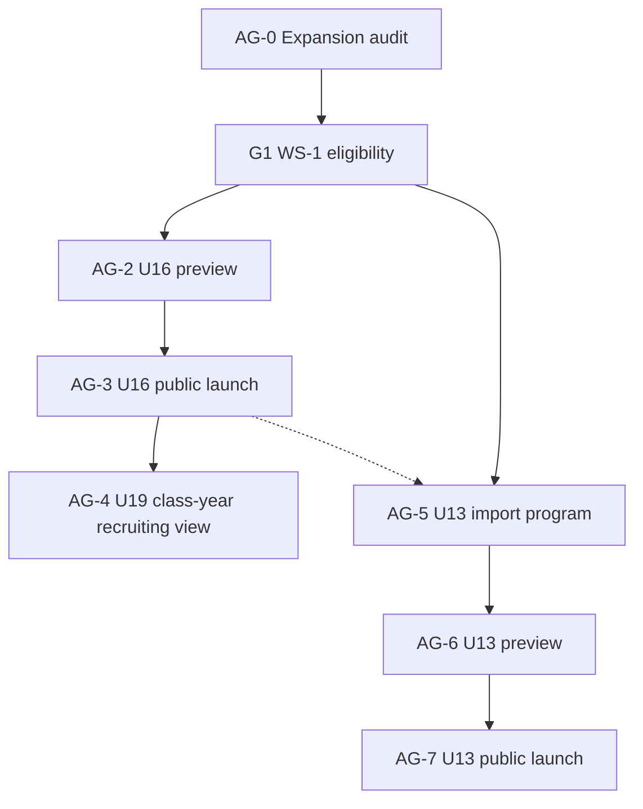

# Age-Group Board Expansion Plan

**Status:** Implementation-ready planning specification  
**Version:** 1.0  
**Effective:** 2026-06-16  
**Authority:** Subordinate to `docs/RANKINGS_ENGINE_BASELINE.md` v1.0, WS-1 Rev 2, ADR-002–004  
**Scope:** Planning only — no code, migrations, recomputes, merges, or public launches without explicit approval

---

## Document Control

| Assumption | Value |
|---|---|
| **Current public board** | U19 Boys and U19 Girls (`PUBLIC_LAUNCH_AGE_GROUP` in `public-rankings-coverage.ts`) |
| **Planned boards** | U13 and U16 (`PLANNED_PUBLIC_AGE_GROUPS`; UI shows Coming Soon) |
| **Authoritative structure** | Age groups (U13, U16, U19) — not class year |
| **Class-year views** | Derived filters on age-group boards only; never separate ranking computations |
| **Official age groups** | U13 ≤13, U16 14–16, U19 17–19 (March 31 cutoff; June 1 progression) |
| **Eligibility thresholds (launch)** | Boys 10 / Girls 5 verified games (ADR-002) |
| **DOB coverage (stable)** | 85 / 216 players with `birthDate` (~39%) |

### Related artifacts

| Artifact | Role |
|---|---|
| `docs/ranking-age-context.md` | Age context, class-year rule, progression policy |
| `docs/PROJECT_STATUS.md` | Stable counts, PYBC U16 evidence, QA history |
| `docs/planning/eligibility-duplication-map.md` | Pre-WS-1 threshold duplication |
| WS-1 Rev 2 | Unified eligibility verdict contract (G1) |
| WS-2 Rev 1 | Per-board snapshot lifecycle |
| ADR-004 | `ageGroupOverride` eligibility semantics |

---

## Executive Summary

Peach Basket already loads national ranking data for U13, U16, and U19 in `getLatestNationalRankings()`, but public UI gates U13/U16 behind **Coming Soon** (`isPlannedPublicAgeGroup`). **U16 is materially closer to launch** than U13: PYBC U16 Boys evidence exists (129 distinct players in latest U16 Boys snapshot per PROJECT_STATUS), and dedicated U16 batch compute/validation scripts exist. **U13 requires additional verified competition import and DOB coverage before public launch.**

Class-year recruiting views are a **UX filter layer** on the U19 board (and optionally U16 for older prospects), not a fourth ranking system. Rank order, `PlayerRating`, and `RankingSnapshot` remain keyed by `ageGroup`.

**Recommended rollout order:** U16 public launch → U19 class-year recruiting filters → U13 public launch.

---

## 1. U13 Board Readiness Criteria

U13 launch requires evidence depth, identity quality, and eligibility governance — not merely flipping the Coming Soon flag.

### 1.1 Data readiness (hard gates)

| Criterion | Target | Rationale |
|---|---|---|
| Verified official games (U13 leagues) | ≥ 2 distinct leagues or seasons with admin-validated imports | Single-league boards lack credibility |
| Distinct players with U13 `PlayerRating` | Boys ≥ 40, Girls ≥ 25 (minimum credible pool) | Percentile/recruiting context needs comparison pool |
| Players meeting launch threshold on U13 board | Boys ≥ 15 at 10+ games; Girls ≥ 10 at 5+ games | ADR-002 minimum public board depth |
| `birthDate` coverage among U13-rated players | ≥ 70% | U13 bracket integrity depends on DOB; unknown DOB rate must be lower than U19 |
| Duplicate identity groups (U13-affected) | 0 unresolved high-confidence groups in pilot tier | WS-4: merges before misleading public ranks |
| GPS / `PlayerRating` for U13 | Computed from U13-league evidence only (not U16/U19 stat bleed) | `verifiedGameCount` must be bracket-scoped |

### 1.2 Governance readiness

| Criterion | Requirement |
|---|---|
| WS-1 unified eligibility live (G1) | U13 board uses same verdict module as U19; no ad-hoc filters |
| `computedAgeBracket` enforcement | Players with verified DOB outside U13 excluded from U13 public board (ADR-004) |
| Unknown DOB policy (ADR-003) | U13 unknown-DOB players may appear **PROVISIONAL** only if competition trust ≥ configured minimum; never RANKED without DOB escalation path |
| `ageGroupOverride` | Override to U13 without U13 games → PROVISIONAL per ADR-004 |
| June rollover plan documented | First U13 June after launch: no carryover required (G5 optional); document rank behavior for age-outs |

### 1.3 Snapshot readiness

| Criterion | Requirement |
|---|---|
| U13 `RankingSnapshot` lineage | At least 1 published monthly freeze per gender before public launch |
| Snapshot `ageGroup = U13` | Header carries `formulaVersionId` + `policyVersionId` (post-G6 / ADR-013) |
| Row provenance | `evaluatedBoard = U13`, `gamesQualified` bracket-scoped |

### 1.4 UX readiness

| Criterion | Requirement |
|---|---|
| Coming Soon removal | Only after data + governance gates pass |
| Empty-state copy | Distinguish “no players meet threshold” vs “board not launched” |
| Profile rank consistency | Player profile U13 rank matches U13 public board lookup (INV-01) |
| Search | U13 ranks surfaced only when player is on U13 public board |

### 1.5 U13 readiness verdict (current estimate)

| Dimension | Status |
|---|---|
| Competition evidence | **Insufficient** — no documented U13 league import at U16/PYBC scale |
| Rating depth | **Unknown / likely insufficient** |
| DOB coverage | **Insufficient** for strict U13 launch |
| Infrastructure | **Ready** — age-group routing and snapshot model exist |
| **Overall** | **Not ready** — target after U16 launch + dedicated U13 imports |

---

## 2. U16 Board Readiness Criteria

U16 is the **first expansion candidate**. PYBC U16 Boys provides a concrete evidence anchor.

### 2.1 Data readiness (hard gates)

| Criterion | Target | Current signal |
|---|---|---|
| Verified official U16 games | ≥ 1 major league fully imported (PYBC U16 Boys ✓) | PROJECT_STATUS: PYBC stored as `ageGroup: U16` |
| Distinct U16-rated players (Boys) | ≥ 80 with `PlayerRating` | Snapshot: 129 PYBC distinct players (Boys) |
| Distinct U16-rated players (Girls) | ≥ 30 with `PlayerRating` | **Gap — verify Girls U16 import coverage** |
| Threshold-qualified public board | Boys ≥ 25 at 10+ games; Girls ≥ 15 at 5+ games | Run dry-run eligibility count pre-launch |
| Age-bracket filter accuracy | ≥ 95% of board rows have `computedAgeBracket` ∈ {U16, null} | `getPublicBoardRows` filters `computedAgeBracket === ageGroup` |
| Team identity cleanup | No duplicate `U16 Boys` public rows (PYBC) | PROJECT_STATUS: prior QA confirmed clean PYBC rows |
| Merge groups affecting U16 | Tier 1–2 merges complete for U16-rated players | WS-4 G3 before public launch |

### 2.2 Governance readiness

| Criterion | Requirement |
|---|---|
| WS-1 eligibility (G1) | U16 uses unified module; threshold 10/5 via policy version |
| Class-year rule on U16 | **Not applied** — class-year graduation exclusion applies to U19 path only (`getCurrentRankingAgeBracket`) |
| Unknown DOB on U16 | Allowed as PROVISIONAL with `competitionTrustLevel` metadata when competition context is trusted |
| Override cross-bracket | U19-rated player overridden to U16 without U16 games → PROVISIONAL (ADR-004) |

### 2.3 Snapshot readiness

| Criterion | Requirement |
|---|---|
| U16 snapshot scripts validated | `validate-ranking-snapshots-v1-u16.ts` green |
| Monthly U16 freeze | At least 1 published snapshot per gender |
| Trend history | Profile trend can show U16 snapshot rows once launched |

### 2.4 UX readiness

| Criterion | Requirement |
|---|---|
| Remove `isPlannedPublicAgeGroup("U16")` gate | Feature flag or config, not hard delete until launch approval |
| Coverage notice update | `publicRankingsCoverageCopy` reflects U16 live |
| Homepage / nav | U16 board linked from rankings hub and site data |
| Min-games slider | Defaults to 10 (Boys) / 5 (Girls) per `rankings-url-state.ts` |

### 2.5 U16 readiness verdict (current estimate)

| Dimension | Status |
|---|---|
| Boys competition evidence | **Strong** (PYBC U16) |
| Girls competition evidence | **Needs audit** |
| Infrastructure | **Ready** |
| Eligibility module | **Pending G1** |
| **Overall** | **Conditionally ready** — Boys U16 can launch after G1 + Girls audit + merge pilot |

---

## 3. Class-Year Filter Architecture

Class year is a **derived recruiting lens**, not an authoritative ranking dimension.

### 3.1 Design principles

| Principle | Rule |
|---|---|
| **P-CY-1** | Rank computation, `PlayerRating`, and `RankingSnapshot` are always keyed by `ageGroup` (U13/U16/U19) |
| **P-CY-2** | Class year is computed from `birthDate` + March-birthday rule, or `classYearOverride` (see `ranking-eligibility.ts`) |
| **P-CY-3** | Class-year filter **narrows display** of an existing age-group board; it does not re-sort by a different rating universe |
| **P-CY-4** | Graduation exclusion (`isRankingEligibleByClassYear`) remains an **eligibility** rule on U19, not a separate board |
| **P-CY-5** | Historical snapshots do not gain class-year dimensions; filter is applied at read time on live board or frozen rows |

### 3.2 Class-year filter model

```
┌─────────────────────────────────────────────────────────┐
│  Authoritative layer (unchanged)                        │
│  PlayerRating(ageGroup) + RankingSnapshot(ageGroup)     │
└──────────────────────────┬──────────────────────────────┘
                           │
┌──────────────────────────▼──────────────────────────────┐
│  Derived filter layer (recruiting view)                 │
│  Input: U19 board rows (live or snapshot)               │
│  Filter: classYear ∈ {2026, 2027, 2028, …}              │
│  Optional: include/exclude PROVISIONAL unknown-DOB        │
│  Output: same rank order, subset of rows                │
└─────────────────────────────────────────────────────────┘
```

### 3.3 Filter parameters

| Parameter | Source | Notes |
|---|---|---|
| `classYear` | `getEffectiveClassYear(birthDate, classYearOverride)` | Display: "Class of YYYY" |
| `includeUnknownClass` | User toggle (default off for recruiting) | Unknown DOB → no class year |
| `graduationEligible` | Derived from `isRankingEligibleByClassYear` | June 1 exclusion for graduated class |
| `evaluatedBoard` | Always parent age group (e.g. U19) | Frozen on snapshot rows when ADR-013 live |

### 3.4 URL / state model (planning)

| State | Example | Board authority |
|---|---|---|
| `/rankings?age=U19&gender=Boys` | Standard U19 board | U19 |
| `/rankings?age=U19&gender=Boys&class=2027` | Recruiting view | U19 (filtered) |
| `/rankings?age=U16&class=2027` | **Invalid as primary** — class filter only on U19 unless product explicitly extends | U16 base, optional secondary filter for advanced prospects |

**Recommendation:** Ship class-year filter on **U19 only** at first. U16 recruiting rarely uses graduation class the same way; if needed later, treat as optional secondary filter without new ratings.

### 3.5 What class-year filter does NOT do

- Does not create `PlayerRating` rows keyed by class year
- Does not generate `RankingSnapshot` per class year
- Does not change formula, accumulation, or carryover scope
- Does not bypass age-group bracket rules

---

## 4. DOB and Class-Year Data Requirements

### 4.1 Field requirements

| Field | Model | Public display | Eligibility use |
|---|---|---|---|
| `birthDate` | `Player.birthDate` | Birth year / age context | Age bracket, class year, graduation |
| `classYearOverride` | `Player.classYearOverride` | "Class of YYYY" | Overrides calculated class year |
| `ageGroupOverride` | `Player.ageGroupOverride` | Board placement hint | Eligibility-affecting (ADR-004) |
| `competitionTrustLevel` | WS-1 verdict metadata | Admin/provisional badge | Unknown DOB temporary eligibility |

### 4.2 Coverage targets by launch phase

| Phase | U19 (maintain) | U16 launch | U13 launch |
|---|---|---|---|
| `birthDate` among rated players | ≥ 40% (current ~39% overall) | ≥ 55% U16 pool | ≥ 70% U13 pool |
| `classYearOverride` abuse rate | < 5% of overrides without audit reason | N/A (class year not primary on U16) | N/A |
| Unknown DOB on public RANKED rows | Trending down via WS-1 §5.4 escalation | PROVISIONAL only unless trusted competition | PROVISIONAL only; stricter trust threshold |
| Admin DOB escalation queue | Operational | Required before U16 Girls launch | Required before U13 launch |

### 4.3 Class-year calculation (locked)

Per `ranking-age-context.md` and `ranking-eligibility.ts`:

- January–March birth month → `classYear = birthYear + 19`
- April–December birth month → `classYear = birthYear + 20`
- Eligible through May 31 of class year; excluded from June 1 of class year (U19 path)

### 4.4 Data quality gates (pre-launch)

| Check | Method |
|---|---|
| Age vs bracket consistency | Sample audit: `getAgeBracketAsOfMarch31` vs competition age group |
| Override audit | All `ageGroupOverride` rows reviewed before board launch |
| Class year override audit | Overrides documented in admin with reason |
| Duplicate slugs | WS-4 R2-a alias map ready |

---

## 5. Recruiting-View UX

### 5.1 Primary recruiting surface: U19 + class-year filter

| Element | Behavior |
|---|---|
| **Entry point** | Rankings page → U19 → "Recruiting view" toggle or class-year chips |
| **Class-year chips** | `Class of 2026`, `2027`, `2028`, `2029`, `All` |
| **Default** | `All` (full U19 board); recruiting mode pre-selects current + next 2 classes |
| **Row metadata** | Show class year, age, height, position, verified games, provisional badge |
| **Graduated players** | Hidden by default (FORMER/HIDDEN verdict); toggle "Show graduated" for history |
| **Unknown class** | Separate badge; excluded from class-year chips by default |

### 5.2 Secondary surfaces

| Surface | Recruiting behavior |
|---|---|
| **Player profile** | Class year prominent; link to U19 rank; percentile within U19+gender board |
| **Team roster** | Class column sortable (existing `TeamRosterTable`); links to player profile |
| **Search** | Filter by class year as **secondary** facet on U19 results |
| **Homepage leaders** | Remain U19 until product expands; optional U16 leader card post-U16 launch |

### 5.3 U16 / U13 recruiting UX

| Board | Recruiting emphasis |
|---|---|
| **U16** | Age-group rank primary; class year informational only (not filter chips at launch) |
| **U13** | Age-group rank primary; no class-year filter; strong DOB/age display for context |

### 5.4 Copy and trust

| Message | Placement |
|---|---|
| "Rankings are by age group, not graduation class" | Recruiting view footer / How We Rank |
| "Class year filter shows a subset of the U19 national board" | Recruiting view helper |
| Provisional / unknown DOB explanation | Row badge tooltip per WS-1 `provisionalReason` |

### 5.5 Non-goals (MVP recruiting view)

- No separate "Recruiting board" rating
- No college commitment indicators in rank order
- No premium-gated rank columns (Premium deferred per PROJECT_STATUS)

---

## 6. Eligibility Implications

### 6.1 Per-board evaluation (WS-1 §6.4)

Each age group is an **`evaluatedBoard`**. Eligibility is evaluated independently:

| Board | Threshold (launch) | Bracket rule | Graduation rule |
|---|---|---|---|
| U13 | Boys 10 / Girls 5 | `computedAgeBracket` = U13 or trusted unknown | N/A |
| U16 | Boys 10 / Girls 5 | `computedAgeBracket` = U16 or trusted unknown | N/A |
| U19 | Boys 10 / Girls 5 | `computedAgeBracket` = U19 or trusted unknown | `isRankingEligibleByClassYear` |

### 6.2 Cross-board behavior

| Scenario | Verdict |
|---|---|
| Player RANKED on U16, viewed on U19 board | Hidden or PROVISIONAL on U19 unless U19 games qualify |
| Player with U19 rating, `ageGroupOverride` to U16 | PROVISIONAL on U16 without U16 games (ADR-004) |
| Unknown DOB, PYBC U16 competition | PROVISIONAL on U16 with `competitionTrustLevel` |
| Carryover (post-G5) | Discounted prior per age group; never satisfies threshold alone (INV-07) |

### 6.3 Class-year filter interaction

- Class-year filter **does not relax** game thresholds
- Graduated players excluded by eligibility before filter applies
- Filter is presentation-only; `gamesQualified` unchanged

### 6.4 Dependency on G1

Public launch of U16/U13 boards should occur **after G1** (WS-1 unified eligibility) or behind explicit waiver documenting continued use of duplicated threshold paths (`public-board-ranks.ts`, `players.ts`) until G1 ships.

---

## 7. Snapshot Implications

### 7.1 Per age-group snapshot lineages

| Age group | Snapshot scope | `RankingSnapshot.ageGroup` |
|---|---|---|
| U13 | Independent monthly freeze | `U13` |
| U16 | Independent monthly freeze | `U16` |
| U19 | Independent monthly freeze | `U19` |

Each lineage has its own `weekOf`, `formulaVersionId`, `policyVersionId` (ADR-013). **No combined cross-age snapshot.**

### 7.2 Publish workflow

1. Live `PlayerRating` per `ageGroup` is source for freeze (ADR-001)
2. WS-1 verdict computed per row at publish time; frozen on `RankingSnapshotRow` (ADR-013)
3. Class-year filter **not** stored on snapshot; derived at read from player DOB at freeze or frozen row metadata if added later

### 7.3 Historical integrity

- Existing U19 snapshots (2 headers / 138 rows stable) unchanged
- U16 snapshots generated separately (`generate-ranking-snapshots-v1-u16.ts`); publish only after approval
- U13 snapshots begin at first U13 launch month
- Coming Soon period: U16/U13 ratings may exist without public snapshot publish — acceptable

### 7.4 Trend charts

- Player profile trend reads `RankingSnapshotRow` for matching `ageGroup` (INV-02)
- Multi-bracket athletes may have trend points in multiple age-group lineages after progression (June rollover)

---

## 8. Rollout Sequencing

### 8.1 Expansion gates (AG series)

| Gate | Name | Purpose | Precondition |
|---|---|---|---|
| **AG-0** | Expansion readiness audit | Count U16/U13 pools; DOB coverage; Girls U16 gap | G0 closed (or conditional) |
| **AG-1** | G1 eligibility dependency | Unified WS-1 on all boards | G1 exit |
| **AG-2** | U16 internal preview | Admin/staging review of U16 boards | AG-0 + AG-1 |
| **AG-3** | U16 public launch | Remove Coming Soon for U16 | AG-2 sign-off + merge Tier 1–2 for U16 |
| **AG-4** | U19 recruiting view | Class-year filter on U19 | AG-3 or parallel; no new ratings |
| **AG-5** | U13 data import program | Targeted U13 league imports | Product approval |
| **AG-6** | U13 internal preview | Staging review | AG-5 + AG-1 |
| **AG-7** | U13 public launch | Remove Coming Soon for U13 | AG-6 sign-off |

### 8.2 Rollout roadmap



### 8.3 Recommended calendar (indicative)

| Phase | Duration | Deliverable |
|---|---|---|
| AG-0 audit | 1–2 weeks | U16/U13 readiness scorecard |
| G1 (external dependency) | Per baseline | WS-1 live |
| AG-2 U16 preview | 1 week | Boys + Girls staging QA |
| AG-3 U16 launch | 1 day (flag flip) + monitoring | Public U16 boards |
| AG-4 recruiting view | 2–3 weeks | Class-year filter UX |
| AG-5 U13 imports | 4–8 weeks | New competition data |
| AG-7 U13 launch | After AG-6 | Public U13 boards |

### 8.4 Coordination with Rankings Engine gates

| Engine gate | Expansion interaction |
|---|---|
| G3 merges | Complete U16-affecting merges before AG-3 |
| G4 accumulation | Lifetime counts benefit U16; launch can precede G4 if submission-scoped counts are accurate |
| G5 carryover | June rollover after U16 launch must be documented for age-outs |
| G6/G7 formula | Age-group launch independent of v2 cutover; use active public formula |

---

## 9. Validation Framework

### 9.1 Pre-launch validation (per board)

| # | Check | U16 | U13 |
|---|---|---|---|
| V1 | Threshold-qualified count meets minimum | Boys ≥ 25, Girls ≥ 15 | Boys ≥ 15, Girls ≥ 10 |
| V2 | `computedAgeBracket` filter removes out-of-bracket players | Sample 50 rows | Sample 50 rows |
| V3 | Profile rank = public board rank for sample players | 10 athletes | 10 athletes |
| V4 | Search rank consistent with board | 5 queries | 5 queries |
| V5 | Snapshot row count matches live board at publish | ±0 rows | ±0 rows |
| V6 | No duplicate public rows (team identity) | PYBC regression | N/A |
| V7 | Unknown DOB players show PROVISIONAL not RANKED | Per WS-1 | Stricter |
| V8 | `ageGroupOverride` PROVISIONAL path | 3 test cases | 3 test cases |
| V9 | Class-year exclusion not applied on U16/U13 | Confirm | Confirm |
| V10 | Mobile + desktop render | Responsive QA | Responsive QA |

### 9.2 Post-launch monitoring (30 days)

| Metric | Alert threshold |
|---|---|
| Board row count drop > 20% week-over-week | Investigate eligibility regression |
| Spike in unknown-DOB RANKED rows | DOB escalation review |
| Profile/board rank mismatch tickets | > 3 unique reports |
| Snapshot publish failure | Any missed monthly freeze |

### 9.3 Recruiting-view validation (AG-4)

| Check | Expected |
|---|---|
| Class filter reduces row count, preserves rank order | Subset monotonic |
| `Class of 2027` filter matches manual count from admin export | Exact match |
| Graduated players absent by default | `isRankingEligibleByClassYear` false |
| URL `class=` param restores filter state | Deep link works |

---

## 10. Success Metrics

### 10.1 Launch success (per board)

| Metric | U16 target (90 days) | U13 target (90 days) |
|---|---|---|
| Public board sessions / week | ≥ 500 | ≥ 200 |
| Unique players viewed | ≥ 200 | ≥ 80 |
| Profile clicks from board | ≥ 25% CTR | ≥ 20% CTR |
| Threshold-qualified players on board | Boys ≥ 30, Girls ≥ 20 | Boys ≥ 20, Girls ≥ 12 |
| DOB coverage among rated players | ≥ 60% | ≥ 70% |
| Support tickets: rank wrong board | < 5 | < 5 |

### 10.2 Recruiting-view success (AG-4)

| Metric | Target |
|---|---|
| Recruiting filter adoption | ≥ 15% of U19 sessions use class filter |
| Class-year chip engagement | Top 3 classes cover ≥ 80% of filter use |
| Bounce rate on recruiting view | ≤ U19 board baseline + 10% |

### 10.3 Integrity metrics (ongoing)

| Metric | Target |
|---|---|
| Profile/board rank mismatch rate | 0 known unresolved |
| Snapshot freeze parity | 100% row match at publish |
| Eligibility duplication incidents (INV-04) | 0 after G1 |

---

## Impact Assessment

### Ranking impact

| Area | U16 launch | U13 launch | Class-year filter |
|---|---|---|---|
| `PlayerRating` computation | No formula change; existing U16 rows become public | New U13 ratings from U13 evidence | **None** — display filter only |
| Rank order | U16 order visible publicly; U19 unchanged | U13 order visible | Subset of U19 order |
| Cross-board | Athletes may appear on one public board per bracket rules | Same | N/A |
| Accumulation (G4) | Lifetime U16 counts improve accuracy post-G4 | U13 counts after imports | None |

### Snapshot impact

| Area | Effect |
|---|---|
| New lineages | U16 publish cadence formalized; U13 begins at launch |
| U19 snapshots | Unchanged |
| Row provenance | ADR-013 fields populated per board at publish |
| Trend history | New points for U16/U13 boards |

### Migration impact

| Area | Effect |
|---|---|
| Schema | **None required** for expansion — `ageGroup` already on `PlayerRating`, `RankingSnapshot` |
| Config | `PUBLIC_LAUNCH_AGE_GROUP` / `PLANNED_PUBLIC_AGE_GROUPS` update |
| Data backfill | U16: optional rating recompute approval; U13: imports required |
| G6 formula versioning | Orthogonal — filter by active formula when G6 lands |

### Historical-data impact

| Area | Effect |
|---|---|
| `Game` / `GameStat` | No rewrite |
| PYBC U16 history | Preserved; becomes publicly visible |
| U19 history | Unchanged |
| Snapshots pre-launch | Immutable; no retro-edit |

---

## Readiness Checklist

### U16 public launch (AG-3)

- [ ] AG-0 audit complete; Girls U16 coverage documented
- [ ] G1 WS-1 eligibility live (or waiver recorded)
- [ ] Boys: ≥ 25 players at 10+ verified U16 games
- [ ] Girls: ≥ 15 players at 5+ verified U16 games
- [ ] `validate-ranking-snapshots-v1-u16.ts` passed
- [ ] U16 merge Tier 1–2 complete for affected players
- [ ] Staging preview approved (AG-2)
- [ ] `public-rankings-coverage.ts` updated to launch U16
- [ ] Coverage notice and How We Rank copy updated
- [ ] Product owner sign-off on AG-3

### U13 public launch (AG-7)

- [ ] U13 league import program complete (AG-5)
- [ ] Boys/Girls minimum pool counts met (§1.1)
- [ ] DOB coverage ≥ 70% among U13-rated players
- [ ] G1 eligibility live
- [ ] U13 snapshot publish dry-run approved
- [ ] Staging preview approved (AG-6)
- [ ] Product owner sign-off on AG-7

### U19 recruiting view (AG-4)

- [ ] Class-year filter UX approved
- [ ] Filter preserves rank order (validation V-AG4)
- [ ] Graduation exclusion respected
- [ ] Copy clarifies age-group authority
- [ ] No new rating or snapshot types introduced

---

## Approval

| Role | U16 launch (AG-3) | U13 launch (AG-7) | Recruiting view (AG-4) |
|---|---|---|---|
| Product owner | Required | Required | Required |
| Rankings architect | Required | Required | Required |
| Data integrity lead | Required | Required | Consulted |
| Engineering lead | Required | Required | Required |

**Explicit approval required** before removing Coming Soon state, publishing new snapshot lineages, or enabling public class-year filters.

---

*End of Age-Group Board Expansion Plan v1.0*
