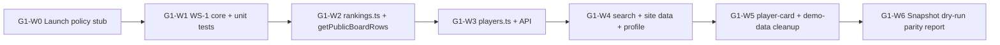
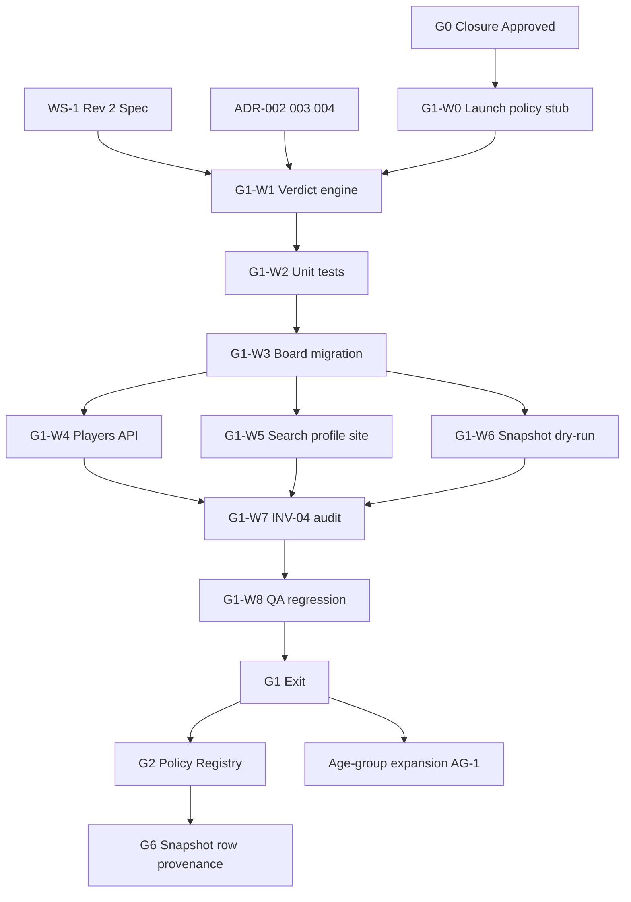

# G1 Eligibility Implementation Plan

**Status:** Implementation-ready planning specification  
**Version:** 1.0  
**Effective:** 2026-06-16  
**Gate:** G1 — WS-1 verdict engine  
**Authority:** Subordinate to `docs/RANKINGS_ENGINE_BASELINE.md` v1.0, WS-1 Rev 2 (locked), ADR-002–004, ADR-013  
**Scope:** WS-1 implementation planning only — no code, migrations, recomputes, merges, or execution

---

## Document Control

| Assumption | Value |
|---|---|
| Architecture Baseline | Approved v1.0 |
| G0 Closure Package | Approved |
| Authoritative spec | **WS-1 Rev 2** |
| Invariant target | **INV-04** — WS-1 sole threshold authority |
| Launch thresholds (unchanged at G1) | Boys 10 / Girls 5 verified games (ADR-002) |
| Policy registry (WS-3) | **G2** — G1 uses launch-policy stub only |

### Related artifacts

| Artifact | Role |
|---|---|
| `docs/planning/g1-entry-checklist.md` | G1 entry criteria G1-R01–R05 |
| `docs/planning/eligibility-duplication-map.md` | Consolidation register |
| `docs/planning/r-read-inventory.md` | Read-path and display impact |
| `docs/planning/test-strategy-outline.md` | G1 test matrix skeleton |
| `docs/planning/AGE_GROUP_BOARD_EXPANSION_PLAN.md` | U16/U13 launch blocked until G1 exit |
| `docs/adr/ADR-002`–`004`, `ADR-013` | Threshold, DOB, override, snapshot provenance |

### G1 scope boundary

| In scope | Out of scope (later gates) |
|---|---|
| WS-1 verdict engine design and implementation | Schema migrations (G6) |
| Threshold consolidation (INV-04) | WS-3 policy registry DB (G2) |
| Verdict payload contract | `policyVersionId` on `RankingSnapshot` header (G6) |
| Public live read-path consumer migration | Row verdict field persistence (G6 / ADR-013) |
| Launch-policy stub (`policyVersionId` constant) | Carryover record population (G5) |
| Unit test matrix P1–P15 | GPS / `PlayerRating` writes |
| Snapshot **dry-run** parity (in-memory verdict) | Snapshot publish workflow redesign (G2) |
| Rollback plan for display-path changes | Player merges (G3) |

---

## Executive Summary

G1 delivers a **single deterministic eligibility evaluator** (WS-1 Rev 2) that replaces ad-hoc threshold and bracket filters across public live read paths. Today, eligibility is fragmented: `public-board-ranks.ts` and `players.ts` duplicate Boys 10 / Girls 5 constants; `ranking-eligibility.ts` holds partial age/class rules; unknown DOB and `ageGroupOverride` are applied inconsistently; the P1–P15 precedence chain is **not implemented**.

G1 does **not** change rating math, recompute ratings, or mutate historical data. Public board **order** should remain identical when launch thresholds and inputs are unchanged; G1 changes **how** eligibility is decided and **unifies** edge-case handling (unknown DOB, override, graduation).

**Recommended implementation sequence:** Launch-policy stub → WS-1 core engine → unit matrix → migrate `getPublicBoardRows` → migrate remaining live consumers → dry-run snapshot parity → G1 exit audit.

---

## 1. Current-State Inventory

### 1.1 Eligibility logic sites (duplication register)

| # | Site | Location | Behavior today | WS-1 gap | G1 action |
|---|---|---|---|---|---|
| 1 | Board minimum games | `src/lib/public-board-ranks.ts` `publicBoardMinimumGames` | Boys 10, Girls 5 hardcoded | INV-04 violation | **Replace** with verdict filter |
| 2 | Leaderboard minimum | `src/lib/players.ts` `leaderboardMinimumGamesForGender` | Same 10 / 5 | INV-04 violation | **Remove**; delegate to WS-1 |
| 3 | Demo export duplicate | `src/lib/demo-data.ts` `leaderboardMinimumGamesForGender` | Re-export of threshold | INV-04 risk | **Remove** or re-export from WS-1 helper |
| 4 | Class year derivation | `ranking-eligibility.ts` `getClassYear`, `getEffectiveClassYear` | March-birthday rule | Input to `classYearStatus` | **Retain as pure helpers**; WS-1 consumes |
| 5 | Class year exclusion | `isRankingEligibleByClassYear` | June 1 U19 exclusion | P1–P5 | **Integrate** into verdict engine |
| 6 | Age bracket | `getAgeBracketAsOfMarch31`, `getCurrentRankingAgeBracket` | U13/U16/U19/OUT_OF_RANGE | `competitionAgeGroup` | **Integrate**; keep helpers |
| 7 | Age override | `Player.ageGroupOverride` on reads | Display + loose bracket filter | ADR-004 P14–P15 | **Integrate** |
| 8 | Unknown DOB | `computedAgeBracket === null` passes board filter | Temporarily rank-eligible | ADR-003 P11–P13 | **Integrate** with trust level |
| 9 | Verdict hierarchy P1–P15 | **Not implemented** | Ad hoc filters | Core deliverable | **Implement** |
| 10 | Player card threshold | `src/components/player-card.tsx` | Uses `demo-data` threshold | Display drift | **Migrate** to verdict |

### 1.2 Live read-path consumers (G1-R05)

| Path | File / route | Eligibility today | G1 migration priority |
|---|---|---|---|
| National board filter | `public-board-ranks.ts` → `getPublicBoardRows` | Threshold + `computedAgeBracket` | **P0** |
| Rankings data assembly | `rankings.ts` → `getLatestNationalRankings` | Sets `computedAgeBracket` per row | **P0** — attach verdict at assembly |
| Player public rank | `rankings.ts` → `getCurrentPublicBoardRankForPlayer` | Via `getPublicBoardRows` | **P0** (inherits) |
| Rankings pages | `src/app/rankings/**` | Inherited | **P1** — verify only |
| Player profile | `player-profile.ts` | Via `getCurrentPublicBoardRankForPlayer` | **P1** |
| Public search | `public-search.ts` | Board rank lookup + ad hoc | **P1** |
| Homepage / site data | `public-site-data.ts` | Board helpers | **P1** |
| Players list / API | `players.ts`, `api/rankings/route.ts` | `leaderboardMinimumGamesForGender` | **P0** |
| Player card component | `player-card.tsx` | Demo threshold | **P2** |

### 1.3 Snapshot / batch paths (G1: dry-run only; full migration G2/G6)

| Path | Location | Eligibility today | G1 action |
|---|---|---|---|
| U19 snapshot generate | `scripts/generate-ranking-snapshots-v1.ts` | Threshold + `isRankingEligibleByClassYear` | Document; **dry-run parity** |
| U16 snapshot generate | `scripts/generate-ranking-snapshots-v1-u16.ts` | Same pattern | Document; dry-run parity |
| Post-import snapshot | `submission-post-import-processing.ts` | Duplicated filters | Document; defer code change to G2 |
| Snapshot validate | `validate-ranking-snapshots-v1*.ts` | Class-year check | Extend dry-run comparator at G1 |
| Post-merge regenerate | `regenerate-affected-ranking-snapshots-after-player-merge.ts` | Class-year + games | Defer to G2 |

**G1 rule:** Do not change published snapshot rows or publish workflow. G1 proves WS-1 produces **equivalent or strictly governed** row sets vs current ad-hoc filters on UAAP S88 baseline.

### 1.4 Admin / planning scripts (out of G1 consumer scope)

| Path | G1 treatment |
|---|---|
| `src/app/admin/**` age bracket display | No eligibility authority change; optional verdict badge later |
| `scripts/plan-*.ts` | Continue using `ranking-eligibility.ts` helpers; not WS-1 consumers |

### 1.5 Data context (stable)

| Metric | Value | G1 relevance |
|---|---:|---|
| `PlayerRating` rows | 181 | Verdict evaluated per row + board |
| Players with `birthDate` | 85 / 216 (~39%) | Unknown DOB path must be exercised |
| Public launch board | U19 | Primary regression anchor |
| U16/U13 boards | Coming Soon UI | Verdict engine must support all boards; UI unchanged at G1 |

### 1.6 Current-state verdict model (implicit)

Today there is no explicit `verdict` enum. Behavior maps approximately as:

| Implicit state | Current mechanism | WS-1 target |
|---|---|---|
| On public board with rank | `verifiedGameCount ≥ threshold` AND bracket match | `RANKED` |
| Has rating, below threshold | Filtered out of `getPublicBoardRows` | `PROVISIONAL` or `HIDDEN` |
| Graduated (U19) | `getCurrentRankingAgeBracket` → OUT_OF_RANGE; class-year scripts exclude | `FORMER` |
| Unknown DOB on board | `computedAgeBracket === null` passes filter | `PROVISIONAL` (ADR-003) |
| Override cross-bracket | Partial; not unified | `PROVISIONAL` (ADR-004) |

---

## 2. Eligibility Logic Consolidation

### 2.1 Target module architecture

```
┌─────────────────────────────────────────────────────────────┐
│  WS-1 Eligibility Module (new)                              │
│  evaluateEligibility(input) → EligibilityVerdict            │
│  evaluateBoardEligibility(rows, board) → Verdict[]          │
└───────────────┬─────────────────────────────────────────────┘
                │
    ┌───────────┼───────────┬──────────────────┐
    ▼           ▼           ▼                  ▼
 ranking-   launch-     trust-level      carryover
 eligibility policy     resolver         stub (null
 helpers    stub        (ADR-003)        until G5)
 (pure)     (G1)
```

### 2.2 Consolidation principles

| Principle | Rule |
|---|---|
| **C-1** | All public eligibility decisions flow through `evaluateEligibility` |
| **C-2** | `ranking-eligibility.ts` remains **pure date/bracket helpers** — not a second verdict engine |
| **C-3** | No consumer applies `verifiedGameCount >= N` directly after G1 |
| **C-4** | Per-board evaluation (WS-1 §6.4): each `evaluatedBoard` ∈ {U13, U16, U19} evaluated independently |
| **C-5** | Cross-board rescue: a player RANKED on U16 is not auto-RANKED on U19 |
| **C-6** | Determinism: same inputs + `policyVersionId` + `evaluationDate` → same verdict |

### 2.3 Verdict hierarchy (WS-1 Rev 2 P1–P15)

G1 implements the full precedence chain. First matching rule wins.

| Band | ID | Rule (summary) | Typical verdict |
|---|---|---|---|
| Graduation | **P1** | Player administratively marked graduated / inactive for ranking | `FORMER` |
| Graduation | **P2** | Class year past June 1 exclusion (U19 path) | `FORMER` |
| Graduation | **P3** | Age bracket OUT_OF_RANGE with verified DOB | `HIDDEN` |
| Graduation | **P4** | Class year unknown but U19 graduation window passed (conservative) | `FORMER` or `PROVISIONAL` per WS-1 table |
| Graduation | **P5** | Snapshot/historical FORMER flag frozen | `FORMER` (G6+ row replay) |
| Threshold | **P6** | `gamesQualified` = 0 for target board | `HIDDEN` |
| Threshold | **P7** | Below launch threshold (gender-specific) | `PROVISIONAL` (`BELOW_THRESHOLD`) |
| Threshold | **P8** | No target-board rating basis and no carryover for board | `HIDDEN` |
| Threshold | **P9** | At/above threshold; all bracket rules pass | `RANKED` |
| Threshold | **P10** | At/above mature threshold (15) — metadata only at G1 | `RANKED` (+ `matureEligible` flag) |
| DOB | **P11** | Unknown DOB; competition trust below minimum | `HIDDEN` |
| DOB | **P12** | Unknown DOB; trust sufficient; games qualify | `PROVISIONAL` (`UNKNOWN_DOB`) |
| DOB | **P13** | Unknown DOB; escalation overdue (WS-1 §5.4) | `PROVISIONAL` → `HIDDEN` per escalation tier |
| Override | **P14** | `ageGroupOverride` to target board; cross-bracket basis without carryover | `PROVISIONAL` (`OVERRIDE_CROSS_BRACKET`); `publicRankAllowed = false` |
| Override | **P15** | Override aligned with rating basis and threshold met | `RANKED` or `PROVISIONAL` per ADR-004 table |

**Carryover bands (P11–P14 in WS-6):** G1 implements verdict **stubs** — `carryoverRecord = null` always. When G5 enables carryover, precedence slots activate without restructuring the engine.

### 2.4 `publicRankAllowed` and `snapshotEligible`

| Field | G1 behavior |
|---|---|
| `publicRankAllowed` | `true` only when `verdict === RANKED` |
| `snapshotEligible` | `true` when row would appear on published snapshot per WS-2 (RANKED + board match); PROVISIONAL rows may appear in admin dry-run only until product confirms |

### 2.5 Consolidation sequence

| Step | Deliverable |
|---|---|
| G1-W1 | Module skeleton + input/output types aligned to WS-1 Rev 2 |
| G1-W2 | Integrate `ranking-eligibility.ts` helpers as inputs |
| G1-W3 | Implement P1–P15 precedence engine |
| G1-W4 | Board batch evaluator `evaluateBoardEligibility` |
| G1-W5 | Remove duplicate threshold logic from consumers |

---

## 3. Threshold-Source Consolidation

### 3.1 Problem

Threshold constants appear in at least three places:

- `public-board-ranks.ts` — `publicBoardMinimumGames`
- `players.ts` — `leaderboardMinimumGamesForGender`
- `demo-data.ts` — exported duplicate

### 3.2 G1 threshold architecture

| Layer | G1 implementation | G2 migration |
|---|---|---|
| **Authority** | WS-1 module | WS-3 policy registry |
| **Launch values** | Boys 10, Girls 5 (unchanged) | Same values in `policyVersionId = launch-v1` |
| **Mature target** | 15 (metadata only; no public behavior change) | Activated via policy bump at G7-M or product decision |
| **Resolution API** | `resolveThreshold(gender, policyVersionId)` | DB-backed policy document |

### 3.3 Launch-policy stub (G1)

Until G2, use a single in-code launch policy record:

| Field | Value |
|---|---|
| `policyVersionId` | `launch-v1` (string constant; not DB row) |
| `boysLaunchThreshold` | 10 |
| `girlsLaunchThreshold` | 5 |
| `matureThreshold` | 15 |
| `effectiveFrom` | Product launch date (documented) |

**INV-11 note:** G1 stub is forward-compatible — G2 replaces stub resolver with registry lookup without changing verdict API.

### 3.4 `gamesQualified` input

| G1 source | G2+ source |
|---|---|
| `PlayerRating.verifiedGameCount` for target `ageGroup` | WS-5 lifetime accumulation (same field, richer semantics) |

G1 does not recompute `verifiedGameCount`. Verdict reads existing rating row counts.

### 3.5 Consolidation exit audit (INV-04)

Post-G1 code search must find **zero** occurrences of:

- Standalone `10` / `5` threshold literals in display or API paths
- `publicBoardMinimumGames` (removed or thin wrapper calling WS-1)
- `leaderboardMinimumGamesForGender` in `players.ts`

Allowed: launch-policy stub module only.

---

## 4. Verdict Payload Implementation

### 4.1 Canonical payload (baseline §WS-1 + ADR-013 minimum subset)

Every `evaluateEligibility` call returns:

| Field | Type | G1 required | Frozen on snapshot row (G6) |
|---|---|---|---|
| `verdict` | `RANKED \| PROVISIONAL \| HIDDEN \| FORMER` | Yes | Yes |
| `provisionalReason` | enum / null | Yes | Yes |
| `exclusionReason` | enum / null | Yes | Partial |
| `publicRankAllowed` | boolean | Yes | Derived at read |
| `ratingAgeGroup` | U13 \| U16 \| U19 \| null | Yes | Yes |
| `evaluatedBoard` | U13 \| U16 \| U19 | Yes | Yes |
| `evaluationDate` | ISO date | Yes | Yes |
| `snapshotEligible` | boolean | Yes | Yes |
| `formulaVersionId` | string | Yes (v1 constant) | Yes |
| `policyVersionId` | string | Yes (`launch-v1`) | Yes |
| `competitionAgeGroup` | bracket enum | Yes | Optional |
| `competitionTrustLevel` | enum | Yes | Yes |
| `classYearStatus` | enum | Yes | Optional |
| `gamesQualified` | number | Yes | Yes |
| `verifiedGameCount` | number | Yes | Yes |

### 4.2 Input contract (WS-1 Rev 2)

| Input group | Fields | Source |
|---|---|---|
| Player identity | `playerId`, `gender`, `birthDate`, `classYearOverride`, `ageGroupOverride` | `Player` |
| Rating context | `ratingAgeGroup`, `verifiedGameCount`, `hasTargetBoardRating` | `PlayerRating` |
| Board context | `evaluatedBoard`, `evaluationDate` | Caller |
| Policy | `policyVersionId`, `formulaVersionId` | Stub / caller |
| DOB governance | `competitionTrustLevel`, `dobEscalationTier` | League/import metadata; default at G1 |
| Carryover | `carryoverRecord` | **null** at G1 |

### 4.3 `provisionalReason` vs `exclusionReason`

| Field | When populated | Examples |
|---|---|---|
| `provisionalReason` | `verdict === PROVISIONAL` | `BELOW_THRESHOLD`, `UNKNOWN_DOB`, `OVERRIDE_CROSS_BRACKET`, `CARRYOVER_ONLY` (G5) |
| `exclusionReason` | `verdict === HIDDEN` or `FORMER` | `GRADUATED`, `OUT_OF_BRACKET`, `NO_RATING_BASIS`, `UNTRUSTED_UNKNOWN_DOB` |

### 4.4 Attachment to ranking rows

At `getLatestNationalRankings` assembly time, each `NationalRankingRow` gains:

- `eligibilityVerdict: EligibilityVerdict` (or embedded subset)
- `computedAgeBracket` retained for display until consumers migrate

`getPublicBoardRows` filters: `verdict === RANKED && publicRankAllowed`.

### 4.5 DOB escalation (WS-1 §5.4) — G1 minimum

| Tier | G1 behavior |
|---|---|
| Tier 0 | Unknown DOB + trusted competition → `PROVISIONAL` |
| Tier 1+ | Document escalation rules; admin queue is **planning hook** only — no admin UI required at G1 |

---

## 5. Consumer Migration Plan

### 5.1 Migration waves



### 5.2 Per-consumer migration spec

| Consumer | Current | Target | Regression check |
|---|---|---|---|
| `getPublicBoardRows` | `verifiedGameCount >= N` + bracket | `verdict === RANKED` | UAAP S88 U19 Boys/Girls row count |
| `getLatestNationalRankings` | Sets `computedAgeBracket` only | Evaluate verdict per row per board | Spot-check 20 players |
| `getCurrentPublicBoardRankForPlayer` | Inherited | Inherited via new filter | Profile rank match |
| `getEligibleRankings` | `games >= threshold` | WS-1 `RANKED` filter | API player count |
| `getPlayerSummaries` region/position rank | Local threshold | Verdict-gated | Rank null below threshold |
| `public-search.ts` | Ad hoc | Verdict-aware rank lookup | Search rank consistency |
| `public-site-data.ts` | Board helpers | Verdict-aware | Homepage leaders unchanged |
| `player-card.tsx` | `demo-data` threshold | Verdict or shared helper | Card badge behavior |

### 5.3 Feature-flag strategy (recommended)

| Flag | Purpose |
|---|---|
| `WS1_VERDICT_ENGINE` | Toggle WS-1 vs legacy filter in staging |
| Default | **Off** in production until G1 exit sign-off |
| Exit | Flag removed; legacy paths deleted |

### 5.4 Backward compatibility

| Concern | G1 handling |
|---|---|
| Public board order | Unchanged when launch policy unchanged |
| Below-threshold players | May shift PROVISIONAL vs hidden — document delta |
| Unknown DOB players | May move from RANKED → PROVISIONAL (expected ADR-003 alignment) |
| API shape | Add optional `verdict` field; do not break existing clients |

### 5.5 Deferred consumers (G2+)

| Consumer | Defer reason |
|---|---|
| Snapshot generation scripts | No publish workflow change at G1; G2 unifies publish |
| `submission-post-import-processing.ts` | Tied to G2 snapshot lifecycle |
| Admin eligibility badges | Product optional |

---

## 6. Read-Path Impacts

### 6.1 Live paths (G1 direct impact)

| Path | Impact | R-READ interaction |
|---|---|---|
| `rankings.ts` | Verdict attached per row; filter logic centralized | R-READ gap (Finding #1) **unchanged** at G1 — still G6 |
| `public-board-ranks.ts` | Becomes thin sort/filter on verdict | N/A |
| `players.ts` | Threshold duplication removed | N/A |
| `public-search.ts` | Eligibility unified | N/A |
| `player-profile.ts` | Rank band from verdict-filtered board | N/A |

### 6.2 Non-impact paths

| Path | Reason |
|---|---|
| `team-rankings.ts` | Out of WS-1 scope |
| Admin count queries | No public eligibility authority |
| GPS / rating compute scripts | G1-R04 prohibited |

### 6.3 Expected public deltas (document before launch)

| Scenario | Current | Post-G1 (expected) |
|---|---|---|
| Unknown DOB, 10+ games, U19 | May appear RANKED on board | `PROVISIONAL` — no public rank number |
| Graduated player | Excluded via bracket / scripts | `FORMER` — consistent on live board |
| Override cross-bracket | Inconsistent | `PROVISIONAL`, no public rank |
| Standard qualified player | RANKED | RANKED — **no change** |

### 6.4 Performance note

Verdict evaluation is O(1) per player per board. Board assembly evaluates N players × 1 board per page load — acceptable at current scale (181 ratings). Cache verdict per request scope; no DB round-trips added.

---

## 7. Snapshot Impacts

### 7.1 G1 snapshot policy

| Action | G1 | G2 | G6 |
|---|---|---|---|
| Change publish workflow | No | Yes | Yes |
| Persist verdict on `RankingSnapshotRow` | No | Plan | Yes (ADR-013) |
| Dry-run WS-1 vs published rows | **Yes** | — | — |
| Regenerate historical snapshots | **No** | No | No |

### 7.2 Dry-run parity procedure

1. Load live `PlayerRating` for snapshot `weekOf` equivalent date.
2. Run WS-1 for each row at `evaluatedBoard = snapshot.ageGroup`.
3. Compare WS-1 `RANKED` set to current published `RankingSnapshotRow` set.
4. Document deltas with reason codes (expected: unknown DOB, override cases).
5. **Exit:** Product owner signs delta report as acceptable or triggers rule tweak before G1 close.

### 7.3 Historical snapshot integrity

| Rule | Enforcement |
|---|---|
| INV-03 | No UPDATE to published snapshot rows at G1 |
| INV-11 | Existing snapshots retain implicit eligibility; no retro-edit |
| Trend charts | Continue reading frozen rows; live profile rank uses WS-1 |

### 7.4 G2 handoff requirements

Snapshot generation must call WS-1 at publish time and set `snapshotEligible` on rows when G2 ships. G1 delivers the callable engine and parity evidence.

---

## 8. Testing Strategy

### 8.1 Test layers (G1)

| Layer | Scope | Owner |
|---|---|---|
| **Unit** | P1–P15 precedence; payload completeness | Rankings architect |
| **Integration** | `getPublicBoardRows` parity vs legacy on fixtures | Engineering lead |
| **Regression** | UAAP S88 public board row sets | Engineering lead |
| **Dry-run** | WS-1 vs 2 published snapshots | Rankings architect |
| **Manual QA** | Profile, search, rankings pages | Product owner |

### 8.2 P1–P15 test matrix (expand skeleton)

| Case ID | Fixture description | Board | Expected verdict | `publicRankAllowed` |
|---|---|---|---|---|
| T-P2-01 | U19 player, class year 2024, eval June 2026 | U19 | `FORMER` | false |
| T-P7-01 | Boys, 9 verified games | U19 | `PROVISIONAL` | false |
| T-P7-02 | Girls, 4 verified games | U19 | `PROVISIONAL` | false |
| T-P9-01 | Boys, 10 verified games, U19 bracket | U19 | `RANKED` | true |
| T-P9-02 | Girls, 5 verified games, U19 bracket | U19 | `RANKED` | true |
| T-P11-01 | Unknown DOB, untrusted competition | U19 | `HIDDEN` | false |
| T-P12-01 | Unknown DOB, PYBC trusted, 10+ games | U16 | `PROVISIONAL` | false |
| T-P14-01 | U16 rating, override to U19, no U19 games | U19 | `PROVISIONAL` | false |
| T-P6-01 | Zero games, U19 bracket | U19 | `HIDDEN` | false |
| T-P3-01 | DOB age 20, U19 board | U19 | `HIDDEN` | false |
| T-X-01 | RANKED on U16, 0 U19 games | U19 | `HIDDEN` or `PROVISIONAL` | false |
| T-X-02 | Same player | U16 | `RANKED` (if qualified) | true |

**Minimum:** 15 fixtures (one per precedence band) + 5 cross-board cases.

### 8.3 Regression anchors (UAAP S88)

| Metric | Pre-G1 baseline | Post-G1 acceptance |
|---|---:|---|
| U19 Boys RANKED row count | Capture at G1-W2 start | ±0 unless documented DOB/override deltas |
| U19 Girls RANKED row count | Capture at G1-W2 start | ±0 unless documented |
| Player profile rank (top 10 sample) | Capture | Must match for standard qualified players |
| `PlayerRating` count | 181 | Unchanged |

### 8.4 Automated test placement

| Artifact | Location (planned) |
|---|---|
| WS-1 unit tests | `src/lib/eligibility/` or `src/lib/ranking-eligibility-verdict.test.ts` |
| Board parity test | Integration test against fixture DB or mocked rows |
| CI gate | Add at G1 exit (not G0) |

### 8.5 Non-goals at G1

- No snapshot publish integration tests (G2)
- No policy registry version switching tests (G2)
- No carryover precedence tests (G5)

---

## 9. Rollback Strategy

### 9.1 G1 rollback triggers

| Trigger | Severity | Action |
|---|---|---|
| U19 board row count drop > 5% unexplained | High | Disable `WS1_VERDICT_ENGINE` flag |
| Profile rank mismatch > 3 reported players | High | Flag off; investigate |
| Unknown DOB mass removal from board | Medium | Product review; may be correct behavior |
| Performance regression > 2× p95 load time | Medium | Flag off; optimize batch evaluate |

### 9.2 Rollback procedure

| Step | Action | Owner |
|---|---|---|
| 1 | Set `WS1_VERDICT_ENGINE=false` in env / feature config | Engineering lead |
| 2 | Verify public `/rankings` serves legacy filter path | Engineering lead |
| 3 | Verify profile ranks restored for sample players | Rankings architect |
| 4 | Log incident; root-cause before re-enable | Rankings architect |
| 5 | No database rollback required (G1 is read-path only) | — |

### 9.3 Rollback constraints

| Constraint | Reason |
|---|---|
| No migration rollback | G1 has no schema changes |
| No rating recompute | G1 does not write ratings |
| Historical snapshots untouched | INV-03 |

### 9.4 Forward-fix vs rollback decision tree

```
Public eligibility anomaly post-G1 deploy
├── Cosmetic (badge copy, tooltip)
│   └── Forward fix; no flag rollback
├── Row count delta explained by ADR-003/004 (signed delta report)
│   └── Forward fix + communication
├── Unexplained rank order change for RANKED players
│   └── Rollback flag immediately
└── Data corruption suspected
    └── Hold deploy; no G1 rollback sufficient — escalate data integrity
```

---

## 10. G1 Exit Criteria

### 10.1 Technical exit

| ID | Criterion | Evidence |
|---|---|---|
| G1-E01 | WS-1 `evaluateEligibility` implements P1–P15 | Unit test report 100% band coverage |
| G1-E02 | Verdict payload includes all baseline §WS-1 fields | Schema checklist signed |
| G1-E03 | INV-04 audit: zero duplicate thresholds in display/API paths | Code search report |
| G1-E04 | All P0 live consumers migrated (§5.2 waves W2–W5) | Migration checklist |
| G1-E05 | UAAP S88 regression anchors met or deltas signed | Regression report |
| G1-E06 | Snapshot dry-run parity report complete | Rankings architect sign-off |
| G1-E07 | Launch-policy stub documented for G2 handoff | `launch-v1` spec appendix |
| G1-E08 | Type check passes | `npx tsc --noEmit` |
| G1-E09 | No GPS/PlayerRating writes introduced | Diff audit |
| G1-E10 | Feature flag removed or production-default ON with legacy deleted | Engineering sign-off |

### 10.2 Governance exit

| ID | Criterion | Approver |
|---|---|---|
| G1-E11 | WS-1 implementation matches Rev 2 spec | Rankings architect |
| G1-E12 | Known public deltas (unknown DOB, override) accepted | Product owner |
| G1-E13 | G1 risk register items closed or accepted | Engineering lead |
| G1-E14 | G2 entry checklist prepared | Rankings architect |

### 10.3 Baseline gate alignment

Per baseline §3: **G1 exit** = verdict hierarchy, precedence, and payload fields **defined, implemented, and agreed**; INV-04 consolidation **executed**.

---

## Impact Assessment

### Ranking impact

| Area | Effect |
|---|---|
| `PlayerRating` values | **None** — G1 does not recompute |
| Public board order (RANKED players) | **Unchanged** at equal launch thresholds |
| Players on board | **May decrease slightly** — unknown DOB / override move to PROVISIONAL |
| U16/U13 ratings | Verdict evaluated; UI still Coming Soon |
| Formula version | G1 uses v1 constant; R-READ gap remains until G6 |

### Snapshot impact

| Area | Effect |
|---|---|
| Published snapshots | **Immutable** — no retro-edit |
| Snapshot scripts | Unchanged at G1; dry-run parity only |
| Trend history | **Unchanged** — reads frozen rows |
| Future publishes | G2+ will call WS-1; G6 persists row provenance |

### Migration impact

| Area | Effect |
|---|---|
| Database schema | **None at G1** |
| Code migration | Read-path refactor only |
| Feature flag | Temporary deploy safety |
| G2 dependency | Launch-policy stub → WS-3 registry |

### Historical-data impact

| Area | Effect |
|---|---|
| `Game` / `GameStat` | **No change** |
| `PlayerRating` | **No change** |
| `RankingSnapshot` / rows | **No change** |
| Merge evidence | Unaffected (G3) |

---

## Work Breakdown Structure (WBS)

| ID | Work package | Duration (est.) | Owner | Depends on |
|---|---|---|---|---|
| **G1-W0** | Launch-policy stub + types | 2d | Rankings architect | G0 close |
| **G1-W1** | WS-1 core engine (P1–P15) | 5d | Engineering lead | G1-W0 |
| **G1-W2** | Unit test matrix (15+ fixtures) | 3d | Rankings architect | G1-W1 |
| **G1-W3** | `rankings.ts` + `getPublicBoardRows` migration | 2d | Engineering lead | G1-W2 |
| **G1-W4** | `players.ts` + API migration | 2d | Engineering lead | G1-W3 |
| **G1-W5** | Search, site data, profile, player-card | 3d | Engineering lead | G1-W3 |
| **G1-W6** | Snapshot dry-run parity report | 2d | Rankings architect | G1-W3 |
| **G1-W7** | INV-04 code audit + cleanup | 1d | Rankings architect | G1-W5 |
| **G1-W8** | Regression + manual QA | 2d | Product + engineering | G1-W7 |
| **G1-W9** | G1 exit package + G2 handoff | 1d | Rankings architect | G1-W8 |

**Total estimate:** ~23 engineering days (sequential); ~15 days with W4/W5 parallel after W3.

---

## Dependency Map



### External dependencies

| Dependency | Direction | Notes |
|---|---|---|
| G0 closure | Blocks G1 start | Baseline + closure package approved |
| WS-3 / G2 | Blocked by G1 | Registry consumes same verdict API |
| WS-2 snapshot publish | Blocked by G2 | Uses WS-1 at publish |
| ADR-013 row fields | Blocked by G6 | G1 computes in memory only |
| WS-6 carryover | Blocked by G5 | Stub null input at G1 |
| Age-group expansion | Blocked by G1 | AG-1 requires unified eligibility |

---

## Risk Register (G1)

| ID | Risk | Severity | Likelihood | Mitigation | Owner |
|---|---|---|---|---|---|
| **G1-R01** | Unknown DOB players drop from public board unexpectedly | Medium | Medium | Delta report; product sign-off on ADR-003 alignment | Product owner |
| **G1-R02** | Profile rank mismatch after migration | High | Low | Regression top-10; parity tests | Engineering lead |
| **G1-R03** | INV-04 incomplete — threshold literals remain | Medium | Medium | G1-W7 code audit grep | Rankings architect |
| **G1-R04** | Scope creep into snapshot publish or schema | High | Medium | G1-R04 prohibition enforced in PR review | Engineering lead |
| **G1-R05** | `gamesQualified` semantics differ from `verifiedGameCount` pre-G4 | Low | Low | Document G1 uses rating row count; G4 reconciles | Rankings architect |
| **G1-R06** | Feature flag left on dual paths indefinitely | Medium | Low | G1-E10 requires legacy deletion | Engineering lead |
| **G1-R07** | Competition trust level defaults too permissive | Medium | Medium | Conservative default → PROVISIONAL; PYBC explicit trust | Rankings architect |
| **G1-R08** | Cross-board evaluation bugs (U16 RANKED shows U19 rank) | High | Low | T-X-01/02 fixtures; per-board tests | Rankings architect |
| **G1-R09** | Performance regression on rankings page | Low | Low | Request-scope memoization | Engineering lead |
| **G1-R10** | G2 delayed — launch stub becomes permanent | Medium | Medium | Document G2 handoff in G1-W9; timebox stub | Rankings architect |

### Link to program risk register

| Program ID | G1 relationship |
|---|---|
| R-04 | **Primary G1 mitigation** — unified verdict engine |
| R-01 | Orthogonal — R-READ remains G6 |
| R-08 | Snapshot retro-edit — not applicable at G1 |

---

## G1 Readiness Checklist

### Entry (G1-R01 – G1-R05)

- [ ] G0 closed (Approve or conditional with G1 scope only)
- [ ] `eligibility-duplication-map.md` consolidation scope signed
- [ ] Verdict payload aligned with baseline §WS-1 and ADR-013 subset
- [ ] P1–P15 test matrix skeleton expanded in this plan §8.2
- [ ] G1-R04 scope confirmed — no writes/migrations/merges
- [ ] `r-read-inventory.md` display impact reviewed
- [ ] Engineering lead + rankings architect G1 kickoff sign-off

### Implementation

- [ ] G1-W0 launch-policy stub complete
- [ ] G1-W1 verdict engine complete
- [ ] G1-W2 unit tests green (15+ cases)
- [ ] G1-W3 board path migrated
- [ ] G1-W4 players/API migrated
- [ ] G1-W5 secondary consumers migrated
- [ ] G1-W6 snapshot dry-run report signed
- [ ] G1-W7 INV-04 audit clean

### Exit

- [ ] G1-E01 through G1-E10 technical criteria met
- [ ] G1-E11 through G1-E14 governance criteria met
- [ ] Rollback procedure rehearsed in staging
- [ ] Manual QA checklist completed (below)
- [ ] G2 entry checklist issued

### Manual QA checklist (post-implementation)

- [ ] `/rankings` U19 Boys — board loads; order matches pre-G1 for qualified players
- [ ] `/rankings` U19 Girls — same
- [ ] Player profile (top 5 ranked) — national rank matches board
- [ ] Public search — ranked players show consistent rank
- [ ] Below-threshold player — no public rank; PROVISIONAL if exposed in admin
- [ ] Unknown DOB player — behavior matches signed delta report
- [ ] Graduated player — not on U19 board
- [ ] No console errors on rankings, profile, homepage
- [ ] `npx tsc --noEmit` passes

---

## Rollout Roadmap

| Week | Milestone | Deliverable |
|---|---|---|
| **1** | Kickoff + stub + engine | G1-W0, G1-W1 |
| **2** | Tests + board migration | G1-W2, G1-W3 |
| **3** | Consumer migration | G1-W4, G1-W5 |
| **4** | Parity + audit + QA | G1-W6, G1-W7, G1-W8 |
| **5** | Exit + G2 handoff | G1-W9, sign-off |

### Deploy sequence

1. Deploy WS-1 module with feature flag **off**
2. Staging: flag on; run regression + manual QA
3. Product owner signs delta report
4. Production: flag on during low-traffic window
5. Monitor 48h; remove legacy path; G1 close

---

## Approval

| Role | G1 plan approved | G1 exit authorized |
|---|---|---|
| Rankings architect | [ ] | [ ] |
| Engineering lead | [ ] | [ ] |
| Product owner | [ ] | [ ] |

**Explicit approval required** before G1 implementation begins and before production flag enable.

---

*End of G1 Eligibility Implementation Plan v1.0*
