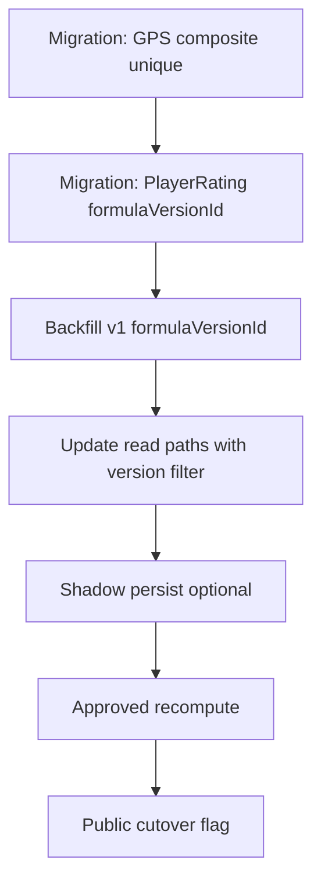

# Rating Formula Versioning Plan

**Status:** Planning — required before production Formula vNext rollout  
**Related:** ADR-010, ADR-013, G6 gate, `docs/planning/RATING_FORMULA_VNEXT.md`

---

## 1. Problem

Formula vNext shadow ratings must coexist with production Formula v1 without overwriting evidence or breaking public reads. Current schema gaps:

| Model | Issue |
|-------|-------|
| `GamePerformanceScore` | `gameStatId` is globally `@unique` — only one GPS row per game stat |
| `PlayerRating` | Unique `[playerId, ageGroup]` — no `formulaVersionId` column |
| `RankingSnapshot` | Has `formulaVersionId` but no `policyVersionId` (ADR-013) |

Shadow preview runs in memory only today. Production promotion requires schema + read-path changes.

---

## 2. Target Schema (G6)

### 2.1 GamePerformanceScore

```prisma
@@unique([gameStatId, formulaVersionId])
```

Remove global `@unique` on `gameStatId`. Migrate existing v1 rows unchanged.

### 2.2 PlayerRating

```prisma
formulaVersionId  String   @db.Uuid
policyVersionId   String?  // e.g. rating-formula-vnext-shadow-v1

@@unique([playerId, ageGroup, formulaVersionId])
@@index([formulaVersionId, ageGroup, adjustedRating])
```

Backfill all existing rows with `formulaVersionId` = v1.

### 2.3 RankingSnapshot

```prisma
policyVersionId String?  // WS-3 policy registry reference
```

Snapshot rows should freeze `policyVersionId` + per-row eligibility provenance per ADR-013.

### 2.4 Policy registry (optional table or code registry)

Extend `src/lib/eligibility/launch-policy.ts` pattern:

```typescript
RATING_FORMULA_POLICIES = {
  "rating-formula-vnext-shadow-v1": { ...FormulaVnextParams },
  "formula-v1-production": { ... }
}
```

---

## 3. Read-Path Changes

| Path | Change |
|------|--------|
| [`src/lib/rankings.ts`](src/lib/rankings.ts) | Filter `PlayerRating` by active `formulaVersionId` + `policyVersionId` from env/config |
| [`src/lib/player-rating-cumulative.ts`](src/lib/player-rating-cumulative.ts) | Accept `formulaVersionId` + policy params; v1 path unchanged |
| [`src/lib/snapshot-board-rows.ts`](src/lib/snapshot-board-rows.ts) | Pass `policyVersionId` into snapshot metadata |
| [`src/lib/submission-post-import-processing.ts`](src/lib/submission-post-import-processing.ts) | Continue v1 writes until cutover flag enabled |

### Active formula pointer

```typescript
// src/lib/ratings/active-formula.ts (new)
export function getActivePlayerFormulaConfig(): {
  formulaVersionNumber: number;
  policyVersionId: string | null;
}
```

Default: `{ formulaVersionNumber: 1, policyVersionId: null }` (current behavior).

---

## 4. Write-Path Changes (Post-Approval Only)

1. **Shadow persist (optional):** Write vNext `PlayerRating` rows with `formulaVersionId=v2` or dedicated vNext version number — never overwrite v1.
2. **Recompute job:** `scripts/recompute-player-ratings-vnext.ts` — batch upsert with explicit `--execute` flag.
3. **Public cutover:** Flip `getActivePlayerFormulaConfig()` after board movement sign-off.

---

## 5. Migration Sequence



| Step | Risk | Rollback |
|------|------|----------|
| M1–M3 | Medium — schema migration | Revert migration; v1 data intact |
| M4 | Low — defaults to v1 | Config flag |
| M5–M6 | High — new rating rows | Delete vNext rows; keep v1 |
| M7 | High — public visible | Flip flag back to v1 |

---

## 6. Testing Requirements

- Unit tests: `src/lib/ratings/formula-vnext/` pure functions
- Integration: shadow preview script output stable across runs
- Regression: v1 `PlayerRating` unchanged after migration backfill
- Public board: `/rankings` returns v1 until cutover flag set

---

## 7. Approval Gates

| Gate | Owner |
|------|-------|
| Schema migration reviewed | Engineering lead |
| Calibration report passes | Rankings architect |
| Board movement sign-off | Product owner |
| Explicit recompute approval | User (data-safety) |
| Public cutover approval | User (data-safety) |

---

## 8. Immediate Action (No Schema Yet)

Until G6 migration:

- Run shadow scripts read-only (`rating-reformulation-*`)
- Review reports in `scripts/reports/`
- Do **not** write `PlayerRating` or recompute production ratings

---

## 9. Files to Create/Modify (When Approved)

| File | Action |
|------|--------|
| `prisma/schema.prisma` | Schema changes per §2 |
| `prisma/migrations/*` | New migration |
| `docs/planning/G6_PLAYER_RATING_FORMULA_VERSIONING.sql` | Draft migration SQL (do not execute without approval) |
| `src/lib/ratings/active-formula.ts` | Active formula pointer (`PLAYER_RATING_FORMULA_MODE` env) |
| `src/lib/rankings.ts` | Version-aware reads |
| `src/lib/player-rating-cumulative.ts` | Version-aware upsert |
| `scripts/recompute-player-ratings-vnext.ts` | New — guarded recompute |
