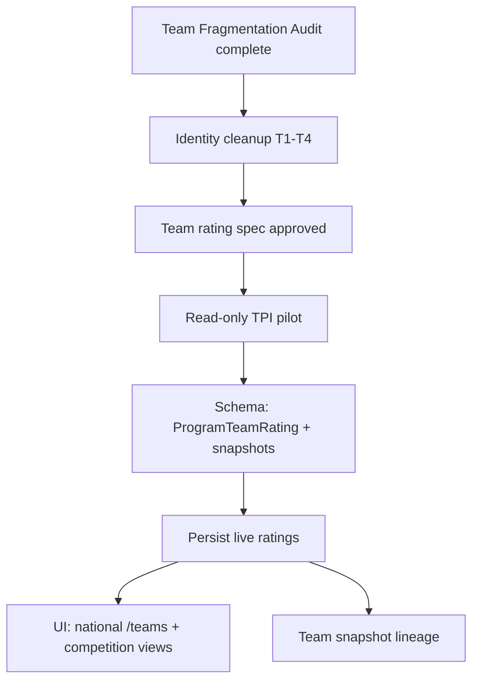

# Team Rankings Architecture Review

**Status:** Architecture planning specification  
**Version:** 1.1  
**Effective:** 2026-06-16  
**Last reviewed:** 2026-06-17 (TR-0/TR-1 readiness — see [audits/TEAM_RANKINGS_TR0_TR1_READINESS.md](./audits/TEAM_RANKINGS_TR0_TR1_READINESS.md))  
**Authority:** Subordinate to domain architecture (Program / Team / League), `docs/RANKINGS_ENGINE_BASELINE.md` principles, `docs/planning/TEAM_FRAGMENTATION_AUDIT_PLAN.md`  
**Scope:** Design review only — no code, migrations, recomputes, or execution without explicit approval

---

## Document Control

### Current state (as-built)

| Behavior | Implementation |
|---|---|
| Public `/teams` | `getDynamicTeamStandings()` — **computed W/L standings** from `Game` rows |
| Bucket key | `leagueId : seasonId : gender : identityKey` |
| PYBC grouping | `identityKey = programId ?? teamId` |
| Non-PYBC grouping | `identityKey = teamId` only |
| League filter = **All** | One row **per competition participation** — same display name may repeat |
| `TeamRating` table | Exists (`teamId + seasonId`) — **not used** for public `/teams` today |
| Player rankings | `PlayerRating` live + `RankingSnapshot` history (ADR-001 pattern) |

### Desired state (target)

| Principle | Target |
|---|---|
| **National identity** | One program/club = **one national team rating** = **one national rank** per age group + gender board |
| **Rating basis** | Derived from **recent performance across all verified competitions** |
| **Public national board** | Team appears **once** on national team rankings |
| **Competition context** | League/season pages retain **competition-specific standings** (W/L, PF, PA) |
| **Historical integrity** | `Game` / `GameStat` evidence unchanged; aggregation layers derived |

### Related artifacts

| Artifact | Role |
|---|---|
| `src/lib/team-rankings.ts` | Current competition-scoped standings |
| `docs/planning/TEAM_FRAGMENTATION_AUDIT_PLAN.md` | Identity cleanup prerequisite |
| `docs/RANKINGS_ENGINE_BASELINE.md` | Player ranking governance pattern (ADR-001, snapshots, policy versioning) |
| `prisma/schema.prisma` | `Program`, `Team`, `TeamRating`, `RankingSnapshot` (player-only rows today) |
| `docs/planning/audits/TEAM_RANKINGS_TR0_TR1_READINESS.md` | TR-0/TR-1 gate assessment (2026-06-17) |
| `docs/planning/TEAM_TPI_SPEC.md` | TPI-v1 formula specification (TR-2) |
| `docs/planning/audits/TEAM_TPI_TR3_PILOT_REPORT.md` | TR-3 read-only pilot validation (2026-06-17) |
| `docs/planning/audits/TEAM_TR35_COMPETITION_VERIFICATION_POLICY.md` | TR-3.5 evidence policy (pre-TR-4) |
| `docs/planning/audits/TEAM_TR4_PERSISTENCE_DESIGN.md` | TR-4 persistence architecture (pre-TR-5) |
| `docs/planning/audits/IDENTITY_INTEGRITY_SWEEP.md` | Post-cleanup merge queue (8 UAAP TD-01 pairs) |
| `docs/planning/SNAPSHOT_POLICY_REV2.md` | Player snapshot governance pattern for TR-7 team lineage |

### TR-0 / TR-1 gate status (2026-06-17)

| Gate | Status | Notes |
|---|---|---|
| **TR-0** | **Not passed** | TF-E01–E07 incomplete; identity sweep ≠ fragmentation audit exit |
| **TR-1** | **Blocked** | 8 UAAP same-program duplicate Teams (~2,900+ GameStats) — merges not executed |
| **TR-2–TR-7** | Not started | Depend on TR-0/TR-1 |
| **Product recommendation** | **B — cleanup before pilot** | See readiness memo |

---

## Executive Summary

Today’s team rankings page is a **competition standings aggregator**, not a national rating system. Repeating team names under League = All are largely **by design** given the bucket key — but they conflict with the product goal of **one national rank per club/program**.

The target architecture **mirrors the player rankings split** established in ADR-001:

| Layer | Player (existing) | Team (proposed) |
|---|---|---|
| **Live national board** | `PlayerRating` | **`ProgramTeamRating`** (new live store) |
| **Historical / trends** | `RankingSnapshot` + rows | **`TeamRankingSnapshot`** + rows (new lineage) |
| **Competition view** | N/A (players are individuals) | **Competition standings** (derived from `Game`, scoped by league/season) |

**Canonical national identity = `Program`** (school/club), scoped by **`ageGroup` + `gender`**. `Team` remains the competition moniker and game-attribution record. PYBC’s `programId` grouping was an early special case of what should become the **default national key**.

**Critical path:** Complete team fragmentation audit (identity cleanup) **before** persisting national team ratings — otherwise ratings compound duplicate identities.

---

## 1. Canonical Team Identity Model

### 1.1 Identity hierarchy (locked)

```
Program (canonical national identity)
  └── Team[] (competition records / monikers)
        └── Game participation (homeTeamId / awayTeamId + seasonId)
        └── PlayerTeamSeason (roster per season)
```

| Entity | National rankings role | Competition standings role |
|---|---|---|
| **Program** | **Primary key** for national rating and rank | Display name source |
| **Team** | Contributor of game evidence via `programId` | Row key within a league/season |
| **League / Season** | Weight + recency context for rating inputs | **Scope boundary** for standings table |

### 1.2 National board key

| Dimension | Value |
|---|---|
| `programId` | Canonical program (required for national row) |
| `ageGroup` | U13 \| U16 \| U19 (from game league context or board policy) |
| `gender` | Boys \| Girls |
| **Uniqueness** | At most one national rating row per `(programId, ageGroup, gender)` |

**Programs without linked Teams in active competitions** do not appear on the national board.

### 1.3 Canonical resolution rules

| Rule ID | Rule |
|---|---|
| **TI-01** | National rank resolves to `programId`; public display uses `Program.fullName` (or approved display alias) |
| **TI-02** | All `Team` records with `programId = P` contribute games to **P’s** national rating pool |
| **TI-03** | `Team` with `programId IS NULL` is **excluded** from national board until linked (admin repair) |
| **TI-04** | Duplicate Programs for same club must be merged **before** national rating persist (fragmentation audit) |
| **TI-05** | UAAP school programs: one Program, seasonal Team monikers may rotate — still one national program identity per age/gender board |
| **TI-06** | Club programs (BBC, Charm, etc.): one Program per club brand; multiple competition Teams roll up |

### 1.4 PYBC alignment

PYBC already treats each participant as **one Program + one canonical Team** with standings grouped by `programId`. National architecture **generalizes PYBC logic** to all competitions — PYBC becomes a **competition standings** view under the national model, not a special-case grouping hack.

### 1.5 Slug and profile routing

| Surface | Current | Target |
|---|---|---|
| `/teams/[teamId]` | Team-scoped profile | **Program-scoped** national profile (`/programs/[slug]` or redirect from canonical Team) |
| National board link | `teamId` | **`programId`** (or canonical representative `teamId` for URL stability during transition) |

*URL migration is a product decision — document dual-route period in rollout.*

---

## 2. Program vs Team Ownership

### 2.1 Ownership matrix

| Concern | Owner entity | Rationale |
|---|---|---|
| National rating & rank | **Program** | Domain rule: Program = school/club identity |
| Game box score attribution | **Team** | Historical evidence tied to competition moniker at game time |
| Roster history | **PlayerTeamSeason** → `teamId` | Who wore which jersey in which season |
| Competition W/L standings | **Team** within **League/Season** | Officials and fans think in tournament/league tables |
| Import matching | **Team** + **TeamExternalAlias**; links to **Program** | Imports create/reuse Team; Program is stable anchor |
| `Player.currentProgramId` | **Program** (metadata only) | Not roster truth; unchanged |

### 2.2 When one Program has multiple Teams

| Scenario | National behavior | Competition behavior |
|---|---|---|
| Same club, two tournaments, two Team records | **One** national rating (games pooled) | **Two** standings rows (one per league/season) |
| UAAP + PYBC same school | One Program; games from both count toward national rating (age/gender permitting) | Separate standings per competition |
| Suffix duplicate Teams (fragmentation) | **Block rating persist** until merged | Duplicate standings rows until repair |

### 2.3 Team merge vs Program merge

| Operation | When | National impact |
|---|---|---|
| **Team reassignment** | Same Program, duplicate Team IDs in one scope | Games roll up to canonical Team; national rating unchanged if same `programId` |
| **Program merge** | Duplicate Programs for same club | National ratings must recompute on canonical `programId` |
| **Program link** | `Team.programId` null → set | Team games begin contributing to Program national pool |

---

## 3. Team Rating Methodology

### 3.1 Design goals

| Goal | Constraint |
|---|---|
| Credible national ordering | Must reflect cross-competition performance, not single tournament hot streaks |
| League quality awareness | Higher-tier competitions weigh more (align with `League.tier`) |
| Opponent strength | Beating strong teams matters more than padding wins vs weak fields |
| Sample size | Minimum verified games threshold (policy-versioned, analogous to ADR-002) |
| Transparency | Methodology page explains inputs; proprietary constants may stay internal |
| Independence from player formula | Team rating is **not** a simple average of `PlayerRating` — parallel methodology |

### 3.2 Proposed rating inputs (conceptual)

| Input | Source | Notes |
|---|---|---|
| Verified game results | `Game` (scores, date, season) | Only `verificationStatus = VERIFIED` |
| Opponent identity | Opponent `programId` via Team link | For strength-of-schedule |
| League tier | `League.tier` | WS-3 / policy-versioned multiplier |
| Home/away | `Game` side | Optional small factor |
| Recency | `Game.gameDate` | See §4 |
| Age/gender board | `League.ageGroup`, inferred gender | Board separation |

### 3.3 Proposed formula structure (v1 team — planning)

**Team Performance Index (TPI)** — illustrative decomposition:

```
gameContribution = resultPoints(win/loss, margin) 
                 × opponentStrength(opponentProgramTPI or tier proxy)
                 × leagueTierWeight(league.tier)
                 × recencyWeight(gameDate)

TPI = normalize( Σ gameContribution ) with Bayesian shrinkage toward board mean
```

| Component | Purpose |
|---|---|
| `resultPoints` | Win/loss + optional margin cap (prevent blowout gaming) |
| `opponentStrength` | Iterative or tier-based SOS (start simple: opponent tier average) |
| `leagueTierWeight` | Align with ADR-012 “weight once at compute” — applied here at team game level |
| `recencyWeight` | §4 |
| Shrinkage | Penalize low game count programs (like player shrinkageK at G7 neutral profile) |

### 3.4 Threshold policy (analogous to player eligibility)

| Policy | Launch proposal | Mature target |
|---|---|---|
| Minimum verified games | 8 games | 12 games |
| Minimum distinct opponents | 3 | 5 |
| Minimum tier-2+ games (optional) | 0 at launch | 2 |

Thresholds are **`policyVersionId`-versioned** when WS-3 extends to team policy (prospective-only).

### 3.5 Live store contract (mirrors ADR-001)

| Store | Purpose |
|---|---|
| **`ProgramTeamRating`** (proposed) | Live national team board — authoritative for `/teams` national view |
| **Competition standings** | Derived read model — **not** stored as rating |

Fields (planning):

- `programId`, `ageGroup`, `gender`
- `rating` (TPI), `rank` (computed at read or materialized)
- `verifiedGameCount`, `verifiedCompetitionCount`
- `formulaVersionId`, `policyVersionId`, `computedAt`

### 3.6 Relationship to existing `TeamRating`

| Model | Scope today | Future |
|---|---|---|
| `TeamRating` (`teamId + seasonId`) | Per-team per-season; unused publicly | **Deprecate or repurpose** as competition-season auxiliary metric, or replace with competition standings cache |
| `ProgramTeamRating` | N/A | **New** national live board |

Do not overload `TeamRating` for national cross-competition rating — season scope is wrong semantically.

---

## 4. Recency Weighting Approach

### 4.1 Principles

| Principle | Rule |
|---|---|
| **P-R1** | Recent games reflect current team strength; old tournaments decay |
| **P-R2** | Decay is **smooth**, not a hard cliff (unless product mandates window) |
| **P-R3** | Recency applies at **game contribution** level before aggregation |
| **P-R4** | Policy-versioned half-life parameter |

### 4.2 Recommended model: exponential decay

```
recencyWeight(gameDate) = exp( -λ × ageDays )

ageDays = evaluationDate - gameDate
λ = ln(2) / halfLifeDays
```

| Parameter | Launch default | Notes |
|---|---|---|
| `halfLifeDays` | 180 | ~6 months; tune with product |
| `maxAgeDays` | 540 (optional cap) | Games older than cap contribute 0 |

### 4.3 Alternative: rolling window (simpler MVP)

| Model | Rule |
|---|---|
| Rolling window | Only games with `gameDate >= evaluationDate - 365 days` count |
| Pros | Easier to explain on How We Rank |
| Cons | Cliff at window boundary |

**Recommendation:** Exponential decay for formula; rolling window as **optional policy profile** for transparency mode.

### 4.4 Cross-competition recency

All verified games across leagues contribute with same decay — national rating naturally emphasizes **recent activity anywhere**. A club idle for 12 months drops even if prior season was strong.

### 4.5 Interaction with competition standings

Competition standings pages show **full tournament W/L** (no recency decay) or **season-scoped** tables — unchanged fan expectation. Recency applies **only** to national TPI.

---

## 5. Competition Standings vs National Rankings Separation

### 5.1 Two-layer model (locked)

```
┌─────────────────────────────────────────────────────────────┐
│  Evidence layer (immutable)                                  │
│  Game, GameStat, Team, Season, League                        │
└──────────────────────────┬──────────────────────────────────┘
                           │
         ┌─────────────────┴─────────────────┐
         ▼                                   ▼
┌─────────────────────┐           ┌─────────────────────────┐
│  National layer      │           │  Competition layer       │
│  ProgramTeamRating   │           │  Standings (derived)     │
│  One row per program │           │  One row per team per    │
│  ageGroup + gender   │           │  league/season scope     │
│  TPI + national rank │           │  W/L, PF, PA, win%       │
└─────────────────────┘           └─────────────────────────┘
```

### 5.2 Public surfaces

| Surface | Layer | Default scope |
|---|---|---|
| `/teams` (national board) | National | All competitions aggregated; **one row per program** |
| `/leagues/[id]` or league detail | Competition | Standings for that league’s active season |
| `/teams` with league filter (optional) | Competition | Filtered standings — **not** national rank reorder |
| Homepage team preview | National | Top N national programs |
| Team/program profile | Both | National rank + competition history table |

### 5.3 UI semantics (avoid AG-4-style confusion)

| Element | National board | Competition standings |
|---|---|---|
| Rank column label | **National Rank** | **Standings** or **# in [League]** |
| Sort default | National rating / rank | Win % |
| Repeated names | **Never** (one program once) | One row per team per competition |
| Helper copy | "Rank reflects performance across verified competitions" | "Standings for [League Name] only" |

### 5.4 Migration of current `/teams` behavior

| Current | Target |
|---|---|
| `getDynamicTeamStandings` powers `/teams` | Split: `getNationalTeamRankings()` + `getCompetitionStandings()` |
| League = All shows duplicates | League = All on **national** view shows unique programs |
| League filter | Switches to **competition standings mode** (subview), not a filter on national ranks |

*Product fork:* League filter on `/teams` toggles **view mode** (National | Competition), not a filter on the same ranking universe.

### 5.5 Analogy to player AG-4 recruiting view

| Player | Team |
|---|---|
| U19 board = authoritative rating | National program board = authoritative TPI |
| Class-year filter = derived subset | League standings = derived competition view |
| National rank preserved in subset | National rank on program profile; competition table shows local W/L |

---

## 6. Snapshot Implications

### 6.1 Player snapshot precedent (ADR-001, ADR-006, ADR-013)

| Player | Team (proposed) |
|---|---|
| `RankingSnapshot` + `RankingSnapshotRow` | **`TeamRankingSnapshot` + `TeamRankingSnapshotRow`** |
| Monthly `weekOf` freeze | Same cadence |
| `formulaVersionId` + `policyVersionId` on header | Same |
| Immutable after publish | Same |
| Live `PlayerRating` authoritative for live board | Live `ProgramTeamRating` authoritative |

### 6.2 Schema planning (no migration in this doc)

**Option A — Parallel snapshot tables (recommended)**

| Table | Keys |
|---|---|
| `TeamRankingSnapshot` | `scope=NATIONAL`, `ageGroup`, `gender`, `weekOf`, `formulaVersionId`, `policyVersionId` |
| `TeamRankingSnapshotRow` | `snapshotId`, `programId`, `rank`, `rating`, `verifiedGameCount`, `movement` |

**Option B — Extend `RankingSnapshot` scope enum**

- Add `TEAM_NATIONAL` scope; rows reference `programId` instead of `playerId`
- Risk: couples player and team snapshot lifecycles — **not recommended**

### 6.3 Snapshot generation

1. Read live `ProgramTeamRating` for board.
2. Apply eligibility threshold (min games — team policy).
3. Freeze rows with provenance fields (program name, game count, competition count).
4. Publish monthly; supersede prior.

### 6.4 Trends

Program profile may show **national rank trend** from `TeamRankingSnapshotRow` — analogous to player profile snapshot trend.

### 6.5 Orthogonality to player snapshots

| Concern | Rule |
|---|---|
| Player `RankingSnapshot` | **Unchanged** |
| Team snapshots | **New lineage** — no retro-edit of player snapshots |
| Same publish job | May orchestrate both after stable gates — separate approval |

---

## 7. Migration Strategy

### 7.1 Gate sequence (planning)



| Gate | Name | Prerequisite |
|---|---|---|
| **TR-0** | Fragmentation audit exit | `TEAM_FRAGMENTATION_AUDIT_PLAN` TF-E01–E07 |
| **TR-1** | Identity canonicalization | No same-scope duplicate Teams per Program |
| **TR-2** | Methodology sign-off | Product + rankings architect |
| **TR-3** | TPI pilot (read-only) | Bounded program set; no persist |
| **TR-4** | Schema readiness | Engineering + data safety |
| **TR-5** | Live rating persist | TR-3 validation report |
| **TR-6** | Public UI cutover | TR-5 + rollback drill |
| **TR-7** | Snapshot publish | TR-6 stable 30 days |

**Coordination:** Team national ratings are **orthogonal** to G1–G7 player engine gates — but reuse governance patterns (policy versioning, snapshots, prospective-only policy).

### 7.2 Phased rollout

| Phase | Deliverable | User-visible change |
|---|---|---|
| **Phase 0** | Identity audit + repair | None (or fewer duplicate rows in competition view) |
| **Phase 1** | Split read paths in planning; competition standings extracted | Optional admin preview |
| **Phase 2** | `ProgramTeamRating` backfill + national `/teams` behind flag | Beta national board |
| **Phase 3** | Default national view; competition via league pages | One row per program nationally |
| **Phase 4** | Team snapshot monthly publish | Trend on program profiles |

### 7.3 URL and link migration

| Period | Behavior |
|---|---|
| Transition | `/teams/[teamId]` redirects to program profile when `team.programId` set |
| Canonical | `/programs/[slug]` national profile (may already exist in admin) |

### 7.4 Import pipeline changes (prospective)

| Change | Purpose |
|---|---|
| Enforce `programId` on import | Every Team links to Program before games count nationally |
| `TeamExternalAlias` required for club names | Prevent BBC/Torch re-creation |
| National rating increment | Post-import hook queues program recomputation (future) |

### 7.5 Feature flag

| Flag | Purpose |
|---|---|
| `TEAM_NATIONAL_RATINGS_ENABLED` | Toggle `/teams` national vs legacy competition aggregation |
| Default | Off until TR-6 sign-off |

---

## 8. Historical Data Implications

### 8.1 Immutable evidence

| Entity | Treatment |
|---|---|
| `Game` scores, dates, team IDs at game time | **Never rewritten** |
| `GameStat` | **Never rewritten** |
| `PlayerTeamSeason` | Reassign only via approved team identity repair |
| Player `RankingSnapshot` | **Untouched** |

### 8.2 Derived history

| Artifact | Treatment |
|---|---|
| Past competition standings (computed) | Recomputable from Games; not stored historically today |
| New `TeamRankingSnapshot` lineage | Starts at first publish — **no retroactive national ranks before cutover** |
| `TeamRating` (season-scoped) | Legacy; may be archived or migrated to competition cache |

### 8.3 Program merge historical narrative

When Programs merge, national TPI recomputes on canonical program — **historical team snapshots** (post-TR-7) remain on frozen `programId` unless explicit forward-correction policy (mirror WS-4 forward correction — planning only).

### 8.4 PYBC historical presentation

PYBC competition standings remain available as **competition view** with 8 rows / 37 games. National board may rank those programs **among all U16 Boys clubs nationally** — rank order may differ from PYBC-only W/L table.

---

## 9. Validation Framework

### 9.1 Pre-persist validation (TR-3 pilot)

| ID | Check | Expected |
|---|---|---|
| **V-TR-01** | Every national row maps to exactly one `programId` | Unique `(programId, ageGroup, gender)` |
| **V-TR-02** | Game count in TPI matches manual audit for sample programs | ±0 games |
| **V-TR-03** | PYBC 8 programs: national pool includes all 37 games | Full coverage |
| **V-TR-04** | Recency: game 200 days ago weighs ~50% of today at 180-day half-life | Math spot-check |
| **V-TR-05** | League tier weight applied once per game | No double-count |
| **V-TR-06** | Programs below threshold excluded from board | Policy compliant |
| **V-TR-07** | Null `programId` teams excluded | Zero national rows without program |

### 9.2 Post-cutover validation (TR-6)

| ID | Check | Expected |
|---|---|---|
| **V-TR-08** | `/teams` national view: no duplicate `programId` per age/gender | Unique display names |
| **V-TR-09** | League competition view matches pre-split W/L for sample league | Standings parity |
| **V-TR-10** | Homepage team preview ⊆ national board | Consistent ordering |
| **V-TR-11** | Player rankings unchanged | No regression on `/rankings` |
| **V-TR-12** | `npx tsc --noEmit` | Pass (when implemented) |

### 9.3 Snapshot validation (TR-7)

| ID | Check | Expected |
|---|---|---|
| **V-TR-13** | Snapshot row count = live board at publish | ±0 |
| **V-TR-14** | `formulaVersionId` + `policyVersionId` on header | Populated |
| **V-TR-15** | Published snapshot immutable | INV-03 pattern |

### 9.4 Ongoing monitoring

| Metric | Alert |
|---|---|
| Programs with multiple active Teams same scope | Fragmentation regression |
| National board size drop > 10% WoW | Compute or identity bug |
| TPI vs competition W/L rank divergence | Expected — document, don’t alert unless bug |

---

## 10. Rollback Strategy

### 10.1 Rollback triggers

| Trigger | Action |
|---|---|
| National board order widely disputed | Disable `TEAM_NATIONAL_RATINGS_ENABLED` |
| TPI compute error / wrong game attribution | Stop persist job; flag off |
| Identity merge defect | Pause TR-5; revert to competition-only view |
| Snapshot publish defect | Hold TR-7; live board unaffected |

### 10.2 Rollback procedure

| Step | Action |
|---|---|
| 1 | Set `TEAM_NATIONAL_RATINGS_ENABLED=false` |
| 2 | `/teams` serves legacy `getDynamicTeamStandings` competition aggregation |
| 3 | Verify competition standings unchanged |
| 4 | `ProgramTeamRating` rows remain in DB but unused (no delete required) |
| 5 | Incident report; fix forward |

### 10.3 Partial rollback

| Scope | Action |
|---|---|
| UI only | Flag off; keep computed ratings for admin preview |
| Compute only | Stop recompute job; serve last good `computedAt` |
| Snapshots only | Stop team snapshot publish; player snapshots continue |

### 10.4 Rollback constraints

| Constraint | Reason |
|---|---|
| No Game rewrites on rollback | Historical integrity |
| No automatic Program un-merge | Data safety |
| Player ranking engine independent | Orthogonal rollback |

---

## Impact Assessment

### Ranking impact

| Area | Effect |
|---|---|
| **Player rankings** | **None** — separate formula, store, and snapshots |
| **Team national board** | **New system** — replaces competition-duplicate view with one row per program |
| **Competition standings** | **Preserved** as derived view — W/L semantics unchanged |
| **PYBC** | National pool aggregates 37 games; competition view still shows 8-team table |
| **Formula v1/v2 player work** | Orthogonal; team TPI is new formula family |
| **Eligibility (WS-1)** | Not applicable to teams at launch; team thresholds separate policy |

### Snapshot impact

| Area | Effect |
|---|---|
| Player snapshots | **Unchanged** |
| New team snapshot lineage | Required for trends; starts at TR-7 |
| Storage | New tables or scope; row count = programs on board, not games |
| ADR-013 pattern | Apply `formulaVersionId` + `policyVersionId` + row provenance |

### Migration impact

| Area | Effect |
|---|---|
| Schema | **New** `ProgramTeamRating` + team snapshot tables (TR-4) — planning only here |
| Identity cleanup | **Required** before TR-5 (TR-0, TR-1) |
| `team-rankings.ts` | Split into national + competition modules |
| `TeamRating` | Deprecate or narrow scope |
| Import pipeline | Stricter `programId` + alias enforcement |
| Player engine gates G1–G7 | No blocker; parallel program |

### Historical-data impact

| Area | Effect |
|---|---|
| `Game` / `GameStat` | **No rewrite** |
| Past public `/teams` behavior | Not frozen — was computed view, not snapshots |
| Team national history | Begins at first snapshot publish — no fictional retroactive national ranks |
| Identity repairs | Reassignment-only merges (PYBC precedent) |

---

## Architecture Decisions (summary)

| ID | Decision | Status |
|---|---|---|
| **ADR-T01** | National canonical identity = `Program` + `ageGroup` + `gender` | Proposed |
| **ADR-T02** | Live national board = `ProgramTeamRating`; competition standings derived from `Game` | Proposed |
| **ADR-T03** | Recency = exponential decay at game level; policy-versioned half-life | Proposed |
| **ADR-T04** | Team snapshots parallel player snapshot governance | Proposed |
| **ADR-T05** | Identity cleanup before rating persist | Proposed |
| **ADR-T06** | `/teams` league filter = view mode switch (national vs competition), not national filter | Proposed |

---

## Dependencies & Prerequisites

| Prerequisite | Why |
|---|---|
| `TEAM_FRAGMENTATION_AUDIT_PLAN` complete | Ratings on duplicate Programs are not credible |
| Product sign-off on TPI methodology | Public trust |
| Team policy versioning design (WS-3 extension or team policy stub) | Threshold changes prospective-only |
| How We Rank page update | Explain national vs competition |
| Player engine stability | Avoid parallel cutover confusion with G7 |

---

## Readiness Checklist (architecture approval)

- [ ] ADR-T01–T06 accepted by product + rankings architect
- [x] TR-0/TR-1 readiness assessment complete (2026-06-17 memo)
- [ ] Team fragmentation audit exit (TR-0 / TF-E01–E07) — **in progress**
- [ ] Identity canonicalization (TR-1) — **blocked on UAAP merges**
- [x] TPI formula spec detailed — [TEAM_TPI_SPEC.md](./TEAM_TPI_SPEC.md) (TR-2)
- [x] TR-4 persistence design — [audits/TEAM_TR4_PERSISTENCE_DESIGN.md](./audits/TEAM_TR4_PERSISTENCE_DESIGN.md)
- [ ] Competition vs national UI wireframes approved
- [ ] Snapshot schema migration approved (engineering + data safety)
- [ ] Rollback flag strategy agreed
- [x] Explicit approval **not** to execute schema or compute in this phase

---

## Approval

| Role | Architecture review |
|---|---|
| Product owner | Required |
| Rankings architect | Required |
| Engineering lead | Required |
| Data integrity lead | Required (identity path) |

---

*End of Team Rankings Architecture Review v1.0*
