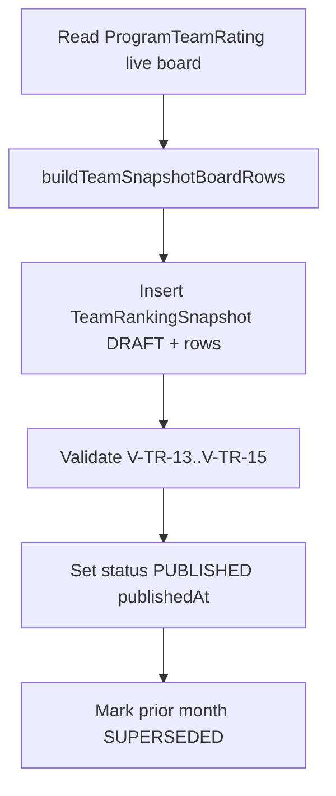

# TR-4 ProgramTeamRating Persistence Design

**Status:** Persistence architecture specification (pre-implementation)  
**Version:** 1.0  
**Effective:** 2026-06-17  
**Authority:** Rankings architect; subordinate to [TEAM_RANKINGS_ARCHITECTURE_REVIEW.md](../TEAM_RANKINGS_ARCHITECTURE_REVIEW.md), [TEAM_TPI_SPEC.md](../TEAM_TPI_SPEC.md), [TEAM_TR35_COMPETITION_VERIFICATION_POLICY.md](./TEAM_TR35_COMPETITION_VERIFICATION_POLICY.md)  
**Scope:** Schema and workflow design only — **no implementation, migrations, code changes, or persistence writes**

---

## Executive Summary

National team rankings persist as **`ProgramTeamRating`** (live board, ADR-T01/T02) and **`TeamRankingSnapshot` + `TeamRankingSnapshotRow`** (historical lineage, ADR-T04). This mirrors the player split (`PlayerRating` / `RankingSnapshot`) but uses **parallel tables** — do not extend player snapshot rows or overload season-scoped `TeamRating`.

**Locked inputs:**

| Dimension | Value |
|---|---|
| National key | `(programId, ageGroup, gender)` |
| Formula | **TPI-v1** |
| Evidence | **`TEAM-EVIDENCE-v1-official-import`** |
| Thresholds | **`TEAM-POLICY-v1-launch`** (8 games / 3 opponents) |
| Snapshots | **Rev 2 pattern** — mirror live public board at `weekOf`; forward-only |

### Implementation recommendation: **A — Ready for TR-5 implementation**

Schema design is complete. TR-5 may proceed after engineering review of §10 pre-flight checklist (seed rows, migration approval, recompute dry-run).

---

## 1. ProgramTeamRating Schema Design

### 1.1 Purpose

Authoritative **live** national team board per ADR-001 team analogue. Public `/teams` national view reads here when `TEAM_NATIONAL_RATINGS_ENABLED=true`.

### 1.2 Proposed model

```prisma
model ProgramTeamRating {
  id                       String       @id @default(uuid()) @db.Uuid
  programId                String       @db.Uuid
  ageGroup                 AgeGroup
  gender                   PlayerGender

  /// Published TPI (TPI_adjusted per TEAM_TPI_SPEC §3.5)
  rating                   Decimal      @db.Decimal(5, 2)

  /// Audit fields (optional at read time; recommended for admin/debug)
  observedRating           Decimal?     @db.Decimal(5, 2)   // pass-1 observed before shrinkage
  effectiveGameWeight      Decimal?     @db.Decimal(8, 3)   // Σ recencyWeight

  /// Evidence counts (eligible games under TEAM-EVIDENCE-v1-official-import)
  verifiedGameCount        Int
  verifiedOpponentCount    Int
  verifiedCompetitionCount Int          // distinct league/season scopes

  /// Board eligibility (threshold gate — analogous to publicRankAllowed)
  publicBoardEligible      Boolean      @default(false)

  /// Provenance (ADR-010 / ADR-013)
  teamFormulaVersionId     String       @db.Uuid
  evidencePolicyVersion    String       // e.g. TEAM-EVIDENCE-v1-official-import
  thresholdPolicyVersion   String       // e.g. TEAM-POLICY-v1-launch

  computedAt               DateTime     @default(now())

  program                  Program      @relation(fields: [programId], references: [id])
  teamFormulaVersion       TeamFormulaVersion @relation(fields: [teamFormulaVersionId], references: [id])

  @@unique([programId, ageGroup, gender])
  @@index([ageGroup, gender, rating])
  @@index([publicBoardEligible, ageGroup, gender, rating])
  @@index([computedAt])
  @@map("program_team_ratings")
}
```

### 1.3 Field semantics

| Field | Rule |
|---|---|
| `rating` | `TPI_adjusted` — public sort key |
| `observedRating` | Pass-1 observed (clamped); audit only |
| `effectiveGameWeight` | Recency-weighted denominator; used in shrinkage interpretability |
| `verifiedGameCount` | Raw eligible game count (not recency-weighted) |
| `verifiedOpponentCount` | Distinct opponent `programId` on eligible games |
| `verifiedCompetitionCount` | Distinct `(leagueId, seasonId)` on eligible games |
| `publicBoardEligible` | `true` iff passes TEAM-POLICY-v1-launch thresholds |
| `evidencePolicyVersion` | Slug — not player WS-3 registry; team-specific |
| `thresholdPolicyVersion` | Min games / opponents; prospective-only changes |

### 1.4 Rank handling

**Do not persist `rank` on live rows.** Compute at read:

```
ORDER BY rating DESC, verifiedGameCount DESC, program.fullName ASC
```

Matches `PlayerRating` pattern (rank from sort, not stored on live table).

### 1.5 Relation to existing `TeamRating`

| Model | Scope | TR-4 action |
|---|---|---|
| `TeamRating` | `teamId + seasonId` | **No writes**; deprecate later; competition cache optional |
| `ProgramTeamRating` | `programId + ageGroup + gender` | **New live national store** |

### 1.6 Supporting model — `TeamFormulaVersion`

Player `FormulaVersion` is GPS-specific. Team formula is independent (ADR-T family).

```prisma
model TeamFormulaVersion {
  id            String   @id @default(uuid()) @db.Uuid
  slug          String   @unique   // "TPI-v1"
  versionNumber Int      @unique   // 1
  description   String
  parameters    Json     // shrinkageK, halfLifeDays, tier weights, iteration count
  effectiveFrom DateTime
  effectiveTo   DateTime?
  isPublic      Boolean  @default(true)
  createdAt     DateTime @default(now())

  programTeamRatings     ProgramTeamRating[]
  teamRankingSnapshots   TeamRankingSnapshot[]

  @@map("team_formula_versions")
}
```

**Seed at migration:** one row `slug = TPI-v1` matching [TEAM_TPI_SPEC.md](../TEAM_TPI_SPEC.md) §3.

### 1.7 Program relation

Add to `Program`:

```prisma
programTeamRatings ProgramTeamRating[]
```

---

## 2. TeamRankingSnapshot Schema Design

### 2.1 Purpose

Immutable monthly freeze of **public national team board** at `weekOf`. Parallel lineage to `RankingSnapshot` — **not** an extension of player scope enum.

### 2.2 Proposed model

```prisma
enum TeamRankingSnapshotStatus {
  DRAFT
  PUBLISHED
  SUPERSEDED
}

model TeamRankingSnapshot {
  id                     String                    @id @default(uuid()) @db.Uuid
  ageGroup               AgeGroup
  gender                 PlayerGender
  weekOf                 DateTime                  // first day of month UTC (match player cadence)

  teamFormulaVersionId   String                    @db.Uuid
  evidencePolicyVersion  String
  thresholdPolicyVersion String

  status                 TeamRankingSnapshotStatus @default(DRAFT)
  publishedAt            DateTime?
  supersededAt           DateTime?

  rowCount               Int                       @default(0)
  evaluationDate         DateTime                  // typically weekOf end-of-day or publish instant

  teamFormulaVersion     TeamFormulaVersion        @relation(fields: [teamFormulaVersionId], references: [id])
  rows                   TeamRankingSnapshotRow[]

  createdAt              DateTime                  @default(now())

  @@unique([ageGroup, gender, weekOf, teamFormulaVersionId, evidencePolicyVersion, thresholdPolicyVersion])
  @@index([ageGroup, gender, weekOf])
  @@index([status, weekOf])
  @@index([teamFormulaVersionId])
  @@map("team_ranking_snapshots")
}
```

### 2.3 Rev 2 alignment

| Rev 2 rule (player) | Team analogue |
|---|---|
| Snapshot mirrors live board at `weekOf` | Freeze rows where `publicBoardEligible = true` on live `ProgramTeamRating` at evaluation |
| `publicRankAllowed` gate | `publicBoardEligible` gate |
| No historical rewrite | **No bulk regen** of published team snapshots; forward publish only |
| Provenance on header | `teamFormulaVersionId` + both policy version strings |

### 2.4 Lifecycle (ADR-006 pattern)

```
DRAFT → PUBLISHED → SUPERSEDED (when newer month published for same board)
```

Player snapshots today omit explicit `status`; team snapshots **should include it** for clearer TR-7 ops and rollback.

---

## 3. TeamRankingSnapshotRow Schema Design

### 3.1 Proposed model

```prisma
model TeamRankingSnapshotRow {
  id                      String              @id @default(uuid()) @db.Uuid
  snapshotId              String              @db.Uuid
  programId               String              @db.Uuid

  rank                    Int
  rating                  Decimal             @db.Decimal(5, 2)

  verifiedGameCount       Int
  verifiedOpponentCount   Int
  verifiedCompetitionCount Int

  /// Frozen display provenance (ADR-013 row freeze)
  programName             String
  programAbbreviation     String?

  movement                Int                 @default(0)  // vs prior PUBLISHED snapshot same board

  snapshot                TeamRankingSnapshot @relation(fields: [snapshotId], references: [id], onDelete: Cascade)
  program                 Program             @relation(fields: [programId], references: [id])

  @@unique([snapshotId, programId])
  @@index([snapshotId, rank])
  @@index([programId])
  @@map("team_ranking_snapshot_rows")
}
```

### 3.2 Row inclusion rule

```ts
// Canonical builder (planning contract — mirror src/lib/snapshot-board-rows.ts)
include row iff ProgramTeamRating.publicBoardEligible === true at evaluationDate
```

Rows below threshold are **excluded** from snapshot (same as PROVISIONAL players off player snapshots).

### 3.3 Optional row provenance (TR-7+)

Defer to TPI-v2 unless product requires at launch:

- `wins`, `losses` frozen
- `evidencePolicyVersion` redundant if on header only

---

## 4. Uniqueness Constraints and Indexes

### 4.1 Uniqueness summary

| Table | Constraint | Purpose |
|---|---|---|
| `ProgramTeamRating` | `@@unique([programId, ageGroup, gender])` | **V-TR-01** one national row per program per board |
| `TeamRankingSnapshot` | `@@unique([ageGroup, gender, weekOf, teamFormulaVersionId, evidencePolicyVersion, thresholdPolicyVersion])` | One header per board/month/policy tuple |
| `TeamRankingSnapshotRow` | `@@unique([snapshotId, programId])` | No duplicate programs in snapshot |
| `TeamFormulaVersion` | `slug` unique, `versionNumber` unique | Formula lineage |

### 4.2 Index rationale

| Index | Query |
|---|---|
| `[ageGroup, gender, rating]` | Live national board sort |
| `[publicBoardEligible, ageGroup, gender, rating]` | Public filter + sort |
| `[snapshotId, rank]` | Snapshot render |
| `[status, weekOf]` | Admin publish queue |
| `[programId]` on rows | Program profile trend |

### 4.3 FK and delete behavior

| FK | On delete |
|---|---|
| `ProgramTeamRating.programId` | **Restrict** — soft-delete program first; recompute removes row |
| `TeamRankingSnapshotRow.programId` | **Restrict** — snapshots are historical evidence |
| `TeamRankingSnapshotRow.snapshotId` | **Cascade** — delete DRAFT snapshot only in admin tooling |

**Rule:** Never hard-delete `Program` with published snapshot rows without merge workflow.

---

## 5. Publish Workflow (TR-7)

Applies **after** TR-6 stable; documented here for schema completeness.



| Step | Action |
|---|---|
| 1 | `evaluationDate` = `weekOf` (month start) or explicit publish timestamp |
| 2 | Load `ProgramTeamRating` for `(ageGroup, gender)` where `publicBoardEligible` |
| 3 | Sort; assign `rank`; compute `movement` vs latest `PUBLISHED` snapshot |
| 4 | Insert header `DRAFT` + rows with frozen `programName` |
| 5 | Validate row count matches live eligible count |
| 6 | Set `PUBLISHED`; supersede prior published header for same board |
| 7 | **Never** update rows after `PUBLISHED` |

**Entry points (planned):**

| Path | When |
|---|---|
| `scripts/generate-team-ranking-snapshots-v1.ts` | Manual monthly (mirror player scripts) |
| Post-import hook (optional) | After TR-6 + 30d soak only |
| Admin action | Explicit approval per data-safety |

**Rev 2 guard:** No `--execute` bulk regen of historical team snapshots.

---

## 6. Recompute Workflow (TR-5)

### 6.1 Triggers

| Trigger | Scope | Approval |
|---|---|---|
| Manual admin / script | Full or per-board | TR-5 explicit |
| Post official import | Affected `(ageGroup, gender)` boards | TR-5 + import approval |
| Scheduled job (future) | All boards nightly | TR-6+ |

### 6.2 Algorithm

```
FOR each board (ageGroup, gender):
  1. Load eligible games per TEAM-EVIDENCE-v1-official-import
  2. Dedupe by gameNumber within board (PYBC lesson)
  3. Run TPI-v1 (scripts/tpi-v1-pilot-readonly.ts logic → src/lib/team-tpi-v1.ts)
  4. UPSERT ProgramTeamRating per programId
  5. DELETE ProgramTeamRating rows for programs with zero eligible games on board
  6. Set computedAt, policy version strings, teamFormulaVersionId
```

### 6.3 Idempotency

| Property | Rule |
|---|---|
| Upsert key | `(programId, ageGroup, gender)` |
| Second run same data | **Identical `rating` ±0.01** (V-TR-17) |
| Game evidence | **Read-only** — no `Game`/`GameStat` mutation |
| Player engine | **Orthogonal** — no `PlayerRating` / GPS writes |

### 6.4 Partial recompute

After single-league import, recompute only boards touched by imported `league.ageGroup` + gender. Full national recompute remains available.

---

## 7. Rollback Workflow

### 7.1 Layers

| Layer | Rollback | Data impact |
|---|---|---|
| **UI** | `TEAM_NATIONAL_RATINGS_ENABLED=false` | Serve `getDynamicTeamStandings()` |
| **Compute** | Disable recompute job / import hook | Stale `computedAt`; last good values remain |
| **Live persist** | Stop upserts; optional soft-delete all `ProgramTeamRating` | Rows orphaned in DB — prefer flag over delete |
| **Snapshots** | Hold TR-7; do not publish new `TeamRankingSnapshot` | Published snapshots **immutable** |

### 7.2 Procedure (UI rollback)

| Step | Action |
|---|---|
| 1 | Set `TEAM_NATIONAL_RATINGS_ENABLED=false` |
| 2 | Verify `/teams` competition standings unchanged |
| 3 | Verify `/rankings` player boards unchanged (**V-TR-11**) |
| 4 | Leave `ProgramTeamRating` rows for admin forensics |
| 5 | Incident memo; fix forward |

### 7.3 Bad publish rollback

| Situation | Action |
|---|---|
| DRAFT snapshot wrong | Delete DRAFT header (cascade rows) |
| PUBLISHED snapshot wrong | **Do not edit rows** — publish corrective forward snapshot next month OR admin incident path with explicit approval (mirror player merge-repair exception) |

### 7.4 Policy rollback

New `evidencePolicyVersion` or `thresholdPolicyVersion` is **prospective-only** (ADR-007). Old snapshots retain header policy strings.

---

## 8. Validation Matrix — V-TR-11 through V-TR-20

| ID | Phase | Check | Expected |
|---|---|---|---|
| **V-TR-11** | TR-5 | Player `/rankings` unchanged after team recompute | Board counts ±0; no `PlayerRating` writes |
| **V-TR-12** | TR-5 | `npx tsc --noEmit` | Pass |
| **V-TR-13** | TR-7 | Team snapshot row count = live eligible count at publish | ±0 |
| **V-TR-14** | TR-7 | Snapshot header has `teamFormulaVersionId`, `evidencePolicyVersion`, `thresholdPolicyVersion` | All populated |
| **V-TR-15** | TR-7 | Published team snapshot rows immutable | No UPDATE on PUBLISHED rows |
| **V-TR-16** | TR-5 | `ProgramTeamRating` uniqueness | 0 duplicate `(programId, ageGroup, gender)` |
| **V-TR-17** | TR-5 | Recompute idempotency | Second run ratings ±0.01 |
| **V-TR-18** | TR-5 | Evidence filter parity | Game counts match TR-3 / inventory for PYBC U16 cohort |
| **V-TR-19** | TR-5 | `TeamRating` (season) untouched | 0 writes to `team_ratings` |
| **V-TR-20** | TR-5 | No national row without program | 0 rows where program `deletedAt` not null |

**Regression carry-forward:** V-TR-01–V-TR-10 remain required at TR-5/TR-6 cutover.

---

## 9. Feature Flag Strategy

### 9.1 Flags

| Flag | Type | Default | Controls |
|---|---|---|---|
| `TEAM_NATIONAL_RATINGS_ENABLED` | env / config | `false` | Public `/teams` national view vs legacy standings |
| `TEAM_TPI_RECOMPUTE_ENABLED` | env / config | `false` | TR-5 upsert job |
| `TEAM_SNAPSHOT_PUBLISH_ENABLED` | env / config | `false` | TR-7 publish scripts |

### 9.2 Rollout sequence

| Stage | Flags |
|---|---|
| TR-5 dry-run | recompute off; script writes to JSON report only |
| TR-5 persist | `TEAM_TPI_RECOMPUTE_ENABLED=true`; UI flag off |
| TR-6 beta | `TEAM_NATIONAL_RATINGS_ENABLED=true` (staging / preview) |
| TR-6 production | UI flag on after V-TR-08–10 |
| TR-7 | `TEAM_SNAPSHOT_PUBLISH_ENABLED=true` after 30d soak |

### 9.3 Read paths

| Surface | Flag off | Flag on |
|---|---|---|
| `/teams` national | `getDynamicTeamStandings()` | `getNationalTeamRankings()` → `ProgramTeamRating` |
| `/teams` competition | Unchanged | Unchanged |
| Homepage team preview | Competition standings | National top-N (TR-6) |
| Admin | Always show both + `computedAt` | |

---

## 10. Implementation Recommendation

### Decision: **A — Ready for TR-5 implementation**

| Gate | Status |
|---|---|
| TR-0 – TR-3.5 | Accepted per user |
| Schema design (this doc) | Complete |
| TPI-v1 compute | Proven in TR-3 pilot script |
| Evidence policy | `TEAM-EVIDENCE-v1-official-import` |
| Snapshot policy | Rev 2 pattern specified |

### Pre-TR-5 checklist (engineering)

| # | Item | Owner |
|---|---|---|
| 1 | Approve migration adding §1–§3 models + `TeamFormulaVersion` seed | Data safety + engineering |
| 2 | Extract `src/lib/team-tpi-v1.ts` from pilot script | Engineering |
| 3 | Extract `src/lib/team-evidence-filter.ts` per TR-3.5 | Engineering |
| 4 | Implement `upsertProgramTeamRatings()` with dry-run mode | Engineering |
| 5 | Optional: batch `SUBMITTED → VERIFIED` promotion (TR-3.5 companion) | Data integrity approval |
| 6 | PYBC `League.tier = 2` data fix (TR-3 finding) | Data integrity |
| 7 | UAAP Cohort B recompute after TR-1 merges | Data integrity |

### Not blocking TR-5 schema migration

| Item | Defer to |
|---|---|
| Team snapshot publish scripts | TR-7 |
| Public UI cutover | TR-6 |
| `TeamRating` deprecation | Post-TR-6 |
| Player `policyVersionId` on `RankingSnapshot` | Orthogonal player workstream |

### Explicit non-goals (TR-4)

- No `Game` / `GameStat` schema changes
- No extension of `RankingSnapshot` / `RankingSnapshotRow` for teams
- No writes to `TeamRating`
- No retroactive team snapshot history

---

## 11. Migration Outline (planning only — not executed)

| Order | Migration | Contents |
|---|---|---|
| M1 | `team_formula_versions` | Table + seed `TPI-v1` |
| M2 | `program_team_ratings` | Live store + FKs + indexes |
| M3 | `team_ranking_snapshots` | Header + status enum |
| M4 | `team_ranking_snapshot_rows` | Rows + FKs |
| M5 | `programs` relation | Back-relation only |

**Estimated rows at first backfill:** ~O(programs × boards) — typically &lt;500 live rows.

---

## 12. Cross-References

| Artifact | Update |
|---|---|
| [TEAM_RANKINGS_ARCHITECTURE_REVIEW.md](../TEAM_RANKINGS_ARCHITECTURE_REVIEW.md) | TR-4 complete; TR-5 ready |
| [TEAM_TPI_SPEC.md](../TEAM_TPI_SPEC.md) | Unchanged |
| [TEAM_TPI_TR3_PILOT_REPORT.md](./TEAM_TPI_TR3_PILOT_REPORT.md) | V-TR-18 baseline |
| [TEAM_TR35_COMPETITION_VERIFICATION_POLICY.md](./TEAM_TR35_COMPETITION_VERIFICATION_POLICY.md) | Evidence filter contract |
| [SNAPSHOT_POLICY_REV2.md](../SNAPSHOT_POLICY_REV2.md) | Team snapshot mirror rule |

---

## Approval

| Role | TR-4 sign-off |
|---|---|
| Rankings architect | [x] Design authored 2026-06-17 |
| Engineering lead | [ ] |
| Data integrity lead | [ ] |
| Product owner | [ ] |

---

*End of TR-4 ProgramTeamRating Persistence Design*
